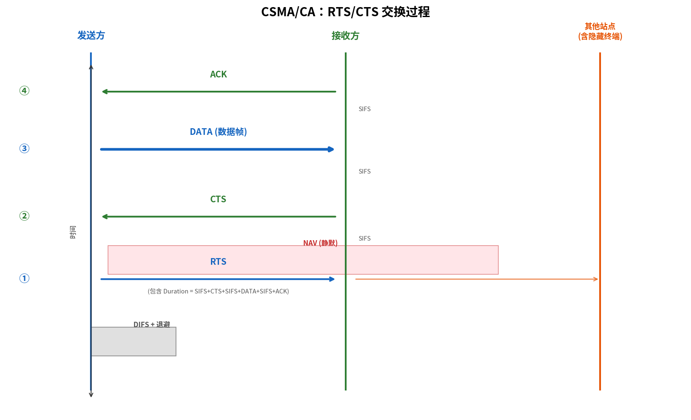

# 802.11 MAC 协议

> 参考：Kurose §7.3.2

802.11 的 MAC 协议与以太网的 CSMA/CD 有本质不同。无线环境中的根本问题——隐藏终端、无法同时发送和接收（半双工）、高误码率——决定了一个新的设计：**CSMA/CA（载波侦听多路访问/碰撞避免）**。

## 为什么不能使用 CSMA/CD？

以太网的 CSMA/CD 要求发送方在传输过程中**同时监听信道**——如果检测到碰撞立即停止。但在 802.11 无线环境中：

1. **无法同时发送和接收**：无线适配器在发送时，其自身信号淹没了接收电路，无法检测到其他信号（半双工限制）
2. **隐藏终端**：即使发送方检测到的信道是空闲的，接收方处可能已存在其他传输——发送方的载波侦听无法保护接收方
3. **信号衰减**：碰撞检测所需的信号强度差值在无线环境中难以可靠获取

因此 802.11 采用了**碰撞避免（collision avoidance）**策略——在发送前采取多种手段尽可能避免碰撞，并通过链路层 ACK 快速恢复丢失的帧。

## CSMA/CA 的核心机制

### 载波侦听

与 CSMA/CD 相同，站点发送前先**检测信道**——如果检测到信道忙（有其他信号），延迟发送直到信道空闲。信道忙可以通过物理载波侦听（实际检测信号能量）或**虚拟载波侦听（virtual carrier sensing）**来判断——后者通过读取收到的 RTS/CTS/DATA 帧首部中的 NAV 字段实现。

### 帧间间隔（Inter-Frame Spacing）

802.11 定义了多种帧间间隔，以提供优先级区分：

| 间隔 | 全称 | 时长（802.11b） | 用途 |
|------|------|----------------|------|
| **SIFS** | Short IFS | 10 μs | 最高优先级：ACK、CTS、DATA（分片后的连续发送） |
| **DIFS** | DCF IFS | 50 μs | 标准数据帧和 RTS 帧的发送前等待 |
| **PIFS** | PCF IFS | 30 μs | 中间优先级：用于 PCF（点协调功能，实际少用） |
| **EIFS** | Extended IFS | 可变 | 最低优先级：前一次接收出错后使用 |

优先级逻辑：短间隔的帧可以抢在长间隔的帧之前发送。例如，接收方正确收到一帧后等待 SIFS（10 μs）就发送 ACK——而等待 DIFS（50 μs）的其他站点还没有机会发送，确保了 ACK 不被碰撞。

### 随机退避（Random Backoff）

即使信道被检测到空闲，站点也不立即发送——而是等待一个额外的**随机退避时间**。退避算法如下：

1. 当站点有帧要发送且信道空闲了 DIFS 后，从 $[0, \text{CW}-1]$ 中随机选择一个退避值，其中 CW 是**竞争窗口（Contention Window）**
2. 站点每经过一个空闲时隙（slot time，802.11b 中为 20 μs）将退避计数器减 1
3. 如果退避倒计时期间信道变忙，站点**冻结**倒计时——等到信道再次空闲 DIFS 后从冻结的值继续倒计时
4. 退避计数器归零时，站点立即发送整个帧

初始 CW = $\text{CW}_{\min}$（通常 31）。如果发送失败（未收到 ACK），CW 加倍（指数回退）直到 $\text{CW}_{\max}$（通常 1023）。成功发送后 CW 重置为 $\text{CW}_{\min}$。

这个退避机制确保了即使多个站点同时检测到信道空闲，由于各自的随机退避值不同，只有选择一个站点会先发送，大大降低了碰撞概率。

## RTS/CTS 机制：解决隐藏终端

CSMA/CA 的信道侦听不能完全避免隐藏终端引起的碰撞（A 和 C 彼此隐藏，都在 B 的范围内但不在对方范围内）。802.11 提供**可选的 RTS/CTS（Request-to-Send / Clear-to-Send）**协议来解决此问题。

### RTS/CTS 握手流程

1. 发送方等待信道空闲 DIFS + 随机退避后，先发送一个短的 **RTS 帧**
2. 接收方收到 RTS 后等待 SIFS，广播一个短的 **CTS 帧**——所有能听到接收方的站点（包括隐藏终端）收到 CTS 后延迟自己的发送
3. 发送方收到 CTS 后等待 SIFS，发送 **DATA 帧**
4. 接收方正确收到 DATA 后等待 SIFS，发送 **ACK 帧**

RTS 和 CTS 帧中都包含一个**持续时间字段（Duration / NAV）**，指示本次交换（DATA + ACK）还需占用的时间。收到 RTS 和 CTS 的所有站点（除发送方和接收方外）设置其 **NAV（Network Allocation Vector，网络分配向量）**——在此时间段内保持静默，不论物理载波侦听是否指示信道空闲。

### RTS/CTS 的代价与使用

RTS/CTS 引入额外开销（RTS + CTS 两帧的传输时间 + 两个 SIFS 间隔），对短数据帧影响显著。因此大多数 802.11 实现只在帧长度超过一个**RTS 阈值**（通常配置为 500–2346 字节）时才使用 RTS/CTS——长帧一旦碰撞代价很大（重传整个长帧），RTS/CTS 的保护是值得的；短帧碰撞后直接重传即可。

## 链路层确认（Link-Layer ACK）

有线以太网不使用链路层确认——如果帧被噪声损坏，由上层协议（TCP）负责恢复。但在无线环境中误码率更高，等待 TCP 端到端重传延迟严重。

802.11 使用**链路层确认**：接收方在正确收到一帧后等待 SIFS 立即发送 ACK。如果发送方未在 ACK 超时期限内收到 ACK，则认为帧丢失，执行退避重传（CW 加倍）。

链路层 ACK + 重传使无线链路上的丢包恢复在**微秒至毫秒级**（而非 TCP 的秒级），显著提升了 TCP 在无线链路上的性能。

## CSMA/CA 与 CSMA/CD 的对比

| | CSMA/CD（以太网） | CSMA/CA（802.11） |
|---|-----------------|-------------------|
| 传输前策略 | 侦听→空闲→发送 | 侦听→空闲 DIFS→随机退避→发送 |
| 碰撞处理 | 检测→中断→退避 | 避免为主（RTS/CTS），链路层 ACK 发现丢包 |
| 链路层 ACK | 无 | 有（每帧立即确认） |
| 隐藏终端 | 不存在（有线共享介质） | 存在（RTS/CTS 可选解决） |
| 全双工 | 是 | 否（半双工，单天线） |
| 碰撞检测 | 可以（边发边听） | 不可以（发送时听不到其他信号） |

- [[WiFi与802.11]]
- [[802.11帧]]
- [[随机访问协议]]
- [[多路访问协议]]
- [[无线链路特性]]
- [[以太网]]
