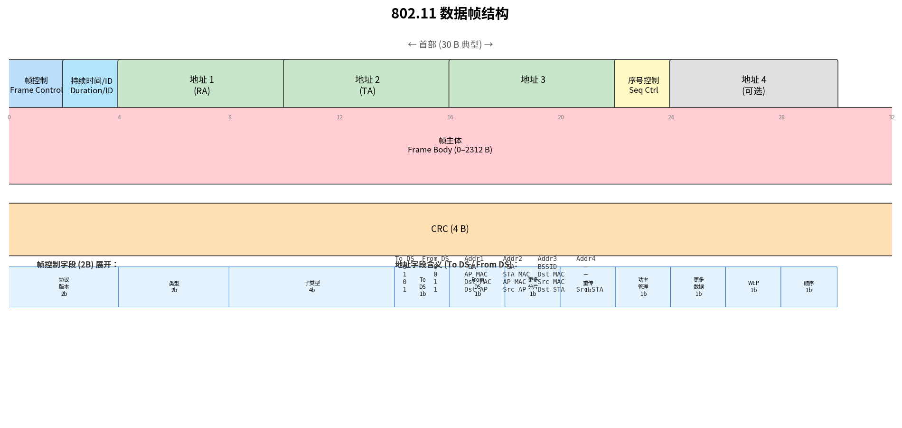

# 802.11 帧

> 参考：Kurose §7.3.3

802.11 帧的结构揭示了无线网络与有线以太网之间在寻址、转发和移动性支持方面的关键差异。802.11 帧最显著的特征是**四个地址字段**——相比之下，以太网帧只有两个地址（源和目的）。这个复杂性是由于无线帧可能需要在 AP、发送站点和接收站点之间进行三方中继。

## 802.11 帧的结构

典型的 802.11 数据帧包含以下字段：

```
┌───────┬──────┬─────┬─────┬─────┬─────┬─────┬──────┬───────┬──────┐
│Frame  │Duration│Addr1│Addr2│Addr3│Seq │Addr4│Data  │ CRC  │
│Control│/ID    │     │     │     │Ctrl│     │      │      │
│2 bytes│2 bytes│6 B  │6 B  │6 B  │2 B │6 B  │0–2312│4 B   │
└───────┴──────┴─────┴─────┴─────┴─────┴─────┴──────┴───────┴──────┘
```



### 帧控制字段（Frame Control, 2 字节）

帧控制字段包含多个子字段：

| 子字段 | 大小 | 说明 |
|--------|------|------|
| 协议版本 | 2 bit | 802.11 版本号（当前为 0） |
| 类型 | 2 bit | 管理(00)/控制(01)/数据(10) |
| 子类型 | 4 bit | 如数据帧(0000)、RTS(1011)、CTS(1100)、ACK(1101) |
| To DS | 1 bit | 帧发往分布式系统（AP→有线网络） |
| From DS | 1 bit | 帧来自分布式系统（有线网络→AP） |
| 更多分片 | 1 bit | 后续还有分片（MF） |
| 重传 | 1 bit | 此帧是重传帧 |
| 功率管理 | 1 bit | 发送方在完成此帧后将进入睡眠 |
| 更多数据 | 1 bit | AP 告知睡眠站点：还有缓存的数据要发送 |
| WEP 加密 | 1 bit | 帧体已用 WEP/WPA 加密 |
| 顺序 | 1 bit | 严格顺序交付 |

### 四个地址字段的含义

802.11 帧中四个地址字段（Addr1–Addr4）的含义由 To DS 和 From DS 两个比特的组合决定：

| To DS | From DS | Addr1 (接收方) | Addr2 (发送方) | Addr3 | Addr4 | 场景 |
|-------|---------|---------------|---------------|-------|-------|------|
| 0 | 0 | 目的站点 | 源站点 | BSSID (AP MAC) | 未使用 | 自组织模式 |
| 1 | 0 | AP MAC | 源站点 MAC | 目的站点 MAC | 未使用 | 站点→AP |
| 0 | 1 | 目的站点 MAC | AP MAC | 源站点 MAC | 未使用 | AP→站点 |
| 1 | 1 | 目的 AP MAC | 源 AP MAC | 目的站点 MAC | 源站点 MAC | WDS（无线分布系统），AP 间中继 |

在基础设施模式中最常见的两个场景：

- **站点→AP（To DS=1, From DS=0）**：Addr1 = AP 的 MAC（帧的直接接收方），Addr2 = 发送站点的 MAC，Addr3 = 远程目的站点的 MAC。AP 收到后将以 From DS=1 模式转发
- **AP→站点（To DS=0, From DS=1）**：Addr1 = 目的站点的 MAC（帧的直接接收方），Addr2 = AP 的 MAC，Addr3 = 远程源站点的 MAC

第三个地址（Addr3）使 AP 知道数据报的最终目的地或原始源——没有它，AP 就无法将帧转发到正确的有线网络目的地。

### 序号控制（Sequence Control, 2 字节）

由于无线链路的高误码率，帧经常需要分片和重传。序号控制字段使接收方能够正确重组分片并检测重复。

### 数据字段（Frame Body, 0–2312 字节）

有效载荷通常是一个完整的 IP 数据报或 ARP 分组。802.11 的最大帧体为 2312 字节，大于以太网的 1500 字节 MTU 以容纳加密和分片开销。

## 802.11 帧的三种类型

### 管理帧（Management Frames）

用于站点与 AP 之间的关联、认证和发现：

- **信标帧（Beacon）**：AP 周期性广播，包含 SSID、支持速率、时间戳（用于同步）
- **探测请求/响应（Probe Request/Response）**：站点主动扫描 AP
- **关联请求/响应（Association Request/Response）**：建立关联
- **认证帧（Authentication）**：身份验证
- **去关联帧（Disassociation）**：断开关联

### 控制帧（Control Frames）

用于协调信道接入和帧确认：

- **RTS / CTS**：可选的隐藏终端保护
- **ACK**：链路层确认
- **PS-Poll**：睡眠站点请求 AP 发送缓存帧

### 数据帧（Data Frames）

承载实际应用数据（如封装的 IP 数据报）。也包含 Data+CF-ACK（数据 + 确认合并）等变种。

## 802.11 帧与移动性

在同一个 IP 子网内，无线站点可以在 AP 之间移动而保持 IP 地址不变——这是 802.11 帧使用了三个以上地址字段的直接结果。AP 作为链路层设备只通过 MAC 地址转发帧（使用自学习），网络层的路由不受影响。

具体来看：当站点从 AP1 移动到 AP2（两者在同一子网内），AP2 的自学习过程将站点的 MAC 地址学习到自己的接口上。AP1 对应的交换机端口上的该 MAC 地址条目超时后被删除。整个过程不涉及 IP 层变化——站点的 IP 地址、默认网关、子网掩码都不变。ARP 缓存中的旧映射也因交换机 MAC 表中的更新而自动更正。

- [[WiFi与802.11]]
- [[802.11 MAC协议]]
- [[以太网]]
- [[链路层寻址与ARP]]
- [[移动性管理原理]]
- [[差错检测与纠错]]
- [[链路层交换机]]
