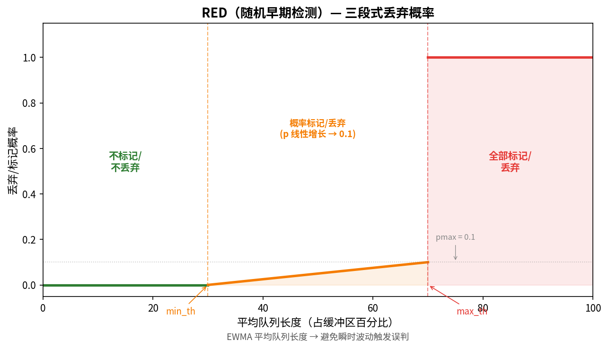

# AQM 与 RED

> 参考：Kurose §3.7.1, §4.3.2

**主动队列管理（Active Queue Management, AQM）**是路由器中的一套队列管理策略，与传统的"队列满后再丢包"（Tail Drop）不同，AQM 在队列完全满**之前**主动丢弃或标记分组，以向发送方提供早期拥塞信号。**随机早期检测（Random Early Detection, RED）**是最经典的 AQM 算法，也是理解 [[ECN]] 工作原理的前提。

## 为什么需要 AQM

传统路由器使用**弃尾（Tail Drop）** 策略：队列缓冲区未满时接受所有到达分组，缓冲区满时直接丢弃新到达的分组。这带来几个严重问题：

### 1. 全局同步（Global Synchronization）

大量 TCP 连接共享同一瓶颈链路时，一旦路由器缓冲区满并开始丢包，**所有连接几乎同时检测到丢包**，同时将 cwnd 减半，然后又同时恢复。结果：链路利用率在"全满"和"近乎空"之间剧烈振荡，吞吐量呈现锯齿状的全局同步。

### 2. 持续满队列（Bufferbloat）

Tail Drop 鼓励缓冲区**始终保持满状态**——只要平均到达速率超过离开速率，队列就永远不会变短。结果：所有分组经历接近最大排队时延，交互式应用（Web、VoIP）的延迟显著升高。

### 3. 死锁与偏向性

TCP 的"激进发送直到丢包"特性使特定连接可能垄断缓冲区（发送速率高的连接占据大部分队列空间），新连接难以获得公平份额。

AQM 的核心思想是：**在拥塞变得严重之前主动通知发送方减速**，使队列长度保持较低，避免上述所有问题。

## RED 算法

RED（Random Early Detection）是最著名的 AQM 算法，由 Sally Floyd 和 Van Jacobson 于 1993 年提出。

### 工作原理

RED 维护队列长度的**指数加权移动平均值（EWMA）**——而非瞬时队列长度——作为拥塞指标。使用平均值而非瞬时值的原因是队列长度可能因突发流量而瞬间波动，平均值更好地反映持续拥塞趋势。

定义两个阈值：

| 参数 | 含义 |
|------|------|
| $min_{th}$ | 最小阈值——低于此值绝不标记/丢弃 |
| $max_{th}$ | 最大阈值——高于此值全部标记/丢弃 |

RED 的行为分三个区间：

1. **平均队列 < $min_{th}$**：不标记、不丢弃任何分组。网络负载正常。
2. **$min_{th}$ ≤ 平均队列 < $max_{th}$**：以概率 $p$ 随机标记（ECN 模式）或丢弃（非 ECN 模式）分组。概率 $p$ 随平均队列长度**线性增长**：$p = p_{max} \times \frac{avg - min_{th}}{max_{th} - min_{th}}$
3. **平均队列 ≥ $max_{th}$**：标记或丢弃所有到达分组，防止队列溢出。

### 关键设计决策

**随机性**使 RED 以概率选中恰好占用更多队列空间的连接（发送速率更高的连接在队列中拥有更多分组，被标记/丢弃的概率更高）。这种隐式的公平性无需维护每流状态。

**早期**使发送方在丢包真正发生之前获得拥塞信号。配合 [[ECN]] 时，分组甚至不需要被丢弃——路由器仅设置 CE 位，接收方通过 ACK 的 ECE 标志通知发送方减速。

## RED 与 ECN 的配合

RED 有两种运行模式，取决于是否启用 ECN：

| 模式 | 拥塞信号方式 | 需要重传？ | 适用场景 |
|------|------------|-----------|---------|
| **RED + ECN** | 设置 IP 首部 CE 位（标记） | 否（分组继续传输） | 现代网络首选 |
| **RED 无 ECN** | 丢弃分组 | 是 | 不支持 ECN 的遗留网络 |

有了 ECN，RED 优先标记而非丢弃支持 ECN 的分组（ECT 位被设置的分组）——这样分组继续到达目的地，发送方仍然获得拥塞信号，但不需要重传。

## AQM 的其他变体

除 RED 外，后续出现了多种 AQM 变体：

| 算法 | 全称 | 改进要点 |
|------|------|---------|
| **WRED** | Weighted RED | 对不同 Diffserv 服务类使用不同的丢弃概率 |
| **ARED** | Adaptive RED | 自动调整 $p_{max}$ 适应变化的流量 |
| **CoDel** | Controlled Delay | 基于**最小排队时延**而非队列长度做决策，避免 Bufferbloat |
| **PIE** | Proportional Integral controller Enhanced | 轻量级，Linux 内核默认 AQM；基于排队延迟的比例积分控制 |

## 部署与现实

AQM 在因特网中的部署历经多年推动。IETF 在 RFC 7567 中明确**推荐在网络设备中默认启用 AQM**。如今：
- **数据中心网络**：ECN + AQM 广泛部署，是实现低延迟的关键
- **Linux 内核**：默认使用 CoDel 或 PIE（通过 `tc` 命令配置）
- **企业/家庭路由器**：部署率仍较低（Bufferbloat 仍普遍存在）

- [[ECN]]
- [[TCP拥塞控制]]
- [[拥塞控制原理]]
- [[路由器排队与调度]]
