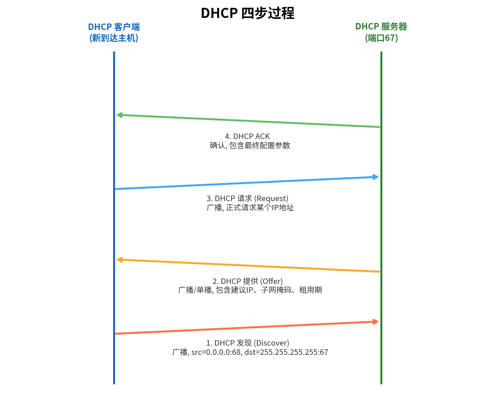

# DHCP

> 参考：Kurose §4.3.4

**动态主机配置协议（Dynamic Host Configuration Protocol, DHCP）**允许主机自动获取（被分配）IP 地址。网络管理员可以配置 DHCP 使给定主机每次连接时获得相同的 IP 地址，也可以分配**临时 IP 地址**——每次连接时地址不同。

除了主机 IP 地址分配外，DHCP 还允许主机获取其他信息：**子网掩码**、**第一跳路由器（默认网关）的地址**和**本地 [[DNS]] 服务器的地址**。

由于 DHCP 能自动化连接主机到网络的网络相关方面，它常被称为**即插即用（plug-and-play）协议**。DHCP 广泛用于住宅因特网接入网、企业网络和无线局域网中主机频繁加入和离开的场景。（注意：DHCP 不同于 ZeroConf/mDNS 等零配置协议——DHCP 依赖服务器提供配置，而 ZeroConf 在无基础设施时自动分配本地地址。）

## DHCP 协议的四步过程

DHCP 是一个**客户-服务器协议**。在最简单的情况下，每个子网都有一个 DHCP 服务器。如果子网中没有服务器，则需要一个**DHCP 中继代理（relay agent）**（通常是路由器），它知道该网络的 DHCP 服务器地址。

对于新到达的主机，DHCP 协议是一个四步过程：

### 1. DHCP 服务器发现（DHCP Server Discovery）

新到达主机的首要任务是找到 DHCP 服务器。通过发送 **DHCP 发现报文（DHCP discover message）**完成——客户在 UDP 分组中从**端口 68** 向**端口 67** 发送，使用广播目的 IP 地址 **255.255.255.255** 和"本主机"源 IP 地址 **0.0.0.0**。链路层随后将此帧广播到子网上的所有节点。

### 2. DHCP 服务器提供（DHCP Server Offer(s)）

DHCP 服务器收到 DHCP 发现报文后，以 **DHCP 提供报文（DHCP offer message）**响应，同样使用广播 IP 地址 255.255.255.255。每个服务器提供报文包含：发现报文的**事务 ID**、为客户提议的 **IP 地址**、**网络掩码**和 **IP 地址租用期（lease time）**——IP 地址有效的时长。通常租用期设为几小时或几天。

### 3. DHCP 请求（DHCP Request）

新到达的客户从一个或多个服务器提供中选择，并以 **DHCP 请求报文（DHCP request message）**回应所选提供，回显配置参数。

### 4. DHCP ACK

服务器以 **DHCP ACK 报文**响应，确认请求的参数。

一旦客户收到 DHCP ACK，交互完成，客户可以在租用期内使用 DHCP 分配的 IP 地址。DHCP 还提供允许客户在租用到期时**续租**的机制。

## DHCP 的移动性局限

DHCP 在移动性方面有一个显著缺陷：由于移动节点每次连接到新子网时都从 DHCP 获得**新的 IP 地址**，它无法在子网间移动时维持到远程应用的 TCP 连接。

- [[IPv4编址]]
- [[NAT]]
- [[IPv6]]
- [[DHCPv6]]
- [[Web请求的一天]]
- [[IPv4数据报格式]]
- [[网络层概述]]
