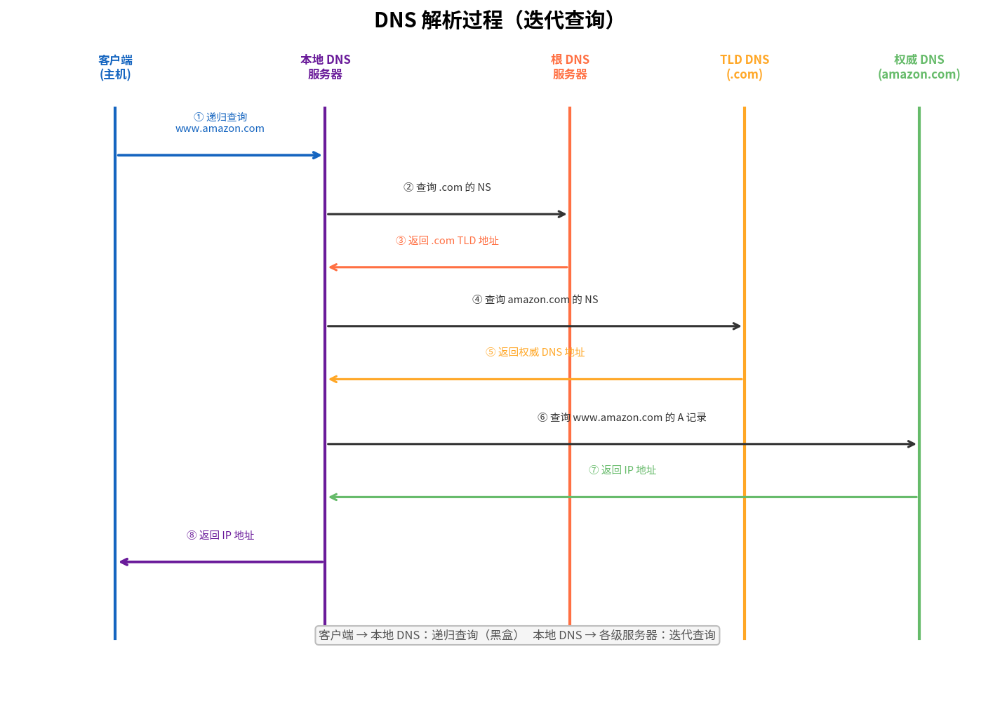
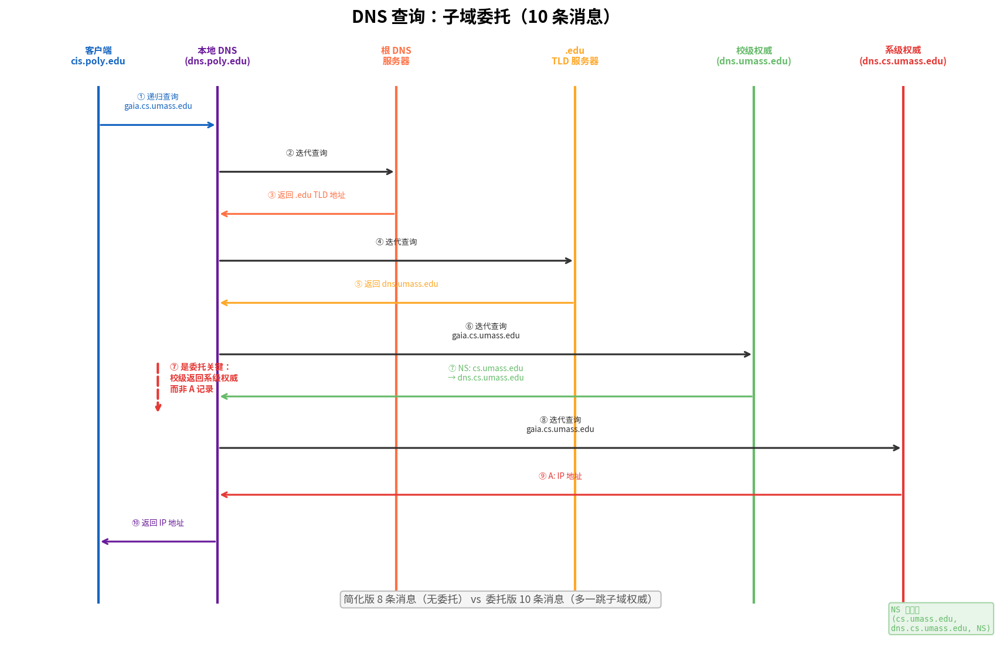
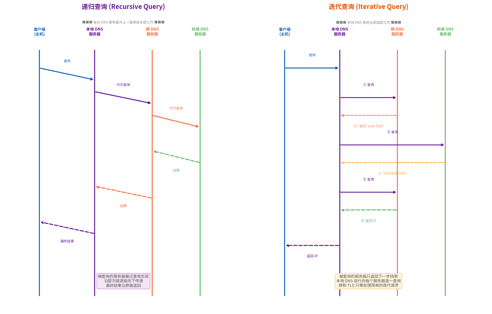

# DNS（域名系统）

> 参考：Kurose §2.4

**域名系统（Domain Name System, DNS）**是因特网的目录服务——它将人类可读的主机名转换为机器可用的 IP 地址。DNS 是一个由分层 DNS 服务器实现的**分布式数据库**，也是一个使主机能查询分布式数据库的**应用层协议**。DNS 协议通常运行在 **UDP** 之上，使用端口 **53**。但当响应超过 512 字节（无 EDNS0 支持时）或进行**区域传送（zone transfer）**（权威 DNS 服务器之间复制 DNS 记录）时，DNS 使用 **TCP** 端口 53。

## DNS 提供的服务

DNS 不仅仅将主机名转换为 IP 地址，还提供以下重要服务：

### 主机别名

具有复杂规范主机名（canonical hostname）的主机可以有一个或多个**别名（alias）**。例如 `relay1.west-coast.enterprise.com` 可能有两个别名 `enterprise.com` 和 `www.enterprise.com`。DNS 可以将别名转换为规范主机名（以及规范主机的 IP 地址）。

### 邮件服务器别名

邮件地址的域名部分可能是一个别名（如 `bob@yahoo.com` 中的 `yahoo.com` 可能比实际邮件服务器的主机名更简单）。DNS 通过 **MX 记录**将邮件服务器别名转换为规范主机名和 IP 地址。MX 记录允许一个公司使用相同的邮件域名别名来对应多个邮件服务器（用于冗余）。

### 负载分发

DNS 越来越多地用于在多个复制服务器之间**分发负载**。对于繁忙的站点（如 `cnn.com`），多台服务器运行在不同的端系统上，每台拥有不同的 IP 地址。DNS 为这些服务器维护一组 IP 地址，在响应 DNS 查询时**轮转（rotate）**返回 IP 地址的顺序——第一个查询收到以第一个 IP 开头的列表，第二个查询收到第一个 IP 被移到列表末尾的列表。这种轮转机制将流量大致均匀地分发到所有服务器。

## DNS 服务器层次结构

DNS 使用大量分布在世界各地的 DNS 服务器，组织成层次结构。主要有三类 DNS 服务器：

### 根 DNS 服务器

全球有 **13 个逻辑根 DNS 服务器**（标记为 A 到 M），每个实际上是分布在世界各地的冗余服务器的集群（通过任播路由实现）。根服务器返回**顶级域（TLD）服务器**的 IP 地址。

### 顶级域（TLD）DNS 服务器

TLD 服务器负责**顶级域名**（如 `.com`、`.org`、`.net`、`.edu`、`.gov` 以及国家顶级域 `.cn`、`.uk`、`.fr`、`.jp` 等）。TLD 服务器返回**权威DNS 服务器**的 IP 地址。

### 权威 DNS 服务器

每个在因特网上有可公开访问主机的组织必须提供可公开访问的 DNS 记录，将这些主机的名称映射到 IP 地址。组织的**权威 DNS 服务器**存放这些 DNS 记录。组织可以选择自行实现自己的权威 DNS 服务器，也可以将记录付费存储在某个服务提供商的权威 DNS 服务器中。

> **澄清：权威 DNS 服务器管理什么？** 权威 DNS 服务器管理的是**单个域（zone）**，而非整个 TLD。`.com` 的域名列表由 `.com` 的 TLD 服务器维护——它们不存每个域名的 A 记录，只存 NS 记录指向各域的权威服务器。注册 `example.com` 时，`.com` TLD 插入 `example.com NS ns1.example.com`；此后 `example.com` 所有记录由该域的权威服务器负责。

> **子域委托（delegation）——何时会有"次级权威 DNS"？** 一个域可以通过 NS 记录将**子域委托给另一组权威 DNS 服务器**。例如 `umass.edu` 的权威服务器中可以存放：
> ```
> cs.umass.edu.    NS    dns.cs.umass.edu.
> dns.cs.umass.edu.    A    128.119.40.100
> ```
> 这条 NS 记录告诉外界：`cs.umass.edu` 及其下所有子域（`*.cs.umass.edu`）的权威查询请去找 `dns.cs.umass.edu`，而非 `umass.edu` 的权威服务器。这就是 DNS 的**层次化委托**——每级域名可以把自己下属的子域"切"出去给另一台服务器管。典型场景：大学各系自管 DNS、公司按区域/部门拆分、CDN 的 CNAME 委托等。这与主/辅冗余（同一份 zone 的多台服务器）是不同的概念。

### 本地 DNS 服务器

除了以上三层，每个 ISP 还有一个**本地 DNS 服务器（local DNS server）**——也称为**默认名称服务器**。当主机连接到 ISP 时，ISP 提供一个或多个本地 DNS 服务器的 IP 地址。当主机发起 DNS 查询时，查询首先被发送到本地 DNS 服务器，由其充当代理，将查询逐级转发到 DNS 服务器层次结构中。

> 详见 [[本地DNS服务器]] 独立条目。

## DNS 查询过程

假设主机 `cis.poly.edu` 想要知道 `gaia.cs.umass.edu` 的 IP 地址。本地 DNS 服务器是 `dns.poly.edu`。查询过程如下：

1. `cis.poly.edu` 向 `dns.poly.edu` 发送 DNS 查询报文
2. 本地 DNS 服务器将查询报文转发到**根 DNS 服务器**
3. 根服务器注意到 `.edu` 后缀，返回负责 `.edu` 的**TLD 服务器**的 IP 地址列表
4. 本地 DNS 服务器向这些 TLD 服务器之一发送查询报文
5. TLD 服务器注意到 `umass.edu` 后缀，返回 `umass.edu` 的**权威 DNS 服务器**的 IP 地址
6. 本地 DNS 服务器向权威 DNS 服务器发送查询报文
7. 权威 DNS 服务器在记录中查找 `gaia.cs.umass.edu`，返回其 IP 地址
8. 本地 DNS 服务器将 IP 地址返回给 `cis.poly.edu`



此过程中，从 `dns.poly.edu` 到根 DNS 服务器以及后续服务器的查询是**迭代查询（iterative query）**——被查询的服务器返回下一级服务器的地址而非自己代为查询。从 `cis.poly.edu` 到 `dns.poly.edu` 的查询是**递归查询（recursive query）**——本地 DNS 服务器代替主机完成所有后续查询工作。详见 [[DNS#递归查询与迭代查询|递归查询与迭代查询]] 专节。

> 以上示例假设 `umass.edu` 的权威服务器直接持有 `gaia.cs.umass.edu` 的 A 记录，共产生 **8 条 DNS 消息**（4 查询 + 4 应答）。

### 子域委托：当域内还有层级权威

上面的简化示例假设 TLD 服务器直接返回最终权威服务器的地址。但在现实中，一个域内部可能存在**多级权威**——Kurose 给出了如下场景（§2.4.2）：

假设麻省大学有一台校级 DNS 服务器 `dns.umass.edu`，而**各系分别维护自己的权威 DNS 服务器**（如 CS 系的 `dns.cs.umass.edu` 对 `*.cs.umass.edu` 拥有权威）。此时查询 `gaia.cs.umass.edu` 的过程变为：

1. `cis.poly.edu` → `dns.poly.edu`：递归查询 `gaia.cs.umass.edu`
2. `dns.poly.edu` → 根服务器：返回 `.edu` TLD 服务器地址
3. `dns.poly.edu` → `.edu` TLD 服务器：返回 `dns.umass.edu`（校级权威）
4. `dns.poly.edu` → `dns.umass.edu`：查询 `gaia.cs.umass.edu`
5. `dns.umass.edu` **不持有该记录**，但它有一条 NS 记录 `(cs.umass.edu, dns.cs.umass.edu, NS)`，于是返回 **`dns.cs.umass.edu` 的 IP 地址**（通过附加区中的 A 记录）
6. `dns.poly.edu` → `dns.cs.umass.edu`：此服务器对 `*.cs.umass.edu` 拥有权威，返回 `gaia.cs.umass.edu` 的 A 记录
7. `dns.poly.edu` → `cis.poly.edu`：返回最终 IP 地址

此委托场景共产生 **10 条 DNS 消息**（5 查询 + 5 应答），比简化版多了子域权威这一跳。

**关键机制**：步骤 5 中 `dns.umass.edu` 返回的是 NS 记录而非 A 记录——它与 TLD 服务器返回 NS 记录指向 `dns.umass.edu` 的逻辑完全相同，只是发生在校→系的更深层级。DNS 的层次化委托正是通过 NS 记录在每一级不断"切"出子域实现的：

```
根 → (.edu NS) → .edu TLD → (umass.edu NS) → dns.umass.edu → (cs.umass.edu NS) → dns.cs.umass.edu → (A 记录)
```



> **谁能做委托？** 任何一个域（zone）的管理员都可以在自己的 zone file 中为子域添加 NS 记录，将子域委托给另一组权威服务器。不需要上级批准——`umass.edu` 自行决定把 `cs.umass.edu` 切出去，与 `.edu` TLD 无关。

## 递归查询与迭代查询

DNS 规范（RFC 1034）定义了两种查询方式：**递归查询（recursive query）** 和 **迭代查询（iterative query）**。这两者的根本区别在于——**谁承担解析域名的负担**。

### 递归查询

在**递归查询**中，被查询的 DNS 服务器**接过完整的解析责任**。如果它自己不知道答案，它会代替原始请求者向其他 DNS 服务器发起查询，跟踪所有引用（referral），直到获得最终答案，然后将答案返回给请求者。

```
客户端："请帮我查 www.example.com 的 IP 地址。"
本地 DNS："好，我替你全权处理，等结果就行。"
（本地 DNS 自己去找根、TLD、权威……）
本地 DNS："拿到了，IP 是 93.184.216.34。"
```

递归查询的特点：
- **对请求者最简单**：发出一次查询，收到一个最终答案
- **被查询服务器负担重**：必须维护中间状态，追踪完整的解析链
- **典型使用场景**：主机 → 本地 DNS 服务器的查询几乎总是递归的

### 迭代查询

在**迭代查询**中，被查询的 DNS 服务器**只返回它已知的最佳信息**——要么是答案，要么是"去问下一台服务器"的引用（NS 记录 + A 记录）。它**不会**代替请求者去查询下一台服务器。

```
本地 DNS："根服务器，www.example.com 的 IP 是什么？"
根 DNS："我不知道，但 .com 的 TLD 服务器在这里，你去问它。"
本地 DNS：".com TLD，www.example.com 的 IP 是什么？"
TLD DNS："我不知道，但 example.com 的权威 DNS 在这里，你去问它。"
本地 DNS："example.com 的权威 DNS，www.example.com 的 IP 是什么？"
权威 DNS："IP 是 93.184.216.34。"
```

迭代查询的特点：
- **被查询服务器负担轻**：只需查找本地数据并返回结果或引用，不维护任何中间状态
- **请求者负担重**：必须自行追踪引用链，逐台查询
- **典型使用场景**：本地 DNS 服务器 → 根/TLD/权威服务器的查询几乎总是迭代的

### 对比

| | 递归查询 | 迭代查询 |
|---|---|---|
| **谁做追踪工作** | 被查询的服务器 | 请求者 |
| **服务器负担** | 重（维护状态、多次查询） | 轻（每次独立响应） |
| **返回内容** | 最终答案或错误 | 答案或"去问下一家"的引用 |
| **DNS 中使用位置** | 主机 → 本地 DNS | 本地 DNS → 根/TLD/权威 |
| **可配置性** | 本地 DNS 可拒绝递归请求（来自非客户主机） | 根/TLD 服务器通常只支持迭代 |



### 为什么 DNS 采用混合模式

DNS 采用**终端递归 + 中间迭代**的混合模式（主机对本地 DNS 递归查询，本地 DNS 对上层服务器迭代查询），这并非偶然：

1. **根和 TLD 服务器必须极轻量**：它们每秒处理数百万查询。如果强制递归，每台根服务器需为成千上万的并发查询维护中间状态并自行追踪整条解析链——这不可行。迭代查询使它们每次只需查表+返回引用，无状态、无追踪。
2. **负担集中在本地 DNS 服务器**：ISP 的本地 DNS 服务器本来就需要强大的处理能力（缓存、并发连接等），由它承担逐级追踪的复杂度是合理的分工。
3. **可选择性**：虽然 TCP 和 DNS 协议本身不强制哪种查询类型，但 DNS 根和 TLD 服务器通常被配置为**仅支持迭代查询**。本地 DNS 服务器可以拒绝来自外部主机的递归请求（防止被滥用为开放解析器）。

> **注意**：虽然通常情况下主机对本地 DNS 发递归查询、本地 DNS 对上层发迭代查询，但 DNS 协议本身允许在任何跳使用递归或迭代查询。DNS 报文首部中有一个 **RD（Recursion Desired，递归期望）** 标志位——主机设置此位表示"我希望你递归地为我解析"，本地 DNS 服务器在响应中通过 **RA（Recursion Available，递归可用）** 标志位告诉主机它是否愿意提供递归服务。

## DNS 缓存

为了减少 DNS 查询流量和延迟，DNS 广泛使用**缓存（caching）**。当 DNS 服务器收到一个 DNS 应答（如某个主机名到其 IP 地址的映射）时，它将这个映射缓存在本地内存中。如果稍后另一个查询到达请求同样的映射，该服务器直接返回缓存的映射而不必重新查询。

每条缓存的记录有一个**生存时间（Time to Live, TTL）**，通常设置为两天。TTL 过期后，缓存记录被删除，下次查询同一映射时将重新执行完整的查询链。本地 DNS 服务器也可以缓存 TLD 服务器的 IP 地址，从而跳过根服务器的查询。

## DNS 资源记录

DNS 分布式数据库中的每条记录被称为**资源记录（Resource Record, RR）**。每条 RR 包含以下字段：

$$(\text{Name}, \text{Value}, \text{Type}, \text{TTL})$$

TTL 是记录的生存时间。Type 字段决定了 Name 和 Value 的含义：

| Type      | Name                               | Value                          | 含义                           |
| --------- | ---------------------------------- | ------------------------------ | ---------------------------- |
| **A**     | 主机名                                | IPv4 地址                        | 将主机名映射到 IPv4 地址              |
| **AAAA**  | 主机名                                | IPv6 地址                        | 将主机名映射到 IPv6 地址              |
| **NS**    | 域（如 `foo.com`）                     | 该域的权威 DNS 服务器主机名               | 将域指向其权威 DNS 服务器              |
| **CNAME** | 别名                                 | 规范主机名                          | 别名解析                         |
| **MX**    | 别名                                 | 邮件服务器的规范主机名                    | 邮件服务器定位                      |
| **SOA**   | 域                                  | 该域的主权威 DNS 服务器、管理员邮箱、序列号、刷新间隔等 | 定义域的权威管理信息（用于区域传送）           |
| **PTR**   | 反向 IP 地址（如 `1.2.3.4.in-addr.arpa`） | 主机名                            | 反向 DNS 查询（IP → 主机名）          |
| **TXT**   | 域名                                 | 任意文本                           | 域名验证（SPF、DKIM、DMARC 等邮件安全机制） |

### A 记录和 NS 记录的配合

要获取主机名的 IP 地址，DNS 服务器可能返回一条 **NS 记录**（指向另一台权威 DNS 服务器）和一条 **A 记录**（给出该权威 DNS 服务器的 IP 地址，在回答的附加区中），从而避免额外的查询。

### CNAME 记录

**CNAME（Canonical Name）**记录用于将别名映射到规范主机名。例如 `foo.com` 的规范主机名可能是 `relay1.bar.foo.com`——查询 `foo.com` 的 A 记录时，权威服务器返回一条 CNAME 记录（含规范主机名）和一条 A 记录（含该规范主机的 IP 地址）。

### MX 记录

**MX（Mail Exchange）**记录用于将邮件服务器的别名映射到其规范主机名。例如查询 `foo.com` 的 MX 记录时，权威服务器返回 `mail.foo.com`（规范主机名）。查询者还需继续查询 `mail.foo.com` 的 A 记录以获得 IP 地址。为了效率，MX 响应的附加区通常包含该规范主机的 A 记录。

### SOA 记录

**SOA（Start of Authority）**记录定义了一个 DNS 域的权威管理信息，每个域有且仅有一条 SOA 记录。SOA 包含：

- **MNAME**：该域的主权威 DNS 服务器主机名
- **RNAME**：域管理员邮箱（`@` 替换为 `.`）
- **序列号（Serial）**：区域文件的版本号，辅 DNS 服务器通过比对序列号判断是否需要区域传送
- **刷新间隔（Refresh）**：辅服务器查询主服务器检查更新的间隔
- **重试间隔（Retry）**：辅服务器刷新失败后的重试等待时间
- **过期时间（Expire）**：辅服务器在无法联系主服务器后仍继续提供权威服务的最大天数
- **最小 TTL（Minimum TTL）**：否定缓存（NXDOMAIN）的默认 TTL

SOA 记录是 DNS 区域传送（Zone Transfer）和主辅服务器同步机制的基础。

### PTR 与 TXT 记录

- **PTR（Pointer）**：用于反向 DNS 查询——将 IP 地址映射回主机名。查询时使用特殊域 `in-addr.arpa`（IPv4）或 `ip6.arpa`（IPv6），例如 `1.2.3.4.in-addr.arpa` 查询 IP 4.3.2.1 对应的主机名。
- **TXT（Text）**：存储任意文本信息。广泛用于域名验证和邮件安全——**SPF（Sender Policy Framework）**在 TXT 记录中声明有权发送该域邮件的服务器 IP，**DKIM** 存储公钥用于验证邮件签名，**DMARC** 定义邮件认证策略。

## DNS 报文格式

DNS 查询报文和应答报文使用相同的格式。DNS 报文的各段如下：

- **首部（Header，12 字节）**：包含标识符（16 比特，匹配查询和应答）、标志（1 比特查询/应答标志、1 比特权威标志、1 比特递归期望标志、1 比特递归可用标志）和四个计数（问题、回答、权威、附加区的 RR 数量）
- **问题区（Question Section）**：包含被查询的名称和查询类型（如 A 类型——查询主机名的 IP 地址）
- **回答区（Answer Section）**：包含被查询名称的资源记录
- **权威区（Authority Section）**：包含其他权威 DNS 服务器的记录
- **附加区（Additional Section）**：包含其他有帮助的记录（如 MX 查询的附加区中包含邮件服务器的 A 记录）

## 插入 DNS 数据库

当你注册一个新的域名（如 `networkutopia.com`）时，需要向注册机构提供你的**主权威 DNS 服务器**和**辅权威 DNS 服务器**的名称和 IP 地址。注册机构确保在 `.com` 的 TLD 服务器中插入两条 NS 记录（对应你的主辅权威服务器）和两条 A 记录（给出你的权威服务器的 IP 地址）。从此之后，任何人对 `networkutopia.com` 域中主机名的 DNS 查询都将被指引到你的权威 DNS 服务器。

## DNS 隐私与安全扩展

传统 DNS 查询以明文形式在 UDP 上传输——ISP、网络管理员或任何能嗅探分组的中间人可以窥探用户访问的所有域名。为解决此隐私问题，IETF 标准化了加密 DNS：

| 协议 | 全称 | 传输方式 | 端口 | 说明 |
|------|------|---------|------|------|
| **DoT** | DNS over TLS | DNS 查询封装在 TLS 加密连接中 | TCP 853 | 网络层面可见 DNS 连接但内容加密 |
| **DoH** | DNS over HTTPS | DNS 查询封装在 HTTPS 请求中（`application/dns-message`） | TCP 443 | 与普通 Web 流量混合，难以被单独识别和阻断 |

DoH 和 DoT 提供了 DNS 的机密性和完整性保护，防止 DNS 被窥探或篡改。但部署也引发了争议：传统 DNS 的分层缓存架构在加密 DNS 下难以维持，企业网络管理和家长控制等功能受到影响。

## nslookup 工具

`nslookup` 程序可从任意主机直接向某 DNS 服务器发送 DNS 查询。例如：

```bash
nslookup www.example.com
```

输出显示执行查询的 DNS 服务器的主机名和 IP 地址，以及查询得到的回答（主机名和 IP 地址）。

- [[域名命名规则]]
- [[本地DNS服务器]]
- [[应用层协议原理]]
- [[HTTP]]
- [[电子邮件与SMTP]]
- [[视频流与CDN]]
- [[Web请求的一天]]
- [[Socket编程]]
- [[SIP]]
