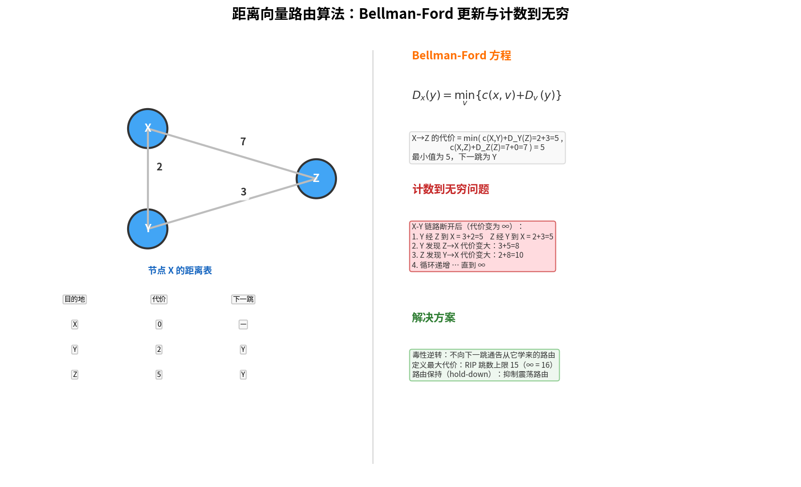

# DV 路由算法

> 参考：Kurose §5.2.2

**距离向量（Distance-Vector, DV）算法**是一种**迭代、异步、分布式**的路由算法。与使用全局信息的 LS 算法不同，每个节点仅知道到其**直接连接邻居**的链路代价，以及从邻居接收的信息。DV 算法在实践中被用于因特网的 [[RIP]]。[[BGP]] 遵循距离向量路由的基本思想，但实际是一种**路径向量（Path Vector）协议**——BGP 在 AS-PATH 属性中携带完整的 AS 路径（而非仅距离值），这提供了比纯 DV 算法更强的环路预防能力。

## Bellman-Ford 方程

DV 算法的理论基础是 **Bellman-Ford 方程**。设 $d_x(y)$ 为从节点 $x$ 到 $y$ 的最低代价路径的代价，则：

$$d_x(y) = \min_v \{c(x, v) + d_v(y)\}$$

其中 $\min_v$ 对 $x$ 的所有邻居 $v$ 进行。方程直观表达了：从 $x$ 到某个邻居 $v$ 后，再沿着从 $v$ 到 $y$ 的最短路径，总代价为 $c(x, v) + d_v(y)$；由于必须从某个邻居出发，最低代价就是所有邻居中的最小值。

Bellman-Ford 方程的实际贡献：**解出方程即为节点 $x$ 转发表中的条目**——使方程取得最小值的邻居 $v^*$ 即为下一跳路由器。

## 算法机制

每个节点 $x$ 维护以下路由信息：
- 到每个邻居 $v$ 的代价 $c(x, v)$
- 节点 $x$ 自己的**距离向量** $D_x = [D_x(y): y \in N]$，即对所有目的地 $y$ 的代价估计
- 其**每个邻居的距离向量** $D_v = [D_v(y): y \in N]$

节点 $x$ 从邻居 $w$ 收到新距离向量后，使用 Bellman-Ford 方程更新自己的距离向量：

$$D_x(y) = \min_v \{c(x, v) + D_v(y)\} \quad \text{for each node } y \in N$$

如果 $D_x(y)$ 因此发生改变，节点 $x$ 向其邻居发送更新后的距离向量。

DV 算法是**自终止**的——没有"计算终止"的信号，它自己停止。算法即使在异步方式下也正确运行（节点计算和更新生成/接收在任何时间发生）。

## DV 算法示例

考虑一个三节点网络。节点 $x$ 的计算：

$$D_x(x) = 0$$
$$D_x(y) = \min\{c(x,y) + D_y(y), c(x,z) + D_z(y)\} = \min\{2 + 0, 7 + 1\} = 2$$
$$D_x(z) = \min\{c(x,y) + D_y(z), c(x,z) + D_z(z)\} = \min\{2 + 1, 7 + 0\} = 3$$

$D_x(z)$ 从 7 变为 3——体现了邻居距离向量如何帮助发现更低代价路径。

## 计数到无穷问题

DV 算法的一个重要病理：当链路代价**增加**时，DV 算法收敛可能极慢。考虑链路代价从 4 变为 60 的场景：

- 节点 $y$ 检测到 $c(y,x)$ 变为 60
- $y$ 计算到 $x$ 的新代价：$\min\{60 + 0, 1 + D_z(x)\} = \min\{60, 1+5\} = 6$
- 但实际上 $D_z(x)=5$ 是**通过 $y$ 本身到达 $x$ 的**（$z$ 的路由经过 $y$ 再到 $x$）
- $y$ 的新距离向量发给 $z$ 后，$z$ 更新到 7，$y$ 再更新到 8……
- 来回 44 次迭代后才收敛到正确的 50（$y$ 直接到 $x$ 而不是通过 $z$）

这就是**计数到无穷（count-to-infinity）**问题。

### 毒性逆转

一种已知的解决方案是**毒性逆转（poisoned reverse）**：如果 $z$ 通过 $y$ 路由到达目的地 $x$，则 $z$ 将告知 $y$ 它到 $x$ 的距离是 $\infty$（即毒性化该路由）。虽然毒性逆转在许多情况下解决了计数到无穷问题，但它不能完全消除——涉及三个或更多节点的循环仍然可能发生。

## LS 与 DV 算法对比

|      | LS              | DV                   |
| ---- | --------------- | -------------------- |
| 信息类型 | 全局（所有链路代价）      | 本地（仅邻居代价 + 邻居距离向量）   |
| 算法类型 | 集中式（Dijkstra）   | 分布式（Bellman-Ford 迭代） |
| 收敛速度 | 快               | 可能慢（计数到无穷）           |
| 鲁棒性  | 错误影响有限（仅计算自己的表） | 错误可能传播到整个网络          |
| 复杂度  | $O(n^2)$        | 取决于收敛                |

- [[LS路由算法]]
- [[BGP]]
- [[OSPF]]
- [[RIP]]
- [[网络层控制平面概述]]
