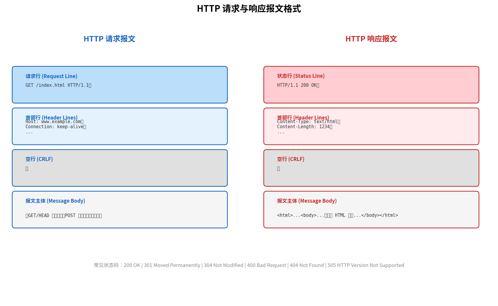

# HTTP 报文格式

> 参考：Kurose §2.2

HTTP 报文有两种类型：**请求报文（request message）**和**响应报文（response message）**。两种报文的格式均以 ASCII 文本编写，便于人类阅读。

## HTTP 请求报文

```
GET /somedir/page.html HTTP/1.1
Host: www.someschool.edu
Connection: close
User-agent: Mozilla/5.0
Accept-language: fr

```

请求报文的第一行称为**请求行（request line）**，后续各行称为**首部行（header line）**。请求行包含三个字段：**方法（method）**、**URL** 和 **HTTP 版本**。首部行之后有一个**空行**，然后是**实体主体（entity body）**（可能为空）。



### HTTP 请求方法

| 方法         | 作用                                    |
| ---------- | ------------------------------------- |
| **GET**    | 请求 URL 指定的资源。参数附加在 URL 的 `?` 后（查询字符串） |
| **POST**   | 向服务器提交数据（如表单）。数据在实体主体中                |
| **HEAD**   | 类似 GET，但服务器只返回首部而不返回请求对象（常用于调试）       |
| **PUT**    | 允许用户向服务器上传对象                          |
| **DELETE** | 允许用户删除服务器上的对象                         |

### 常见首部行

- **Host**：目标主机名（HTTP/1.1 **必需**）
- **Connection**：`close` 表示非持久连接，`keep-alive` 表示持久连接
- **User-agent**：浏览器类型（如 `Mozilla/5.0`）
- **Accept-language**：用户偏好语言（如 `fr` 表示法语）
- **Accept**：客户端接受的 MIME 类型
- **If-Modified-Since**：条件 GET（参见 [[Web缓存]]）

### GET 与 POST：为什么数据传递方式不同

设计差异源自 HTTP 规范给两种方法定义的**不同语义**：

- **GET 是"取东西"**：语义为"给我这个资源"。参数只是**描述你要什么**（搜索条件、过滤、分页），属于资源标识的一部分，所以附加在 URL 上。因为 GET 不改变服务器状态（幂等），所以 URL 可以被缓存、收藏、复制分享。
- **POST 是"送东西"**：语义为"处理这份数据"。数据是你要提交的**内容本身**（表单、文件上传），不是描述资源的条件，所以放在请求体的实体主体中。

从这个语义根源推导出的所有差异：

| | GET | POST |
|---|-----|------|
| 数据位置 | URL 查询字符串 `?key=val` | 实体主体（body） |
| 语义 | "给我这个资源" | "处理这份数据" |
| 幂等性 | 是（重复请求不应改变服务器状态） | 否（重复提交可能创建多份订单） |
| 缓存 | 响应可被浏览器/CDN 缓存 | 响应默认不缓存（需显式 Cache-Control） |
| 书签 | URL 保存搜索结果 | URL 不包含表单数据，无法靠收藏夹复现 |
| 长度限制 | URL 实际限制约 2048 字符 | body 理论无限制 |
| 安全性 | 参数暴露在地址栏、浏览器历史、服务器日志、Referer 首部 | body 不出现在 URL 和 Referer 中，但不代表加密——HTTP 明文，加密要靠 HTTPS |

> 一句话：GET 的参数是"地址的一部分"，POST 的参数是"寄送的货物"。两者在 HTTP 层面均明文传输，安全性差异仅在表层——真正保护数据需要 HTTPS。

## HTTP 响应报文

```
HTTP/1.1 200 OK
Connection: close
Date: Tue, 09 Aug 2011 15:44:04 GMT
Server: Apache/2.2.3 (CentOS)
Last-Modified: Tue, 09 Aug 2011 15:11:03 GMT
Content-Length: 6821
Content-Type: text/html

(data data data ...)
```

响应报文的第一行称为**状态行（status line）**，包含三个字段：**HTTP 版本**、**状态码（status code）**和对应的**状态信息（status message）**。状态行之后是**首部行**、一个**空行**，然后是**实体主体**（实际数据）。

### 常见状态码

| 状态码 | 含义 |
|--------|------|
| **200 OK** | 请求成功，信息包含在响应中 |
| **301 Moved Permanently** | 请求的对象已被永久转移，新 URL 在 `Location` 首部中 |
| **304 Not Modified** | 对象未被修改（条件 GET 响应），无实体主体 |
| **400 Bad Request** | 服务器无法理解请求报文 |
| **404 Not Found** | 请求的文档不在服务器上 |
| **505 HTTP Version Not Supported** | 服务器不支持请求的 HTTP 版本 |

### 常见响应首部行

- **Date**：服务器创建响应的时间
- **Server**：服务器软件类型（如 `Apache/2.2.3`）
- **Last-Modified**：对象最后修改的时间——对 [[Web缓存]] 中的条件 GET 非常重要
- **Content-Length**：被发送对象的字节数
- **Content-Type**：实体主体的 MIME 类型（如 `text/html`、`image/jpeg`）
- **Set-Cookie**：设置 [[Cookie]]（参见 [[Cookie]] 页面）

- [[HTTP]]
- [[HTTP持久连接与非持久连接]]
- [[Cookie]]
- [[Web缓存]]
- [[应用层协议原理]]
