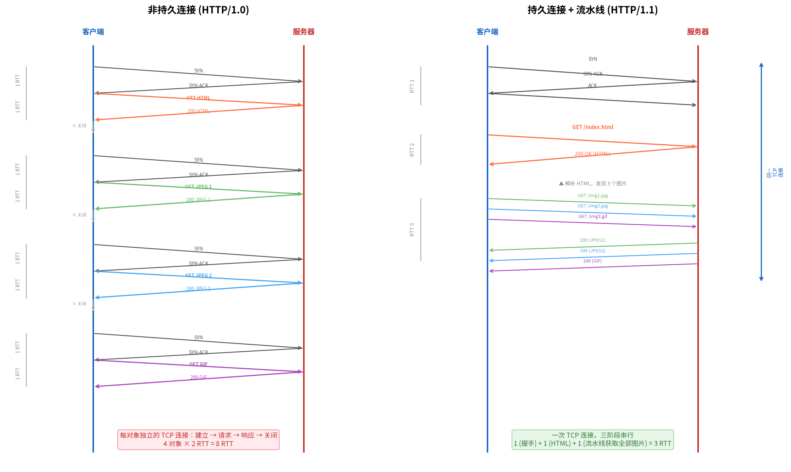

# HTTP 持久连接与非持久连接

> 参考：Kurose §2.2

HTTP 应用开发者需要决定每个请求/响应对是经过一个**单独的 TCP 连接**发送，还是所有的请求和响应经过**同一个 TCP 连接**发送。前者称为**非持久连接（non-persistent connection）**，后者称为**持久连接（persistent connection）**。



## 非持久 HTTP（HTTP/1.0 默认）

HTTP/1.0 **默认**使用非持久连接——每个 TCP 连接只传输**一个**请求报文和一个响应报文。HTTP/1.0 也支持通过 `Connection: keep-alive` 首部协商持久连接（客户端在请求中携带该首部，服务器在响应中确认），但这不是规范强制要求，实现支持参差不齐。以用户访问一个含基本 HTML 文件和 10 个 JPEG 图片的 Web 页面（共 11 个对象，均位于同一服务器）为例：

1. HTTP 客户端在端口 80 向服务器发起 TCP 连接
2. HTTP 客户端通过套接字发送 HTTP 请求报文（包含路径名 `/someDepartment/home.index`）
3. HTTP 服务器通过套接字接收请求报文，从磁盘获取对象，将其封装在 HTTP 响应报文中发送
4. HTTP 服务器通知 TCP 断开连接（但直到 TCP 确认客户端完整接收到响应报文后才实际断开）
5. HTTP 客户端接收响应报文，TCP 连接关闭。客户端从响应报文中提取 HTML 文件，发现引用了 10 个 JPEG 对象
6. 对每个 JPEG 对象重复步骤 1–4

每步涉及客户端向服务器请求一个对象并接收响应。注意步骤 4 中服务器"通知 TCP 断开连接"，但直到客户端也完成接收后连接才实际断开。

### 往返时间与响应时间

**[[时延丢包与吞吐量|往返时间（Round-Trip Time, RTT）]]**是客户端发送一个小分组到服务器并返回所需的时间。RTT 包含分组传播时延、在中间路由器和交换机的排队时延以及分组处理时延。

非持久 HTTP 的响应时间 = **2 RTT + 传输 HTML 文件的时间**：
- 第一个 RTT：建立 TCP 连接（三次握手）
- 第二个 RTT：发送 HTTP 请求并接收响应中最初的几个字节
- 然后加上服务器传输 HTML 文件所需的时间

```
客户端                                             服务器
  |                                                   |
  |--- TCP SYN (三次握手开始, 1 RTT) ---------------->|
  |                                                   |
  |--- HTTP GET 请求 (1 RTT) ------------------------>|
  |<---- HTTP 响应 (传输时间) -------------------------|
  |                                                   |
  总时间 = 2 RTT + 文件传输时间
```

### 非持久连接的缺点

- 每个请求对象都需要建立**新的 TCP 连接**——TCP 连接建立需要分配缓冲区、维护 TCP 变量，给服务器带来沉重负担
- 每个对象的延迟为 **2 RTT**
- 浏览器通常打开**并行 TCP 连接**（5–10 个）来减轻延迟，但这进一步加重服务器负担

## 持久 HTTP（HTTP/1.1，默认）

在持久连接方式中，服务器在发送响应后**保持 TCP 连接打开**——后续的请求和响应可以复用同一条连接。整个 Web 页面（基本 HTML 文件 + 所有引用对象）可以通过一条 TCP 连接发送。

持久连接还可以是**流水线式（pipelining）** 的——客户端可以在收到前一个响应**之前**发送新请求。非流水线式持久连接中，客户端在收到前一个响应后才发送下一个请求。

对于**流水线式**持久连接，以 1 个 HTML + 3 个图片的页面为例，响应时间 =
- **RTT 1**：TCP 三次握手
- **RTT 2**：发送 GET HTML 请求 → 接收 HTML 响应（此时客户端才解析 HTML 并发现图片 URL）
- **RTT 3**：连续发送全部图片 GET 请求（流水线，不等响应）→ 接收全部图片响应
- 总计：**3 RTT** + 传输时间

对于**非流水线式**持久连接（实际使用最广泛的方式），每个对象仍需 1 RTT（客户端必须在收到前一个响应后才发送下一个请求）。以上述页面为例：1 RTT（握手）+ 1 RTT（HTML）+ 3 RTT（3 个图片各 1 RTT）= **5 RTT** + 传输时间。

```
非流水线持久连接:
客户端                                             服务器
  |-- GET index.html (1 RTT 后) -------------------->|
  |<-- index.html ------------------------------------|
  |-- GET img1.jpg ---------------------------------->|
  |<-- img1.jpg --------------------------------------|
  |-- GET img2.jpg ---------------------------------->|
  |<-- img2.jpg --------------------------------------|

流水线持久连接:
客户端                                             服务器
  |-- GET index.html -------------------------------->|
  |-- GET img1.jpg (不等响应, 紧随发送) -------------->|
  |-- GET img2.jpg (不等响应, 紧随发送) -------------->|
  |<-- index.html ------------------------------------|
  |<-- img1.jpg --------------------------------------|
  |<-- img2.jpg --------------------------------------|
```

HTTP/1.1 默认使用持久连接，并**可选支持**流水线（pipelining）。实践中由于代理兼容性和队首阻塞问题，大多数浏览器和服务器并未启用流水线，实际使用的是非流水线的持久连接。

- [[HTTP]]
- [[HTTP报文格式]]
- [[TCP连接管理]]
