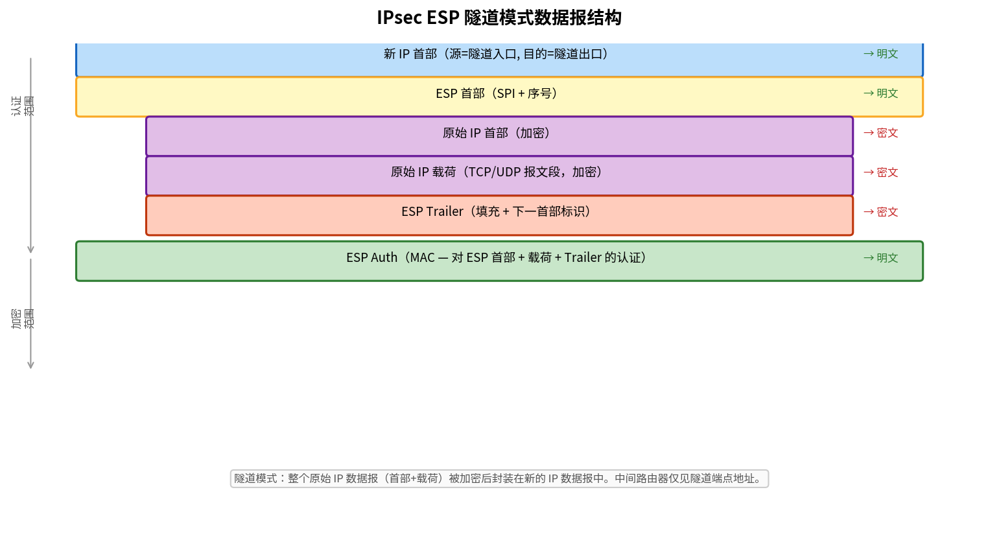

# IPsec 与 VPN

> 参考：Kurose §8.7

**IPsec（IP Security）**是为 IP 数据报提供机密性、完整性、源认证和抗重放保护的网络层安全协议族。它被广泛用于构建**虚拟专用网络（Virtual Private Network, VPN）**。

## IPsec 在网络层安全中的位置

不同于 TLS 仅保护单个 TCP 连接，IPsec 在网络层提供**覆盖式安全（blanket security）**——一旦部署，所有通过 IPsec 安全信道的流量（无论何种运输层协议和应用层协议）都自动受到保护。应用无需感知 IPsec 的存在。

## VPN 与 IPsec

**VPN** 通过公共因特网为地理上分散的站点提供安全的虚拟专用连接。IPsec 是实现 VPN 的最常用技术：

- 机构在各个分支网络的网关路由器上部署 IPsec
- 两个分支机构之间的流量经过 IPsec 加密后通过因特网传输
- 对于两端的内部主机来说，通信就像在专用网络中一样（透明）

典型应用场景：公司总部与分支办公室之间的安全通信、远程员工安全接入公司网络。

## IPsec 的两个核心协议

### AH（Authentication Header）

- 提供**源认证**和**数据完整性**
- 包含对整个 IP 数据报（除可变字段如 TTL）的 MAC
- **不提供加密**（无机密性）
- 协议号 51

### ESP（Encapsulation Security Payload）

- 提供**加密**、**源认证**和**数据完整性**
- 加密载荷（运输层报文段）+ ESP Trailer
- 包含对 ESP 头部和载荷的 MAC
- 协议号 50
- **比 AH 更常用**，因为提供完整的加密 + 认证

> 许多 VPN 部署仅使用 ESP（加密 + 认证），不使用 AH。

## 传输模式 vs 隧道模式

| | 传输模式 | 隧道模式 |
|---|---------|---------|
| **加密范围** | 仅 IP 数据报的**载荷**（运输层报文段），IP 首部不加密 | **整个原始 IP 数据报**（含首部）被加密 |
| **典型场景** | 端到端通信（两台主机之间） | 网关到网关（VPN 网关之间）、主机到网关（远程接入 VPN） |
| **IP 首部** | 使用原始 IP 首部，不隐藏源/目的地址 | 添加新的外层 IP 首部，隐藏内层 IP 地址 |

在隧道模式中，原始 IP 数据报被完整加密后作为新 IP 数据报的载荷。新 IP 首部的源和目的地址是隧道端点（两个 VPN 网关）的 IP 地址。中间路由器只看到隧道端点地址，无法获知实际通信的主机。

## 安全关联（Security Association, SA）

**SA** 是 IPsec 中单工的安全连接。每个 SA 定义了：
- **源和目的 IP 地址**
- **使用的协议**（AH 或 ESP）
- **加密算法和密钥**（如 AES-128）
- **认证算法和密钥**（如 [[消息认证码|HMAC]]-SHA-256）
- **安全参数索引（SPI, Security Parameter Index）**：32 比特标识符，用于在接收端查找对应的 SA

因为 SA 是单工的，双向通信需要**两个 SA**（每个方向一个）。SA 的信息存储在发送端和接收端的 **SAD（Security Association Database）**中。

## IPsec 数据报结构（ESP 隧道模式）

```
┌──────────────────────────────────────┐
│  新 IP 首部（源/目的 = 隧道端点）       │
├──────────────────────────────────────┤
│  ESP 首部（包含 SPI、序号）             │
├──────────────────────────────────────┤
│  原始 IP 首部（加密）                  │
├──────────────────────────────────────┤
│  原始 IP 载荷（加密）                  │
│  ...                                  │
├──────────────────────────────────────┤
│  ESP Trailer（填充 + 下一首部）         │
├──────────────────────────────────────┤
│  ESP Auth（MAC，对 ESP 首部+载荷+Trailer）│
└──────────────────────────────────────┘
```

序号字段用于**抗重放攻击**——接收方跟踪已接收的序号，拒绝重复序号。



## IKE：IPsec 的密钥管理

**Internet 密钥交换（Internet Key Exchange, IKE）**负责自动建立和管理 SA。IKE 使用 Diffie-Hellman 密钥交换在非安全信道上安全地协商共享密钥。

IKE 分为两个阶段：
- **IKE Phase 1**：建立 IKE SA（双向），用于保护后续的 Phase 2 协商
- **IKE Phase 2**：建立 IPsec SA（两个单工 SA，供 AH/ESP 使用）

## SPD（Security Policy Database）

除 SAD 外，IPsec 还维护 **SPD**，为每个数据报指定安全策略（哪类流量需要 IPsec 处理）：
- **DISCARD**：丢弃数据报
- **BYPASS**：不经过 IPsec 处理，直接转发
- **PROTECT**：应用 IPsec 保护（根据 SAD 中的 SA）

- [[IPv4数据报格式]]
- [[TLS]]
- [[对称密钥密码学]]
- [[公开密钥密码学]]
- [[防火墙与入侵检测系统]]
