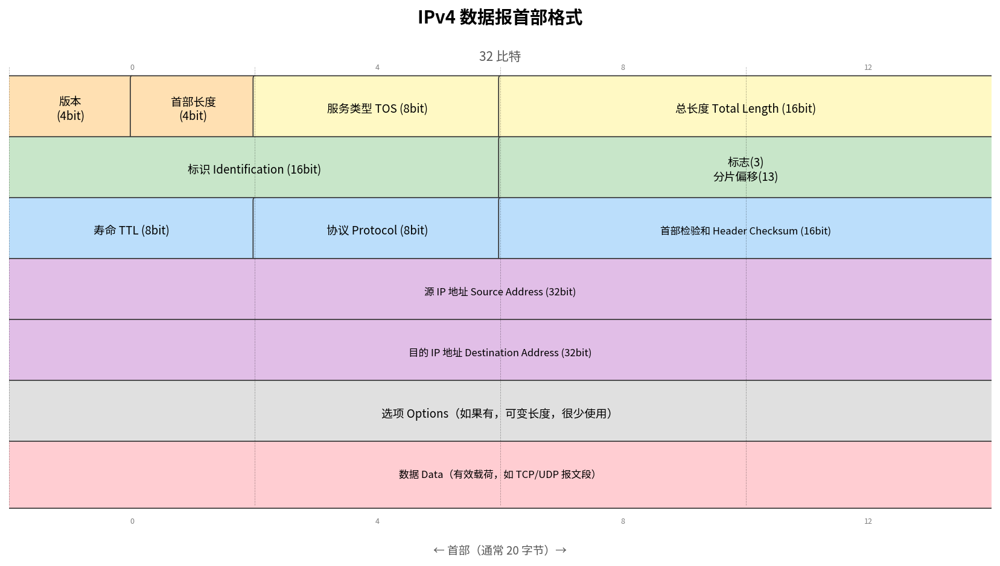

# IPv4 数据报格式

> 参考：Kurose §4.3.1

IPv4 是因特网中广泛部署的网络层协议版本。网络层分组称为**数据报（datagram）**。IPv4 数据报首部通常为 **20 字节**（不含选项）。如果数据报承载 TCP 报文段，则总开销为 40 字节（20 字节 IP 首部 + 20 字节 TCP 首部）。

## IPv4 首部字段

### 各字段说明

**版本号（Version，4 比特）**：指定 IP 协议版本。IPv4 值为 4。路由器通过版本号确定如何解释数据报的其余部分。

**首部长度（IHL，4 比特）**：以 4 字节为单位指示首部的长度。由于选项可能使首部长度变化，此字段用于确定数据（有效载荷）的起始位置。典型值为 5（5 × 4 = 20 字节）。

**服务类型（TOS，8 比特）**：允许网络管理员区分不同类型的 IP 数据报。该字段已被重新定义为 **DSCP（Differentiated Services Code Point，前 6 比特）**加 **ECN（Explicit Congestion Notification，后 2 比特）**。DSCP 用于定义每跳行为（PHB）；ECN 用于[[ECN|显式拥塞通知]]。

**数据报长度（Total Length，16 比特）**：IP 数据报的总长度（首部 + 数据），以字节为单位。理论最大值为 65,535 字节，但实践中很少超过 1,500 字节。

**标识、标志、分片偏移（共 32 比特）**：用于 IP 分片。这些字段在 [[IP分片]] 中有详细讨论。IPv6 不允许分片。

**寿命（TTL，8 比特）**：确保数据报不会在网络中永久循环（如因长期存在的路由环路）。每经过一个路由器，TTL 减 1。当 TTL 为 0 时，路由器必须丢弃该数据报并通常发送 ICMP 消息。

**协议（Protocol，8 比特）**：指示数据部分应传递给哪个运输层协议。值 6 表示 TCP，值 17 表示 UDP。协议号是捆绑**网络层和运输层**的胶水——类似于端口号捆绑运输层和应用层。

**首部检验和（Header Checksum，16 比特）**：帮助路由器检测 IP 首部中的比特错误。

**计算方式**：与 [[UDP]] 检验和完全相同——**反码求和（Internet checksum）**，即对首部所有 16 比特字做二进制加法并进位回卷（carry wrap-around），最后逐位取反。发送方计算时检验和字段暂填 0。

**覆盖范围**：**仅 IP 首部**（含选项，不含数据）。与 UDP/TCP 检验和的区别在于：IP 检验和**不使用伪首部**——它不引入 IP 地址或协议号参与计算，纯粹校验首部自身的比特完整性。数据部分的差错检测由运输层（[[UDP]] / [[TCP报文段结构|TCP]]）的检验和负责。

**每跳重算**：每个路由器都必须重新计算检验和——因为 TTL 字段每次转发减 1，首部内容变了，检验和必须跟着更新。这是 IPv4 设计的一个低效之处：路由器每次转发都需要遍历整个首部。[[IPv6]] 因此取消了首部检验和，让运输层全权负责差错检测。

> TCP/IP 在网络层和运输层都做差错检测的原因：（1）IP 仅校验首部，运输层校验首部+数据，分工不同；（2）TCP 在原则上可以运行在不同的网络协议上，运输层不应依赖网络层的差错检测。

**源和目的 IP 地址（各 32 比特）**：发送方创建数据报时插入。源主机通常通过 DNS 查找确定目的 IP 地址。

**选项（Options，可变长度）**：允许扩展 IP 首部，但很少使用。由于选项使首部长度可变，给高性能路由器的 IP 处理带来挑战。IPv6 首部不再包含此字段。

**数据（有效载荷）**：通常包含运输层报文段（TCP 或 UDP），也可以携带 ICMP 报文等其他类型数据。

- [[IP分片]]
- [[IPv4编址]]
- [[IPv6]]
- [[DHCP]]
- [[NAT]]
- [[ICMP]]
- [[路由器体系结构]]
