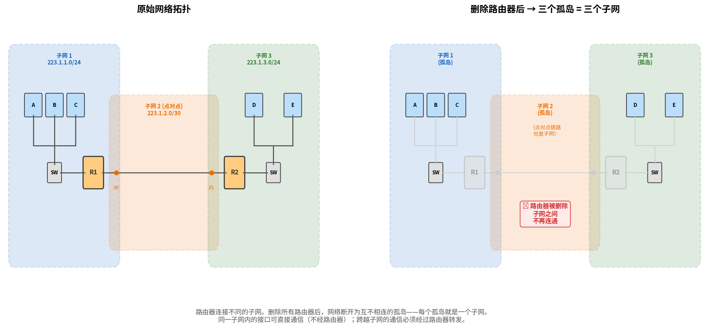
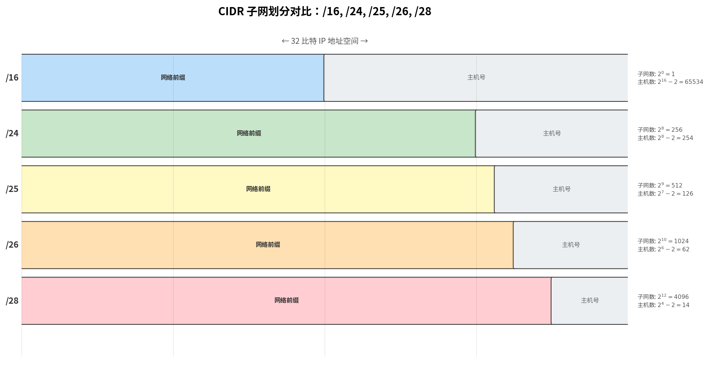

# IPv4 编址

> 参考：Kurose §4.3.3

IPv4 地址长度为 **32 比特**（4 字节），共有约 40 亿个可能的地址。通常以**点分十进制记法（dotted-decimal notation）**书写，如 193.32.216.9，其中每个字节以十进制形式书写，用点分隔。

## 接口与子网

IP 地址在技术上与**接口（interface）**相关联，而非主机或路由器本身。主机通常只有一个到网络的链路（一个接口），而路由器有多个接口（每个链路一个）。

**子网（subnet）** 是由**没有路由器隔开**的一组接口构成的网络片段。一个实用的判定方法是：在网络拓扑图中**删除所有路由器**（或删除所有连接到路由器的链路），剩余的每个互连孤岛就是一个子网：

```
原始拓扑：                         删除路由器（用 ✕ 标记）后：

 主机A ──┐                            主机A ──┐
 主机B ──┼── [交换机] ── [R1]          主机B ──┼── [交换机]        ← 子网1
 主机C ──┘                            主机C ──┘

                   [R1] ────────── [R2]                         ← 子网2（R1-R2 之间）
                                                                  点对点链路也是一个子网

                                    [R2] ── [交换机] ── 主机D    ← 子网3
                                    [R2] ── 主机E               ← 子网4
```

删除路由器后，连在一起的就是同一个子网，断开的就是不同子网。



上图中产生了三个子网——每个子网内的接口可以直接通信（不需要经过路由器），跨越子网的通信则必须经过路由器转发。

在地址层面，子网通过 **CIDR 记法 a.b.c.d/x** 来表达，其中 /x（「斜杠 x」）称为**子网掩码**，表示 32 比特地址中**最左侧的 x 比特**定义了子网地址（网络前缀），同一子网内所有接口的这 x 位必须相同。后 32−x 位用于区分子网内部的不同主机。

## CIDR 与无分类编址

因特网的地址分配策略称为**无分类域间路由（Classless Interdomain Routing, CIDR）**。CIDR 推广了子网编址的概念，将 32 比特 IP 地址分为两部分：前 x 比特为**网络前缀（network prefix）**，剩余 32−x 比特用于区分组织内部的设备。

在 CIDR 之前，IP 地址的网络部分被限制为 8、16 或 24 比特（分别对应 A、B、C 类网络）。C 类（/24）子网仅支持 254 台主机，B 类（/16）支持 65,534 台——对于有 2,000 台主机的组织来说，B 类地址造成了巨大浪费。CIDR 解决了这一问题。

## 子网掩码确定地址范围

CIDR 记法 `a.b.c.d/x` 将 32 比特 IP 地址分为两部分：**前 x 位为网络前缀**（子网内所有接口相同），**后 32−x 位为主机号**（子网内可变）。地址范围的计算步骤：

1. 将 IP 地址转换为 32 位二进制
2. 将前 x 位固定为网络前缀，后 32−x 位从全 0 到全 1 遍历
3. **主机位全 0** = 网络地址（标识子网本身，不可分配给接口）
4. **主机位全 1** = 广播地址（定向广播到该子网所有接口，不可分配）
5. 网络地址与广播地址之间的地址即为可用主机地址

以 `223.1.1.0/24` 为例：

```
223 . 1 . 1 . 0
11011111 00000001 00000001 00000000   ← 主机位全 0 = 网络地址 223.1.1.0
                             └──┬──┘
                            8位主机号
11011111 00000001 00000001 11111111   ← 主机位全 1 = 广播地址 223.1.1.255
```

可用范围：223.1.1.1 ~ 223.1.1.254（共 $2^8 - 2 = 254$ 个地址）。

以 `223.1.1.0/26` 为例（掩码 255.255.255.192）：

```
223 . 1 . 1 . 0
11011111 00000001 00000001 00 000000   ← 网络地址 223.1.1.0
                               └─┬─┘
                              6位主机号
11011111 00000001 00000001 00 111111   ← 广播地址 223.1.1.63
```

可用范围：223.1.1.1 ~ 223.1.1.62（共 $2^6 - 2 = 62$ 个地址）。

**常用子网掩码速查：**

| 子网掩码 | 主机位数 | 总地址数 | 可用地址数 |
|---------|---------|---------|-----------|
| /24 (255.255.255.0) | 8 | 256 | 254 |
| /25 (255.255.255.128) | 7 | 128 | 126 |
| /26 (255.255.255.192) | 6 | 64 | 62 |
| /27 (255.255.255.224) | 5 | 32 | 30 |
| /28 (255.255.255.240) | 4 | 16 | 14 |

> 核心规律：`/x` → 主机位 = 32−x → 地址总数 = $2^{32-x}$。从网络地址起算，连续 $2^{32-x}$ 个地址属于该子网。



### 地址聚合

CIDR 的一个重要能力是**地址聚合（address aggregation，也称路由聚合 route aggregation 或路由汇总 route summarization）**。ISP 可以向外部世界通告单个前缀来代表多个组织。例如，ISP 通告 200.23.16.0/20，外界无需知道内部有八个组织各自拥有子网块。这极大减小了转发表的规模。

但当地址不按层次分配时，可能需要使用更具体的路由。例如，如果 Organization 1 的地址 200.23.18.0/23 同时被两个不同的 ISP 通告，外部路由器将使用**最长前缀匹配**选择具有最长（最具体）匹配前缀的路由。

## 获取地址块与主机地址

### 获取地址块

网络管理员联系其 ISP，ISP 从已分配的大地址块中提供地址。IP 地址由 **ICANN（Internet Corporation for Assigned Names and Numbers）**管理，ICANN 将地址分配给区域因特网注册机构（如 ARIN、RIPE、APNIC、LACNIC）。

### DHCP：获取主机地址

一旦组织获得地址块，可以通过**动态主机配置协议（DHCP）**自动为各主机分配 IP 地址。DHCP 是一种即插即用协议。

### 广播地址

IP 广播分两种：

| 类型 | 地址格式 | 路由器转发？ | 用途 |
|------|---------|------------|------|
| **定向广播** (directed broadcast) | 子网广播地址，主机位全 1（如 223.1.1.63/26） | 理论上可跨路由器，但通常被管理员阻塞（安全原因） | 向特定远程子网的所有主机发送 |
| **受限广播** (limited broadcast) | `255.255.255.255` | **路由器绝不转发** | 子网内通信（如 DHCP 发现） |

> `255.255.255.255` 之所以被局限在同一子网，根本原因是**路由器收到目的地址为 255.255.255.255 的数据报后直接丢弃，不转发**。

**受限广播的逐层工作机制：**

1. **IP 层**：主机将目的地址设为 `255.255.255.255`
2. **链路层**：将该地址映射到链路层广播地址（以太网中为 `FF:FF:FF:FF:FF:FF`），帧在整个广播域内传播
3. **交换机**：收到链路层广播帧后泛洪到所有端口，同一广播域内的所有节点均能收到
4. **路由器**：收到该帧后终止——不转发到其他网络，构成广播域边界

以 DHCP 发现为例的完整流程：

```
主机 (DHCP 客户端) → IP 层: dst=255.255.255.255, src=0.0.0.0
                   → 链路层: dst=FF:FF:FF:FF:FF:FF
                   → 交换机: 泛洪到所有端口（同一广播域）
                   → 同子网内所有主机和 DHCP 服务器收到
                   → 路由器: 丢弃，不向其他子网转发
```

受限广播的覆盖范围"天然"等于子网范围，因为**链路层广播域 = 路由器边界 = 子网边界**。这也解释了为何路由器被称为广播域的分隔点。

- [[IPv4数据报格式]]
- [[DHCP]]
- [[NAT]]
- [[DNS]]
- [[BGP]]
- [[链路层寻址与ARP]]
- [[IP多播]]
