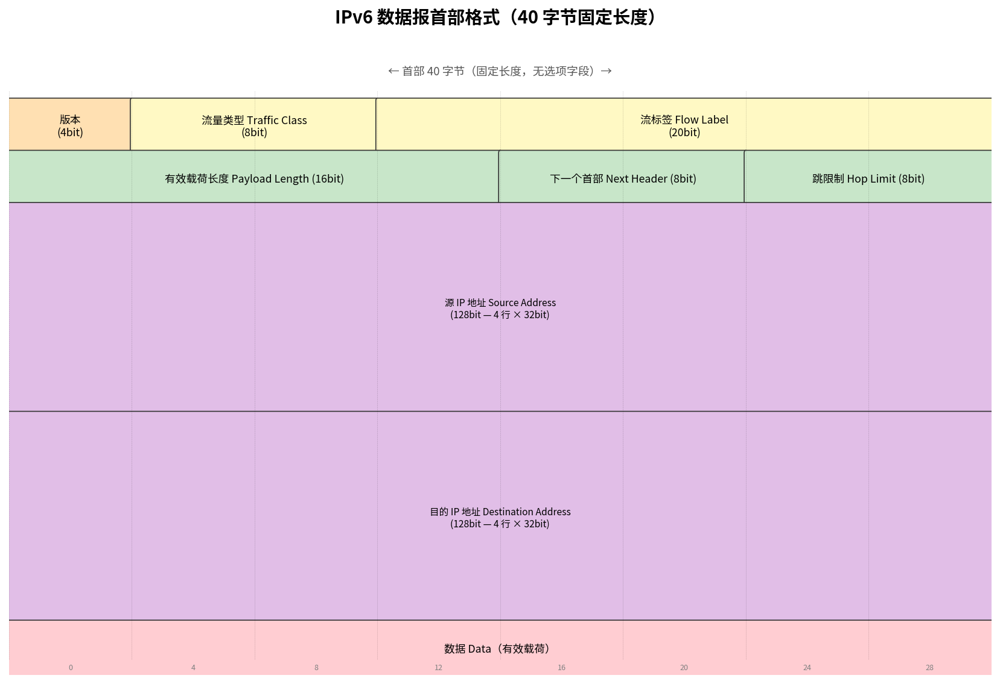

# IPv6

> 参考：Kurose §4.3.6

在 1990 年代初期，IETF 开始开发 IPv4 的继任协议。主要动机是 32 比特 IPv4 地址空间开始被耗尽。此外，IPv6 的设计者还利用此机会基于 IPv4 的运营经验调整和增强了其他方面。

## IPv6 数据报格式

IPv6 最重要的变化体现在数据报格式中：

**扩展的寻址能力**：IPv6 将 IP 地址从 32 比特增加到 **128 比特**。除了单播和组播地址外，还引入了一种新地址类型——**任播地址（anycast address）**，允许将数据报交付给一组主机中的任意一个。

**精简的 40 字节固定长度首部**：若干 IPv4 字段被删除或变为可选，使路由器更快处理。

**流标签（Flow Labeling）**：允许标记属于特定流的分组以获得特殊处理（如非默认 QoS 或实时服务）。

IPv6 数据报各字段：

- **版本（4 比特）**：标识 IP 版本号，IPv6 值为 6
- **流量类型（Traffic Class，8 比特）**：类似于 IPv4 的 TOS 字段，用于为流内的某些数据报或某些应用提供优先权
- **流标签（Flow Label，20 比特）**：用于标识数据报的流
- **有效载荷长度（Payload Length，16 比特）**：无符号整数，表示 40 字节固定首部之后的数据字节数
- **下一个首部（Next Header，8 比特）**：标识数据字段将交付给哪个协议（如 TCP 或 UDP）。使用与 IPv4 协议字段相同的值
- **跳限制（Hop Limit，8 比特）**：每经过一个路由器减 1，达到零时丢弃
- **源和目的地址（各 128 比特）**
- **数据（有效载荷）**

## IPv6 中删除的 IPv4 字段

**分片/重组**：IPv6 **不允许在中间路由器进行分片和重组**；这些操作只能由源和目的地执行。如果收到的 IPv6 数据报对出链路太大，路由器丢弃数据报并发送"Packet Too Big"ICMP 错误消息。将分片功能从路由器移出显著加快了 IP 转发速度。

**首部检验和**：由于运输层（TCP/UDP）和链路层（以太网）都执行检验和，网络层的检验和被认为是多余的。此外，IPv4 的 TTL 每次变化均需重新计算检验和——在 IPv6 中消除了这一开销。

**选项**：选项字段不再是标准 IP 首部的一部分，而是作为"下一个首部"的一种可能。

## IPv6 地址自动配置

IPv6 支持两种自动配置方法：

### 无状态地址自动配置（SLAAC）

**SLAAC（Stateless Address Autoconfiguration）**是 IPv6 的一项关键功能——主机无需 DHCP 服务器即可自动配置自己的 IPv6 地址。过程：

1. 主机生成一个**链路本地地址**（前缀 `fe80::/10`），用于与同链路上的其他设备通信
2. 主机向路由器发送 **Router Solicitation** 消息
3. 路由器回复 **Router Advertisement**，包含网络前缀（如 `2001:db8::/64`）
4. 主机将 64 位前缀与自己的 **64 位接口标识符**（由 MAC 地址经 EUI-64 算法生成）拼接，形成完整的 128 位 IPv6 地址
5. 主机执行**重复地址检测（DAD）**确保地址唯一

SLAAC 是"无状态"的——不需要服务器追踪已分配的地址。这极大简化了网络管理，是 IPv6 相较 IPv4 的重要改进。

然而，使用 EUI-64 生成的接口标识符基于 MAC 地址，在不同网络中始终保持不变。这意味着设备从一个网络移动到另一个网络时，其 IPv6 地址的**后 64 位不变**，可以被用来追踪该设备。为此，**隐私扩展（Privacy Extensions，RFC 4941）**定义了一种替代方法：使用伪随机算法生成**临时接口标识符**，定期更换，防止设备被跨网络追踪。现代操作系统通常默认同时生成稳定的 EUI-64 地址（用于接受连接）和临时地址（用于发起外向连接）。

### DHCPv6

对于需要更精细控制的环境，**DHCPv6** 提供有状态地址分配，类似于 IPv4 的 DHCP，但增加了 IPv6 特定的选项。详见 [[DHCPv6]]。

## 从 IPv4 到 IPv6 的过渡

已部署的 IPv4 系统无法处理 IPv6 数据报，因此向 IPv6 的过渡是一个重大挑战。两种主要的过渡策略是**双协议栈**和**隧道**。

### 双协议栈

**双协议栈（Dual Stack）**是最基本的过渡方法——节点同时运行 IPv4 和 IPv6 协议栈。双协议栈节点可以：
- 与 IPv4 节点使用 IPv4 通信
- 与 IPv6 节点使用 IPv6 通信
- 通过 DNS 查询返回的地址类型决定使用哪个版本（A 记录→IPv4，AAAA 记录→IPv6）

双协议栈的缺点是每个节点需要维护两套协议栈、两套地址和两套路由表，增加了复杂度。此外双协议栈不解决 IPv4 地址耗尽的问题——每个节点仍需要一个 IPv4 地址。

### 隧道

基本思想：假设两个 IPv6 节点（如 B 和 E）希望通过 IPv6 数据报通信，但被中间的 IPv4 路由器隔开。中间这组 IPv4 路由器称为一个**隧道**。使用隧道时：

1. 隧道发送侧的 IPv6 节点（B）将**整个 IPv6 数据报**放入一个 IPv4 数据报的**数据（有效载荷）字段**中
2. IPv4 数据报的协议号设为 **41**（指示有效载荷为 IPv6 数据报）
3. 该 IPv4 数据报被寻址到隧道接收侧的 IPv6 节点（E）
4. 隧道中的 IPv4 路由器在彼此之间路由该 IPv4 数据报，完全不知其包含完整的 IPv6 数据报
5. 隧道接收侧的 IPv6 节点（E）接收 IPv4 数据报，确定其包含 IPv6 数据报，提取并路由 IPv6 数据报

## IPv6 的现状

虽然 IPv6 的采用最初进展缓慢，但势头正在增强。推动力包括：IP 电话和便携设备的普及；欧洲 3GPP 已将 IPv6 指定为移动多媒体的标准寻址方案。Google 报告全球约 45% 的客户端通过 IPv6 访问其服务（2026 年数据），许多国家已超过 60%。IPv6 采用在过去十年中持续加速。

从 IPv6 经验中得出的重要教训是：改变**网络层协议极其困难**——就像更换一栋房子的地基。相比之下，应用层新协议的部署极为迅速——就像给房子刷一层新漆。

- [[IPv4数据报格式]]
- [[IPv4编址]]
- [[ICMP]]
- [[DHCP]]
- [[DHCPv6]]
- [[IPv6邻居发现协议]]
- [[NAT]]
- [[IP多播]]
- [[IP分片]]
- [[通用转发与SDN数据平面]]
- [[网络层概述]]
