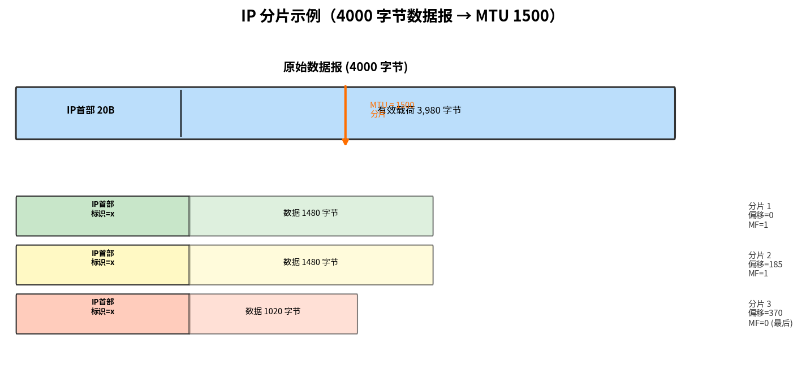

# IP 分片

> 参考：Kurose §4.3.2

并非所有链路层协议都能承载相同大小的网络层分组。链路层帧能承载的最大数据量称为**最大传输单元（Maximum Transmission Unit, MTU）**。以太网帧的 MTU 为 **1,500 字节**，某些广域网链路的 MTU 为 **576 字节**。

问题在于：发送方和目的地之间路径上的每条链路可能使用**不同的链路层协议**，每种协议具有**不同的 MTU**。当路由器收到一个需要从出链路转发的 IP 数据报，而出链路 MTU 小于该数据报的长度时，需要通过**分片（fragmentation）**来解决。

## 分片原理

分片的过程：将原始 IP 数据报的有效载荷分成两个或多个较小的 IP 数据报（称为**分片 fragment**），每个分片封装在单独的链路层帧中，通过出链路发送。分片在到达目的地之前的路径上**可以被再次分片**。

**重组（reassembly）**由**目的端系统**执行，而非网络路由器。IPv4 的设计者遵循了保持网络核心简单的原则——在路由器中重组数据报会引入显著的复杂性并降低路由器性能。

## 分片相关字段

IPv4 数据报首部中使用三个字段支持分片和重组：

- **标识（Identification，16 比特）**：发送主机为每个数据报标记一个标识号。当数据报被分片时，所有分片携带与原始数据报相同的标识号。通常发送主机对每个发送的数据报递增标识号
- **标志（Flags，3 比特）**：第 0 位保留（必须为 0），第 1 位为 **DF（Don't Fragment，不分片）**——置 1 时路由器不对此数据报分片（若超出 MTU 则丢弃并发送 ICMP 差错报文，用于**路径 MTU 发现 PMTUD**），第 2 位为 **MF（More Fragments）**——最后一个分片的 MF 设为 **0**，所有其他分片的 MF 设为 **1**
- **分片偏移（Fragmentation Offset，13 比特）**：指定该分片中的数据在原始数据报有效载荷中的**起始位置**，以 **8 字节为单位**

## 分片示例

一个 **4,000 字节**的数据报（20 字节 IP 首部 + 3,980 字节有效载荷）到达路由器，需要转发到 MTU 为 **1,500 字节**的链路。

由于 MTU = 1,500，每个分片最多包含 1,500 字节（含 20 字节 IP 首部），即每个分片最多承载 **1,480 字节数据**。但 1,480 必须能被 8 整除（偏移以 8 字节为单位），而 1,480 / 8 = 185 ✓。

### 目的端的重组

当目的主机收到分片时：
1. 检查每个分片的**标识**字段，确定哪些分片属于同一原始数据报
2. 使用**偏移**字段确定分片的顺序
3. 使用**标志**字段确定何时收到了最后一个分片（MF = 0）
4. 将数据部分按偏移顺序拼接，还原原始有效载荷

如果任意分片丢失（IP 是不可靠服务），整个原始数据报将被丢弃——TCP 层面会检测到丢包并触发重传。

## IPv6 的不同处理

IPv6 **不允许**在中间路由器进行分片。如果 IPv6 数据报对出链路太大，路由器**丢弃数据报**并向发送方发送 ICMP "Packet Too Big"消息。分片和重组只能由源和目的地执行。这显著加快了 IP 转发速度。

- [[IPv4数据报格式]]
- [[IPv6]]
- [[路由器体系结构]]
- [[MTU与MSS]]
- [[网络层概述]]
- [[IPv4编址]]
