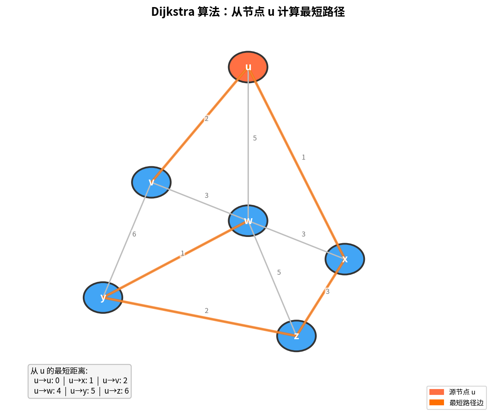

# LS 路由算法

> 参考：Kurose §5.2.1

**链路状态（Link-State, LS）算法**是一种集中式路由算法——算法在执行前拥有网络的完整信息（所有节点的连通性和所有链路的代价）。这分为两个阶段：

**阶段一：链路状态洪泛（Link-State Flooding）**

每个路由器向网络中所有其他路由器广播自己的**链路状态分组（LSA, Link State Advertisement）**。一个 LSA 包含两类信息：

- **拓扑信息**：该路由器连接着哪些邻居路由器，每条链路的代价是多少
- **地址信息**：该路由器每个接口所连的**子网前缀**（如 `223.1.3.0/24`）

洪泛完成后，每个路由器都拥有一份完全相同的**链路状态数据库（LSDB）**——既知道全网拓扑（谁连着谁），也知道每个路由器接口上挂着哪些子网（IP 地址在图中的哪个位置）。

**阶段二：路由计算**

每个路由器以自己为源，在 LSDB 这张完整地图上运行 Dijkstra 算法，算出到每个目的地子网的最短路径和下一跳，生成转发表。

由于算法需要知道网络中每条链路的代价，LS 算法也称为具有**全局状态信息**的算法。整个过程主机不参与——只有路由器之间交换链路状态和计算路由。

## Dijkstra 算法

LS 路由算法使用 **Dijkstra 算法**，计算从一个源节点 $u$ 到网络中所有其他节点的最低代价路径。



定义以下符号：

- $D(v)$：算法当前迭代中从源到目的 $v$ 的最低代价路径代价
- $p(v)$：从源到 $v$ 的当前最低代价路径上 $v$ 的前一节点
- $N'$：节点子集；如果从源到 $v$ 的最低代价路径已确定，$v$ 在 $N'$ 中

算法由一个初始化步骤和一个循环组成，循环执行次数等于网络中节点数。终止时，算法已计算出从源节点 $u$ 到网络中每个其他节点的最短路径。

伪代码：

```
初始化：
  N' = {u}
  for all nodes v:
    if v is a neighbor of u:
      then D(v) = c(u, v)
    else D(v) = ∞

循环：
  find w not in N' such that D(w) is a minimum
  add w to N'
  update D(v) for each neighbor v of w and not in N':
    D(v) = min(D(v), D(w) + c(w, v))
until N' = N
```

## Dijkstra 算法的执行示例

对于教材中的示例网络，从节点 $u$ 开始的算法计算过程：

| 步骤 | N' | D(v), p(v) | D(w), p(w) | D(x), p(x) | D(y), p(y) | D(z), p(z) |
|------|-----|-----------|-----------|-----------|-----------|-----------|
| 0 | u | 2, u | 5, u | 1, u | ∞ | ∞ |
| 1 | ux | 2, u | 4, x | | 2, x | ∞ |
| 2 | uxy | 2, u | 3, y | | | 4, y |
| 3 | uxyv | | 3, y | | | 4, y |
| 4 | uxyvw | | | | | 4, y |
| 5 | uxyvwz | | | | | |

最终，节点 $u$ 中的转发表由每个目的地的**最低代价路径上的下一跳节点**确定。

## 从算法输出构建转发表

Dijkstra 算法完成后，每个节点得到的是 **上一跳信息**（$p(v)$ = 到 $v$ 的最短路径上 $v$ 的前一个节点），而转发表需要的是**下一跳信息**。需要一次推导：

> 对于每个目的地 $v$，从 $v$ 出发沿着 $p(v)$ 反向溯源，直到追溯到 $u$ 的某个直接邻居为止。那个直接邻居就是 $u$ 到 $v$ 的**下一跳**。

从上面表格中 $u$ 为源的最终结果推导：

| 目的地 | 前一跳 p(v) | 溯源过程 | 下一跳 |
|:---:|:---|:---|:---:|
| **v** | p(v) = u | u 是源本身 → 直接邻居就是 v | **v** |
| **x** | p(x) = u | u 是源本身 → 直接邻居就是 x | **x** |
| **y** | p(y) = x | y ← x ← u，u 的直接邻居是 x | **x** |
| **w** | p(w) = y | w ← y ← x ← u，u 的直接邻居是 x | **x** |
| **z** | p(z) = y | z ← y ← x ← u，u 的直接邻居是 x | **x** |

因此 $u$ 的最终转发表为：

| 目的地 | 出链路（下一跳） |
|:---|:---|
| v | (u→v) |
| w | (u→x) |
| x | (u→x) |
| y | (u→x) |
| z | (u→x) |

这种推导每个节点都独立运行——但由于所有节点拥有相同的 LS 数据库且运行相同的 Dijkstra 算法，转发表之间不会出现冲突或环路。

更一般地说，对于任一路由器 $R$ 运行 Dijkstra 后：

1. 对于每个目的地 $d$，查 $p(d)$，获得最短路径上 $d$ 之前的最后一跳
2. 重复查 $p(\cdot)$ 直到遇到 $R$ 自己的邻居 $n$
3. $(d, n)$ 写入转发表：「去 $d$ 的，从接口连 $n$ 的方向走」

## 计算复杂度

给定 $n$ 个节点（不含源），最坏情况下需要搜索的总节点数为 $\frac{n(n+1)}{2}$——前述实现的复杂度为 **$O(n^2)$**。使用堆数据结构可将寻找最小值的复杂度降为对数级别，从而降低总体复杂度。

## 振荡问题

当链路代价取决于链路上承载的流量时，LS 算法可能出现路径振荡。例如，当链路代价反映延迟（与负载相关）时，节点可能反复在顺时针和逆时针路径之间切换。

解决方案包括：
1. 要求链路代价**不依赖于承载的流量**（但违背了路由的主要目标之一——避开拥塞链路）
2. 确保**并非所有路由器同时运行 LS 算法**——每个路由器随机化发送链路通告的时间以防止自同步（研究发现路由器可能自我同步，导致同步振荡）

- [[DV路由算法]]
- [[OSPF]]
- [[网络层控制平面概述]]
- [[SDN控制平面]]
