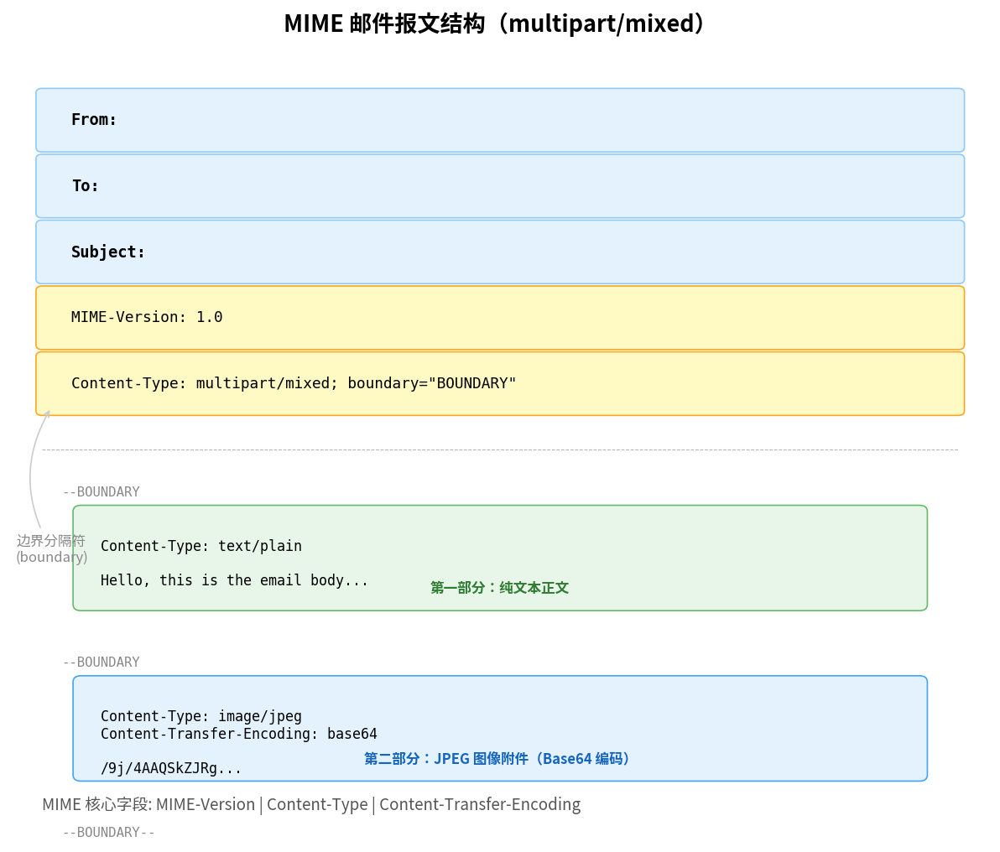

# MIME（多用途因特网邮件扩展）

> 参考：Kurose §2.3.3

**MIME（Multipurpose Internet Mail Extensions，多用途因特网邮件扩展）**是对因特网邮件格式的扩展标准。SMTP 最初只能传输 7 比特 ASCII 编码的纯文本——无法处理非英语字符（如中文、日语）、非文本附件（图像、音频、视频）或包含多种内容类型的复合邮件。MIME 通过增加首部行描述了邮件主体中的数据类型和编码方式，使邮件客户端能正确解码和显示丰富内容。

虽然 MIME 最初为电子邮件设计，但其核心概念（`Content-Type`、内容编码）已被 [[HTTP]]、[[SIP]] 等协议采纳——HTTP 的 `Content-Type: application/json` 就是 MIME 类型的直接应用。

## MIME 新增的首部行

MIME 邮件的首部行在标准 RFC 5322 首部（`From:`、`To:`、`Subject:`）的基础上增加了三个关键字段：

```
From: alice@crepes.fr
To: bob@hamburger.edu
Subject: Picture of yummy crepe.
MIME-Version: 1.0
Content-Transfer-Encoding: base64
Content-Type: image/jpeg

（base64 编码的图像数据 ...）
```

### MIME-Version

标识 MIME 规范的版本。当前为 `1.0`。此字段的存在向接收方用户代理表明邮件可能包含非 ASCII 内容。

### Content-Transfer-Encoding

指示邮件主体中二进制数据的**编码方式**。二进制数据（如图像字节）不能通过只支持 7 比特 ASCII 的 SMTP 直接传输，必须转换为 ASCII 可打印字符序列。

两种常用编码：

| 编码 | 方式 | 膨胀率 |
|------|------|--------|
| **Base64** | 每 3 字节（24 比特）编码为 4 个 ASCII 字符 | 约 33%（3→4） |
| **Quoted-Printable** | 大部分 ASCII 字符保持原样，非 ASCII 字节编码为 `=XX`（XX 为十六进制） | 对英文邮件几乎为 0%，对二进制为 200%+ |

Base64 适合二进制附件；Quoted-Printable 适合以 ASCII 为主含少量特殊字符的文本（如带有少量中文字符的邮件）。

### Content-Type

指示主体中媒体数据的 **MIME 类型**（类型/子类型），使接收方邮件阅读器知道如何正确显示。常见类型：

| MIME 类型 | 说明 |
|-----------|------|
| `text/plain` | 普通无格式文本 |
| `text/html` | HTML 格式邮件 |
| `image/jpeg` | JPEG 图像 |
| `image/png` | PNG 图像 |
| `audio/basic` | 基本音频 |
| `video/mpeg` | MPEG 视频 |
| `application/pdf` | PDF 文档 |
| `application/msword` | Microsoft Word 文档 |
| `application/octet-stream` | 通用二进制数据（接收方应下载保存） |

### Content-Disposition（常用扩展）

非 MIME 标准的正式字段，但几乎所有现代邮件客户端支持，用于指示内容的展示方式：
- `inline`：在主邮件视图中直接显示（如图像嵌入邮件正文）
- `attachment`：作为可下载保存的附件

## Multipart 类型

`multipart/mixed` 类型允许**单个邮件**包含多种不同内容类型——邮件正文可以是纯文本，同时附带的 JPEG 图片作为附件。每个部分有自己的 `Content-Type` 和 `Content-Transfer-Encoding`，各部分之间由**边界标记（boundary）**分隔。

```
Content-Type: multipart/mixed; boundary="----=_Part_0"

------=_Part_0
Content-Type: text/plain

邮件正文内容...

------=_Part_0
Content-Type: image/jpeg
Content-Transfer-Encoding: base64

/9j/4AAQSkZJRg...（base64 编码的图像数据）

------=_Part_0--
```

其他常见 multipart 子类型：
- `multipart/alternative`：不同版本的同内容（如 `text/plain` + `text/html`，客户端选择可显示的版本）
- `multipart/related`：各部分相互引用（如 HTML 邮件引用嵌入式图像）



## MIME 在 HTTP 中的应用

[[HTTP报文格式|HTTP]] 借用了 MIME 的 `Content-Type` 概念。HTTP 响应中的 `Content-Type` 头告诉浏览器如何解析响应体：

```
HTTP/1.1 200 OK
Content-Type: text/html; charset=utf-8

<html>...</html>
```

HTTP 使用的常见 MIME 类型：
| MIME 类型 | HTTP 用途 |
|-----------|----------|
| `text/html` | Web 页面 |
| `application/json` | API 响应 |
| `image/svg+xml` | SVG 矢量图 |
| `application/javascript` | JS 脚本 |

- [[电子邮件与SMTP]]
- [[HTTP报文格式]]
- [[POP3与IMAP]]
- [[安全电子邮件]]
