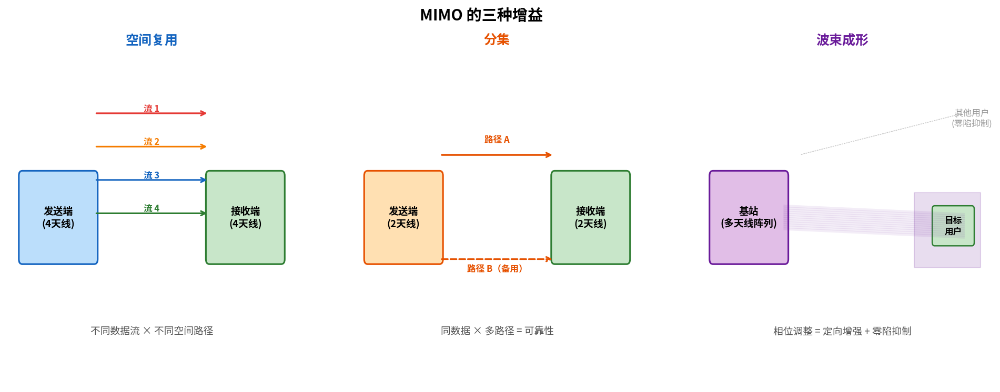

# MIMO（多输入多输出）

> 参考：Kurose §7.3.2, §7.4.2

**MIMO（Multiple-Input Multiple-Output，多输入多输出）**是一种在发送端和接收端同时使用**多根天线**的无线通信技术。通过在空间中创建多个并行的"空间信道"，MIMO 可以在不增加频谱带宽的情况下**线性提升吞吐量**——这是 802.11n（WiFi 4）以来每一代无线标准速率大幅跃升的核心推动力。

## 从 SISO 到 MIMO

| 配置 | 发送天线数 | 接收天线数 | 说明 |
|------|-----------|-----------|------|
| **SISO** | 1 | 1 | 传统单天线收发 |
| **SIMO** | 1 | 多 | 接收分集（改善可靠性） |
| **MISO** | 多 | 1 | 发送分集/波束成形 |
| **MIMO** | 多 | 多 | 空间复用 + 分集增益 |

## MIMO 的核心增益

MIMO 提供了三种增益，互不冲突，可同时利用：

### 1. 空间复用（Spatial Multiplexing）→ 吞吐量增益

多根天线在多条**空间流（spatial stream）**上同时传输**不同数据**。在良好的多径环境下（散射丰富），各空间流通过不同的空间路径到达接收方，接收方利用多根天线和信道状态信息（CSI）分离各流。

空间复用将链路吞吐量提升 $N_{min}$ 倍——其中 $N_{min} = \min(N_T, N_R)$ 是发送天线和接收天线中较少者的数量。例如：4×4 MIMO（4 发送 + 4 接收天线）可获得最多 4 条独立空间流，吞吐量接近单天线方案的 4 倍。

### 2. 发送/接收分集（Diversity）→ 可靠性增益

多根天线发送**相同的数据**或在不同天线上做编码（如 Alamouti 空时编码），接收方合并多个副本。即使某些路径经历了深衰落（deep fade），其他路径可能仍然可靠。分集将**误码率（BER）**降低几个数量级。

### 3. 波束成形（Beamforming）→ 覆盖/信噪比增益

通过调节各天线上的信号**相位和幅度**，使各天线的电磁波在目标方向**相干叠加**（形成强波束），在其他方向**相消干涉**（抑制干扰）。大规模 MIMO（Massive MIMO）——5G 基站可能配备 64–256 根天线——可以形成**极窄的波束**跟踪移动用户，极大提升小区边缘的 SNR。

## MU-MIMO

**多用户 MIMO（Multi-User MIMO, MU-MIMO）**允许 AP 或基站在同一时刻向**不同用户**发送不同的空间流。AP（或基站）有多根天线，每个客户端可能只有 1–2 根天线——MU-MIMO 利用 AP 侧的更多天线同时服务于多个客户端。

- 802.11ac（WiFi 5）引入**下行 MU-MIMO**（AP→多站点，至多 4 用户）
- 802.11ax（WiFi 6）进一步支持**上行 MU-MIMO**（多站点→AP）
- 5G NR 的 Massive MIMO 支持下行和上行的 MU-MIMO，同时服务数十个用户

MU-MIMO 与 [[OFDM与OFDMA|OFDMA]] 互补：OFDMA 在频率上划分用户，MU-MIMO 在空间上划分用户——WiFi 6 和 5G 可以二者结合使用。

## MIMO 在不同标准中的应用

| 标准 | MIMO 配置 | 最大空间流数 | 备注 |
|------|----------|-------------|------|
| 802.11n (WiFi 4) | 至多 4×4 | 4 | 首次引入 MIMO |
| 802.11ac (WiFi 5) | 至多 8×8 | 8（DL MU-MIMO） | 仅下行 MU-MIMO |
| 802.11ax (WiFi 6) | 至多 8×8 | 8（DL+UL MU-MIMO） | MU-MIMO + OFDMA 组合 |
| 802.11be (WiFi 7) | 至多 16×16 | 16 | MLO 多链路增强 |
| LTE (4G) | 至多 8×8 | 8 | TM9/TM10 传输模式 |
| 5G NR | 至多 256×256（Massive MIMO） | 数十流（MU-MIMO） | 波束管理为核心设计 |

## MIMO 的物理前提

MIMO 的空间复用依赖于**丰富的多径环境**。如果发送方和接收方之间只有一条直射路径（视距 LOS，Line-of-Sight），各天线间的信号高度相关——MIMO 退化为普通的波束成形，空间复用增益消失。办公室、城市等散射体丰富的环境适合 MIMO。

MIMO 需要接收方估计**信道状态信息（CSI）**——即每对发送-接收天线之间的复增益。CSI 通过已知的训练符号（pilot）测量得到。CSI 的准确度直接影响 MIMO 性能，因此高速移动场景（CSI 迅速过时）对 MIMO 构成挑战。

- [[WiFi与802.11]]
- [[蜂窝网络因特网接入]]
- [[OFDM与OFDMA]]
- [[无线链路特性]]
