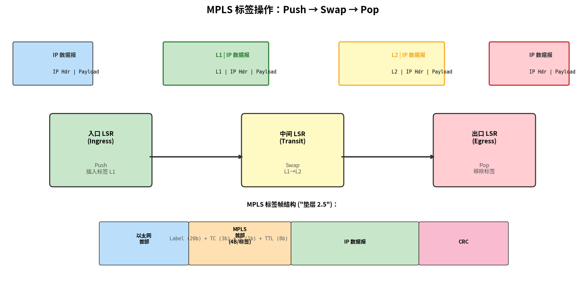

# MPLS 与链路虚拟化

> 参考：Kurose §6.5

链路虚拟化（link virtualization）的核心思想是将网络本身视为链路层，构建一个底层网络之上的虚拟网络。**多协议标签交换（Multiprotocol Label Switching, MPLS）**是实现这一思想的关键技术。

## MPLS 的动机

传统 IP 路由的问题：路由器和交换机都必须逐跳地根据 IP 地址进行最长前缀匹配，速度慢。MPLS 的目标是在 IP 路由器间引入链路层交换机的**快速、固定长度标签交换**能力。

MPLS 的另一个重要能力是**流量工程（traffic engineering）**——传统 IP 路由基于最短路径，无法灵活地将流量分配在非最短路径上以减轻拥塞。

## MPLS 的工作原理

在 MPLS 网络中，IP 数据报在进入 MPLS 网络时被分配一个**固定长度的标签（label）**。MPLS 路由器（标签交换路由器，LSR）根据标签进行转发，而非目的 IP 地址匹配。

| 操作 | 说明 |
|------|------|
| **Push** | 入口路由器在数据报前插入 MPLS 标签 |
| **Swap** | 中间路由器将入标签交换为对应的出标签 |
| **Pop** | 出口路由器移除 MPLS 标签，恢复纯 IP 转发 |

MPLS 标签位于链路层帧头与 IP 数据报之间（"垫层 2.5"——位于 L2 和 L3 之间），因此 MPLS 被描述为"介于链路层和网络层之间"的技术。

## MPLS 与 IP 路由的比较

| 维度 | 传统 IP 路由 | MPLS |
|------|------------|------|
| 转发依据 | 目的 IP 地址（最长前缀匹配） | 固定长度标签（精确匹配） |
| 转发速度 | 较慢（软件查找） | 较快（硬件标签交换） |
| 流量工程 | 受限于最短路径 | 可沿任意路径转发 |
| 路由协议 | OSPF、BGP | 可独立运行，也可与 IP 路由并存 |

MPLS 已被广泛应用在大型 ISP 骨干网中，例如用于实现虚拟专用网络（VPN）和快速重路由。

## MPLS 帧格式

在以太网承载 MPLS 的典型部署中，链路层帧结构（从外到内）为：

> 以太网头部 | MPLS 首部（标签栈） | IP 数据报 | CRC

MPLS 首部由 4 字节组成：
- **Label（20 比特）**：标签值，用于转发决策
- **TC / EXP（3 比特）**：流量类别/实验位，用于 QoS
- **S（1 比特）**：栈底标志（Bottom of Stack），标签栈可以有多个标签
- **TTL（8 比特）**：生存时间，类似 IP TTL

- [[网络层概述]]
- [[路由器体系结构]]
- [[通用转发与SDN数据平面]]
- [[BGP]]
- [[IPsec与VPN]]
