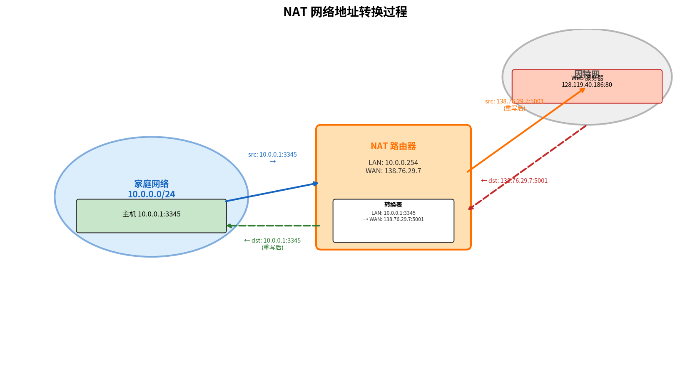

# NAT

> 参考：Kurose §4.3.5

**网络地址转换（Network Address Translation, NAT）**解决了一个实际问题：随着 SOHO（Small Office, Home Office）子网的激增，如果每个 IP 设备都需要一个唯一的全球 IP 地址，地址空间将面临巨大压力。NAT 允许多个设备通过一个共享的公共 IP 地址访问因特网。

## 私有地址空间

NAT 依赖于[RFC 1918] 中规定的**私有网络地址（private addresses）**。IP 地址空间中保留了三段用于私有网络：

- **10.0.0.0/8**
- **172.16.0.0/12**
- **192.168.0.0/16**

这些地址只在给定网络内部有意义。成千上万的家庭网络可以使用相同的 10.0.0.0/24 地址，但**不能**将这些地址用于全球因特网中（作为源或目的地址）。

## NAT 的工作原理

NAT 路由器对外部世界表现为拥有**单一 IP 地址的单一设备**。所有离开家庭路由器的流量源 IP 地址都被替换为该单一公共地址，所有进入的流量目的地址都被替换为该地址。

关键问题是：当所有从 WAN 到达 NAT 路由器的数据报都有相同的**目的 IP 地址**时，路由器如何知道该转发给哪个内部主机？诀窍是使用 **NAT 转换表（NAT translation table）**，并在表条目中包含**端口号**以及 IP 地址。

具体过程如下（以一个家庭主机 10.0.0.1 请求 Web 服务器 128.119.40.186:80 为例）：

1. 主机 10.0.0.1 分配（任意）源端口号 3345，将数据报发送到 LAN
2. NAT 路由器收到数据报，为数据报**生成新的源端口号 5001**，将源 IP 地址替换为 WAN 侧 IP 地址（如 138.76.29.7），将原源端口号 3345 替换为新的 5001
3. NAT 路由器在转换表中加入条目：`(10.0.0.1, 3345) ↔ (138.76.29.7, 5001)`
4. Web 服务器不知数据报已被篡改，响应数据报的目的地址为 NAT 路由器的 IP，目的端口号为 5001
5. 到达 NAT 路由器后，使用目的 IP 和目的端口号索引转换表，找到对应的内部 IP 和端口号（10.0.0.1:3345），重写目的地址和端口号，转发到家庭网络

由于端口号字段为 16 比特长，NAT 可以在路由器单一 WAN 侧 IP 地址下**支持超过 60,000 个同时连接**。

## NAT 的争议

NAT 并非没有批评者：

1. **端口号的角色被扭曲**：端口号本应用于寻址进程，而非寻址主机。这给运行在家庭网络中的服务器带来问题——服务器进程在周知端口上等待请求，P2P 协议中的对等方需要在充当服务器时接受入连接。技术解决方案包括 NAT 穿越技术：

   - **STUN（Session Traversal Utilities for NAT）**：客户端向公网 STUN 服务器发送请求，STUN 服务器回复客户端在 NAT 上的公网 IP 地址和端口号映射。客户端随后将此公网地址告知通信对端，双方直接通信。STUN 适用于**锥形 NAT（Cone NAT）**——内部 (IP, port) 映射到固定公网 (IP, port) 的场景。
   - **TURN（Traversal Using Relays around NAT）**：当 NAT 类型为对称型（Symmetric NAT）或对端也在 NAT 后导致直接通信失败时，双方通过公网 TURN 服务器**中继**所有数据。TURN 保证可达性但增加延迟和带宽开销。
   - **ICE（Interactive Connectivity Establishment）**：综合 STUN 和 TURN 的框架——先尝试直接连接（STUN），失败后回退到中继（TURN）。
   - **UPnP（Universal Plug and Play）**：允许内网设备通过协议请求 NAT 路由器自动添加端口映射规则，无需手动配置。

2. **违反层次原则**：路由器本应是第 3 层（网络层）设备，只处理到网络层。NAT 违反了这个原则（参见 [[运输层概述]]）——中间节点修改 IP 地址和端口号。

3. 尽管如此，NAT 已成为因特网的重要组成部分，与其他**中间盒（middlebox）**一起运行在网络层，执行与传统路由器完全不同的功能。

## 防火墙与入侵检测系统

NAT 通常与防火墙和入侵检测系统配合使用：

- **防火墙（Firewall）**：检查数据报和报文段首部字段，拒绝可疑数据报进入内部网络。可以基于源/目的 IP 地址、端口号和 TCP 连接状态进行过滤。
- **入侵检测系统（IDS）**：执行"深度分组检查"，不仅检查首部字段还检查数据报中的有效载荷，与已知攻击的签名数据库进行比对。
- **入侵防御系统（IPS）**：类似于 IDS，但除了创建告警外还实际**阻止分组**。

- [[IPv4编址]]
- [[DHCP]]
- [[IPv4数据报格式]]
- [[通用转发与SDN数据平面]]
- [[计算机网络安全概述]]
- [[防火墙与入侵检测系统]]
- [[多路复用与多路分解]]
- [[运输层概述]]
- [[网络层概述]]
- [[ICMP]]
