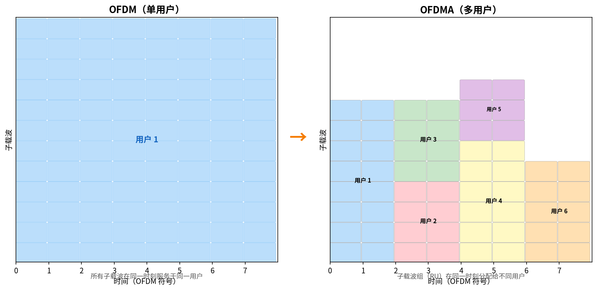

# OFDM 与 OFDMA

> 参考：Kurose §7.3.2, §7.4.2

**正交频分复用（Orthogonal Frequency Division Multiplexing, OFDM）**是一种将高速数据流分割到多个低速**子载波（subcarrier）**上并行传输的调制技术。**OFDMA（Orthogonal Frequency Division Multiple Access）**在 OFDM 基础上进一步将子载波组分配给不同用户，实现多用户同时接入。二者是现代无线通信（WiFi 4–7、4G LTE、5G NR）共同的物理层基础。

## OFDM 的原理

### 频率选择性衰落的挑战

在高速无线通信中，符号周期（symbol period）远小于信道的**多径时延扩展（delay spread）**，导致**符号间干扰（Inter-Symbol Interference, ISI）**——前一个符号的反射信号叠加到后一个符号上，使接收方无法正确解调。

传统单载波方案的对策是使用**均衡器（equalizer）**补偿信道畸变，但均衡器在高速率下复杂度过高。

### OFDM 的解决方案

OFDM 将可用的总带宽 $B$ 划分为 $N$ 个**正交子载波**，每个子载波的带宽为 $B/N$。原始的高速数据流被**串并转换**为 $N$ 个低速并行流——每个子载波上的符号周期变长了 $N$ 倍。符号周期远大于多径时延扩展后，ISI 大幅度降低。

子载波之间"正交"意味着一个子载波的频谱峰值恰好落在相邻子载波的零点上——子载波之间**没有干扰**，即使它们紧密排列甚至部分重叠。这比传统 FDM（需要保护频带）的频谱效率高得多。

### 循环前缀

为了彻底消除 ISI，OFDM 在每个符号前插入**循环前缀（Cyclic Prefix, CP）**——复制符号尾部的部分样本放在符号开头。CP 长度大于最大多径时延扩展时，前一个符号的反射只影响 CP 部分（被丢弃），符号本身的数据部分不受影响。

代价是 CP 占用了传输时间——例如 LTE 中 CP 开销约为 7%（短 CP 模式）。

## OFDMA：从单用户到多用户

OFDM 本身只是调制技术——单个发送方在所有子载波上传输给单个接收方。**OFDMA** 将多址接入叠加在 OFDM 之上：**将不同的子载波组（称为资源块，Resource Block / RU）分配给不同的用户**。

AP（WiFi 6）或基站（LTE/5G）可以在**同一时刻**向多个用户发送数据——每个用户只接收和调制分配给自己的子载波组。

以 WiFi 6（802.11ax）为例：
- 80 MHz 信道被划分为 256 个子载波
- 子载波被组织为 **RU（Resource Unit）**，可包含 26 / 52 / 106 / 242 / 484 / 996 个子载波
- AP 在同一 OFDM 符号周期内将不同 RU 分配给不同站点——**同时多用户下行传输**

## OFDM/OFDMA 的部署

| 标准 | 年份 | 技术 | 子载波特点 |
|------|------|------|-----------|
| 802.11a/g | 1999/2003 | OFDM | 52 子载波（20 MHz），单用户 |
| 802.11n | 2009 | OFDM + [[MIMO]] | 56 子载波（20 MHz），至多 4 空间流 |
| 802.11ac | 2013 | OFDM + MU-MIMO | 更大带宽（80/160 MHz） |
| 802.11ax (WiFi 6) | 2019 | **OFDMA** + MU-MIMO | RU 粒度多用户接入 |
| 802.11be (WiFi 7) | 2024 | **OFDMA** + MLO | 320 MHz，多链路 |
| LTE (4G) | 2010s | **OFDMA**（DL） | 子载波间隔 15 kHz，RB = 12 子载波 × 7 符号 |
| 5G NR | 2020s | **OFDMA**（DL+UL）| 灵活子载波间隔（15/30/60/120 kHz），适应不同频段 |

## OFDM vs CDMA

在 3G 时代，CDMA（码分多址）是主流多址技术（见 [[信道划分协议]]），但 4G/5G 全面转向 OFDMA：

| | CDMA | OFDMA |
|---|------|-------|
| **多址方式** | 不同编码区分的用户同时传输 | 不同子载波组的用户同时传输 |
| **抗频率选择性衰落** | 需要 Rake 接收机处理多径 | 子载波内为平坦衰落，配合 CP 消除 ISI |
| **频带扩展** | 扩频因子（较大带宽需求） | 子载波窄带（灵活带宽扩展） |
| **高峰值速率** | 受限于码间干扰 | 结合高阶 QAM 和 MIMO 可达极高吞吐量 |

OFDMA 在支持宽带宽和高吞吐量方面具有本质优势，这是 4G/5G 选择 OFDMA 的根本原因。

- [[WiFi与802.11]]
- [[蜂窝网络因特网接入]]
- [[MIMO]]
- [[信道划分协议]]
- [[无线链路特性]]
- [[物理介质]]
