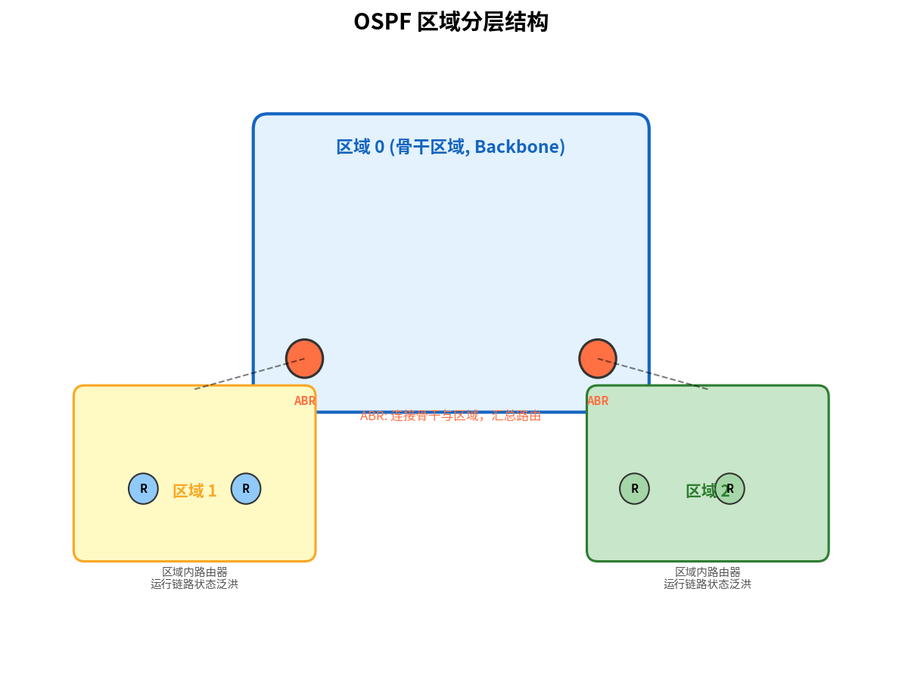

# OSPF

> 参考：Kurose §5.3

**开放最短路径优先（Open Shortest Path First, OSPF）** 是因特网中使用的 **自治系统内部（intra-AS）** 路由协议。它基于链路状态（LS）算法，每台路由器向整个自治系统中的所有其他路由器广播其链路状态，并在本地运行 Dijkstra 最短路径算法。



## 自治系统的概念

研究 OSPF 之前需要理解**自治系统（Autonomous System, AS）** 的概念。一个 AS 是由单一管理机构控制的一组路由器。因特网中有成千上万个 AS——每个 ISP 自身以及它们的网络构成一个 AS。自治系统由全局唯一的**自治系统号（ASN）** 标识。

因特网路由协议分为两类：
- **域内路由协议（Intra-AS）**：在单个 AS 内部运行，如 OSPF、[[RIP]]、IS-IS
- **域间路由协议（Inter-AS）**：在 AS 之间运行，即 BGP

## OSPF 的特性

OSPF 的核心是一个**链路状态协议**，使用**链路状态广播（flooding）** 和 **Dijkstra 最低代价路径算法**。OSPF 路由器不交换距离向量，而是互相广播链路状态信息。每台 OSPF 路由器构建整个 AS 的完整拓扑图，然后在本地运行 Dijkstra 算法。

OSPF 路由器向邻居发送链路状态通告（包括链路代价）后，邻居将通告**泛洪（flood）** 到其所有邻居，最终每个路由器都拥有相同的链路状态数据库。

使用 OSPF 的链路代价由网络管理员配置，可以设为与链路容量成反比（使高容量链路更优），也可以设为统一的 1（使最小跳数路径最优）。OSPF 不强制要求代价设置策略。

## OSPF 的增强特性

OSPF 在基本 LS 算法基础上提供了多个增强：

**传输机制**：OSPF 消息**直接封装在 IP 数据报**中（协议号 89），不经过 TCP 或 UDP。这使得 OSPF 自身必须实现可靠传输和消息确认等功能。

**OSPF 消息类型**：共五种：

| 类型 | 名称 | 功能 |
|------|------|------|
| 1 | Hello | 邻居发现与维护，检测邻居是否存活 |
| 2 | 数据库描述（Database Description, DD） | 向邻居汇总自己的链路状态数据库，用于初始同步 |
| 3 | 链路状态请求（Link-State Request, LSR） | 向邻居请求特定的链路状态记录 |
| 4 | 链路状态更新（Link-State Update, LSU） | 发送链路状态通告（LSA）以响应请求或触发更新 |
| 5 | 链路状态确认（Link-State Ack, LSAck） | 确认 LSU 的接收，实现可靠泛洪 |

**Hello 协议**：OSPF 路由器定期在每条链路上发送 Hello 消息，用于发现邻居路由器、协商参数（Hello 间隔、Dead 间隔）以及选举指定路由器。如果一长时间未收到邻居的 Hello 消息，则认为该邻居失效。

**指定路由器（DR）与备份指定路由器（BDR）**：

在广播网络（如以太网）中，多台 OSPF 路由器共享同一条链路。如果每两台之间都建立邻接关系、互相交换 LSA，$n$ 台路由器会产生 $O(n^2)$ 条邻接和大量冗余的链路状态更新。OSPF 通过选举一个 **DR（Designated Router）**和一个 **BDR（Backup Designated Router）**来解决：

- 所有路由器**只与 DR 和 BDR 建立邻接关系**，LSA 交换通过 DR 中转
- BDR 被动接收所有 LSA，但不参与中转——只在 DR 失效时接管
- 选举规则：先比**优先级**（0=不参选，默认 1），优先级相同比 **Router ID**（通常是最高环回地址）

邻接数量从 $\frac{n(n-1)}{2}$ 降至 $2n-3$——10 台路由器时从 45 条降到 17 条，效果显著。

**LSA 类型**：OSPF 定义了多种链路状态通告（LSA）类型：

| 类型 | 名称 | 传播范围 | 内容 |
|------|------|---------|------|
| 1 | 路由器 LSA | 区域内 | 路由器自身的链路状态和代价 |
| 2 | 网络 LSA | 区域内 | 由 DR 生成，描述广播网络上的路由器集合 |
| 3 | 网络汇总 LSA | 区域间 | 由 ABR 生成，汇总一个区域的网络到其他区域 |
| 4 | ASBR 汇总 LSA | 区域间 | 由 ABR 生成，通告到达 ASBR 的路径 |
| 5 | AS 外部 LSA | 整个 AS | 由 ASBR 生成，通告来自其他路由域的外部路由 |

**安全性**：OSPF 提供多种认证机制。**简单认证**（明文密码）安全性较低。**MD5 认证**基于所有路由器中配置的共享秘密密钥——发送路由器计算 OSPF 分组的 MD5 哈希（附加秘密密钥），接收方使用预配置的秘密密钥验证。

**多条相同代价路径**：当多个路径到目的地具有相同代价时，OSPF 允许**同时使用多条路径**——不必选择单一路径来承载所有流量。

**对单播和组播路由的集成支持**：组播 OSPF（MOSPF）提供简单扩展以支持组播路由。

**区域分层结构（Area Hierarchy）**：

OSPF 把一个 AS 切分为多个**区域（Area）**，每个区域是一个独立的路由域，内部运行自己的 LS 洪泛和 Dijkstra 计算。一台路由器只需维护自己所在区域的完整拓扑，无需知道其他区域内部的链路细节。

**区域类型与角色**：

- **骨干区域（Backbone Area）**：Area ID 固定为 **0**（`0.0.0.0`）。**整个 AS 有且仅有一个骨干区域**——它承载所有区域间的流量，其他区域之间不能直接通信，必须经过 Area 0 中转。
- **非骨干区域（Regular Area）**：Area ID ≠ 0。每个非骨干区域**必须物理连接到骨干区域**。
- **区域边界路由器（ABR, Area Border Router）**：接口同时属于骨干区域和一个非骨干区域的路由器。ABR 负责汇总本区域的网络信息并以类型 3 LSA 注入骨干区域，同时将骨干区域的路由信息注入本区域。
- **AS 边界路由器（ASBR）**：将 OSPF AS 连接到外部路由域（BGP、RIP 等）的路由器，负责把外部路由以类型 5 LSA 注入 OSPF。

**区域间路由的完整流程**：分组在区域 A 的一台主机出发，要去区域 B 的一台主机：

```
源主机（区域 A）
    │
    ▼
区域内路由器 ──→ 区域 A 的 ABR
    （区域内路由）      │
                       ▼
                  骨干区域（Area 0）  ← 所有区域间流量必经
                       │
                       ▼
                  区域 B 的 ABR
                       │
                       ▼
              区域 B 内路由器 ──→ 目的主机
                  （区域内路由）
```

**为什么要强制经过骨干？** 如果允许非骨干区域之间直接相连，区域间路由可能形成环路，而 Area 0 作为唯一的 transit 枢纽，天然避免了区域间的环路问题。

使用区域的好处是显著减小了 LSDB 大小——一个拥有 500 台路由器的 AS，切为 10 个区域后，每台路由器的 LSDB 只包含约 50 台同区域邻居的链路状态，而非全部 500 台。

- [[LS路由算法]]
- [[BGP]]
- [[网络层控制平面概述]]
- [[DV路由算法]]
- [[RIP]]
- [[Web请求的一天]]
- [[IP多播]]
