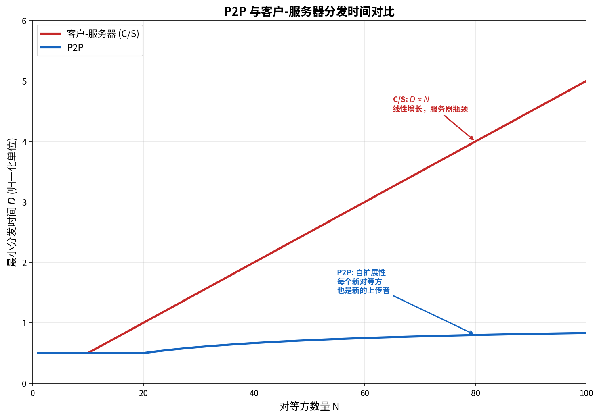

# P2P 文件分发

> 参考：Kurose §2.5

P2P（Peer-to-Peer）文件分发是另一种重要的因特网应用模式。与依赖专用服务器的客户-服务器模式不同，P2P 应用使对等方直接交换数据，具有自扩展性。

## C/S 与 P2P 文件分发的量化对比

设 $F$ = 待分发的文件大小，$u_s$ = 服务器上传速率，$d_i$ = 对等方 $i$ 的下载速率，$u_i$ = 对等方 $i$ 的上传速率，$N$ = 对等方数量。

### 客户-服务器分发时间

$$D_{C/S} \geq \max\left\{\frac{NF}{u_s}, \frac{F}{d_{\min}}\right\}$$

第一项是服务器向 $N$ 个对等方各上传一份完整副本的总时间；第二项是最慢对等方的下载时间。分发时间随 $N$ **线性增长**——服务器上传带宽成为瓶颈。

### P2P 分发时间

$$D_{P2P} \geq \max\left\{\frac{F}{u_s}, \frac{F}{d_{\min}}, \frac{NF}{u_s + \sum_{i=1}^{N} u_i}\right\}$$

关键在第三项——对等方**同时作为消费者和再分发者**。总上传能力随对等方数量增长，使 P2P 具有**自扩展性**：$N$ 增大时分发时间远小于 C/S 模式。

## BitTorrent

**BitTorrent** 是最流行的 P2P 文件分发协议，由 Bram Cohen 设计。参加某个特定文件分发的所有对等方集合称为一个 **torrent**。每个 torrent 由一个称为 **tracker** 的基础设施节点进行跟踪。

### 文件分块

torrent 中的对等方平等地下载和上传大小相等的文件**分块（chunk）**——典型大小为 256 KB。对等方一旦获得一个分块，就可以立即向其他对等方上传该分块。

### 获取策略：最稀有优先

对等方在没有分块时，从邻居获取最稀有的分块——也就是说，**稀缺的分块优先获取，使其更快地在 torrent 中重新分布**。这一策略有助于均衡每块在 torrent 中的副本数量。

### 激励机制：TFT（Tit-for-Tat）

BitTorrent 使用基于**一报还一报**的激励策略：

- 每个对等方周期性地（每 10 秒）计算向自己发送数据的速率最高的 4 个邻居——这些邻居被 **unchoked**（解除阻塞），接收来自该对等方的数据
- 每 30 秒，对等方额外**乐观地 unchoke** 一个随机邻居——给新加入的对等方一个被"发现"的机会
- 这 4 + 1 个 unchoked 邻居之外的其他邻居被 **choked**（阻塞），不从该对等方接收数据

激励机制确保了对等方相互之间交换数据——收取数据多的邻居更有可能获得回报。乐观 unchoke 机制允许新加入的节点（没有数据可以交换）逐步积累初始分块然后参与交换。

## DHT（分布式哈希表）

**DHT（Distributed Hash Table）** 是一种实现简单 P2P 分布式数据库的方法。

### 动机

BitTorrent 虽然高效，但依赖集中式 tracker 进行对等方发现——这是一个单点故障和性能瓶颈。完全去中心化的 P2P 系统需要一个分布式的「tracker」，即分布式数据库。

### 基本思想

DHT 建立在简单的 **(key, value) 对**抽象之上。每个对等方存储一部分 (key, value) 对，并提供功能确定性地将 key 映射到 value 的对等方。每个对等方只需要知道极少数其他对等方（通常是 $O(\log N)$）。

### Chord 协议

**[[Chord]]** 是经典的 DHT 协议：对等方排列在一个逻辑环上，(key, value) 对存在顺时针第一个对等方处。每个对等方维护一个 finger table（约 $\log N$ 个条目），查找时在 finger table 中找不超过 key 的最大节点转发——每跳距离减半，总跳数 $O(\log N)$。详见 [[Chord]]。

### 对等方扰动（Churn）

P2P 系统中的一个关键挑战是**对等方扰动（churn）**——对等方持续地加入和离开。DHT 通过要求每个对等方跟踪其前驱和后继（并定期发送 ping 消息确认其存活）来应对扰动。当对等方离开时，其 (key, value) 对被重新分配到新的后继。

## P2P 与 NAT 穿越

P2P 应用面临的一个重要实际挑战是 **NAT 穿越（NAT Traversal）**——许多对等方位于 [[NAT]] 或防火墙之后，使用私有 IP 地址，无法从外部直接连接。常见的 NAT 穿越技术包括：

- **UDP 打洞（UDP Hole Punching）**：两个位于 NAT 后的对等方通过外部服务器的协助建立直接连接。双方先向外部服务器注册自己的公网地址，然后同时向对方的公网地址发送 UDP 分组，"打穿"NAT 映射。
- **TCP 打洞（TCP Hole Punching）**：原理类似但更复杂，因为 TCP 的连接状态管理更严格。
- **UPnP/IGD**：对等方通过 UPnP 协议请求 NAT 设备为其创建端口转发映射。

BitTorrent 客户端通常综合使用这些技术以实现最大的对等方可达性。

- [[应用层协议原理]]
- [[视频流与CDN]]
- [[NAT]]
- [[Socket编程]]
- [[DNS]]
