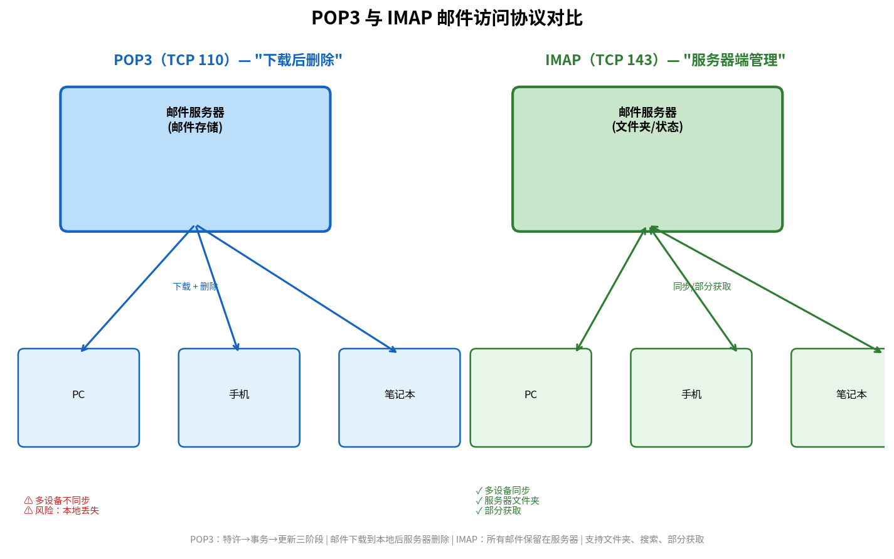

# POP3 与 IMAP

> 参考：Kurose §2.3.4

SMTP 将邮件从发送方邮件服务器推送到接收方邮件服务器，但用户如何从自己的邮件服务器获取（读取）邮件？这需要**邮件访问协议（mail access protocol）**。因特网中使用最广泛的两种邮件访问协议是 **POP3** 和 **IMAP**，第三种常见方式是通过 HTTP 访问 Web 邮件。

注意：邮件访问协议运行在接收方邮件服务器到接收方用户代理之间，而 SMTP 运行在发送方邮件服务器到接收方邮件服务器之间。

## POP3（Post Office Protocol — Version 3）

**POP3** 是一种极其简单的邮件访问协议。它使用 TCP 端口 **110**，经过三个阶段：

### 1. 特许阶段（Authorization）

用户代理以明文发送用户名和密码来认证用户。两个主要命令：

- `user <username>`：指定用户名
- `pass <password>`：指定密码

服务器响应 `+OK`（成功）或 `-ERR`（失败）。

### 2. 事务处理阶段（Transaction）

用户代理在事务处理阶段可以进行以下操作：

- `list`：列出所有邮件的编号和大小
- `retr <msg#>`：获取指定编号的邮件
- `dele <msg#>`：标记指定编号的邮件为删除
- 获取邮件内容（包括首部）

### 3. 更新阶段（Update）

客户端发送 `quit` 命令后，POP3 服务器进入更新阶段：**执行所有标记为删除的邮件删除**，并解除对邮箱的独占锁，结束 POP3 会话。

### POP3 的局限性

POP3 默认在下载邮件后**删除邮件服务器上的副本**——这意味着用户在一台设备上下载邮件后，无法从另一台设备再次查看。虽然 POP3 支持"下载并保留"配置，但它缺乏管理服务器上邮件的能力：不支持创建文件夹、不支持在服务器上搜索、不支持部分读取（如仅读取首部）。它本质上是将邮件从服务器"拉取到本地"的简单协议。

## IMAP（Internet Mail Access Protocol）

**IMAP** 是一个比 POP3 复杂得多的邮件访问协议，使用 TCP 端口 **143**。与 POP3 的根本区别在于 IMAP **将所有邮件保留在服务器上**，用户代理在服务器上管理邮件。

IMAP 支持的高级功能：

- **文件夹管理**：用户可以创建、删除和重命名远程文件夹（邮箱），并将邮件移动到不同的文件夹中
- **状态跟踪**：服务器跟踪每条邮件的状态（已读/未读/已回复/已删除/草稿）
- **部分获取**：用户代理可以只获取邮件首部，或只获取 MIME 报文的特定部分（如仅文本部分而非大附件），对低带宽连接非常有用
- **服务器端搜索**：用户代理可以指示 IMAP 服务器在邮件中搜索匹配特定条件的邮件
- **并发访问**：多个用户代理可以同时访问同一邮箱

IMAP 的命令和响应比 POP3 复杂得多，但提供的灵活性使其成为当今主流的邮件访问方式——用户可以无缝地在手机、平板、笔记本和桌面电脑上访问同一个邮箱。

## POP3 vs IMAP 对比

| | POP3 | IMAP |
|------|------|------|
| **邮件存储位置** | 下载到本地，服务器副本默认删除 | 始终保留在服务器上 |
| **文件夹管理** | 不支持 | 支持远程文件夹/标签 |
| **部分获取** | 不支持 | 支持仅获取首部或特定部分 |
| **服务器搜索** | 不支持 | 支持 |
| **协议复杂度** | 简单 | 复杂 |
| **离线访问** | 可离线（邮件已下载） | 需缓存功能 |
| **多设备访问** | 差（默认下只有一个设备能看到邮件） | 好（所有设备看到同一视图） |
| **TCP 端口** | 110 | 143 |

## 基于 Web 的电子邮件

在 Web 电子邮件（如 Gmail、Outlook.com）的场景中，用户代理是 Web 浏览器，用户使用浏览器通过 **HTTP** 与其远程邮箱交互。在这个架构中，从发送方邮件服务器到接收方邮件服务器仍然使用 SMTP，但从接收方邮件服务器到用户浏览器之间使用的是 **HTTP**（而非 POP3 或 IMAP）。

无论是 POP3、IMAP 还是基于 Web 的电子邮件，SMTP 始终负责将邮件从发送方传输到接收方邮件服务器。

- [[电子邮件与SMTP]]
- [[应用层协议原理]]
- [[HTTP]]
