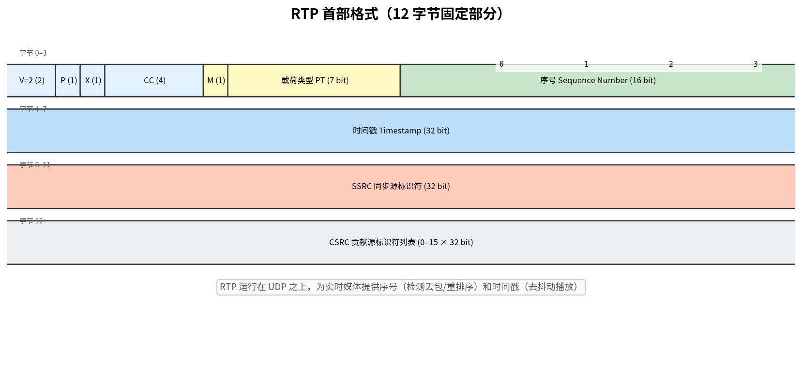

# RTP 与 RTCP

> 参考：Kurose §9.4.1

**RTP（Real-time Transport Protocol, 实时传输协议）**和 **RTCP（RTP Control Protocol, RTP 控制协议）**是 IETF 为实时多媒体应用（VoIP、视频会议、流媒体）定义的传输协议。RTP 承载媒体数据，RTCP 提供带外控制和统计反馈。

## RTP 在协议栈中的位置

RTP 通常运行在 **UDP** 之上。UDP 提供端口号（多路分解）和检验和，RTP 在此基础上增加实时媒体所需的传输功能：

```
┌──────────────┐
│  媒体应用      │
├──────────────┤
│  RTP | RTCP  │
├──────────────┤
│     UDP      │
├──────────────┤
│     IP       │
└──────────────┘
```

注意：RTP 虽然名为"传输协议"，但在协议栈中实际属于**应用层**——它作为应用代码的一部分（库/类），被多媒体应用调用，而非 OS 内核实现。

## RTP 首部格式

RTP 首部（12 字节固定部分）包含以下关键字段：

| 字段 | 比特 | 说明 |
|------|------|------|
| **载荷类型（Payload Type）** | 7 | 标识编码格式（如 PCMU=0, G.729=18, H.264=96 动态） |
| **序号（Sequence Number）** | 16 | 每发送一个 RTP 分组递增 1。接收方用于**检测丢包**和**恢复分组顺序** |
| **时间戳（Timestamp）** | 32 | 分组中**第一个字节的采样时刻**。接收方用于**去抖动播放**。时钟频率取决于载荷类型 |
| **SSRC（Synchronization Source ID）** | 32 | 标识 RTP 流的**来源**（每个发送方在 RTP 会话中有唯一 SSRC） |
| **CSRC 列表（Contributing Source）** | 0–15 个 × 32 | 用于**混音器（mixer）**场景——标识参与混音的各个源 |



标记位（Marker bit, M）在应用中有特定含义——对于视频，通常标记帧的最后一个分组。

## RTP 的核心功能

### 序号

- 初始序号随机选择（防止对加密 RTP 流的已知明文攻击）
- 接收方利用序号检测分组丢失率，并恢复乱序分组的正确播放顺序
- RTP **不重传**丢失的分组——这是它与 TCP 的关键差异。实时应用中重传来得太晚

### 时间戳

- 时间戳的时钟是**单调递增的**，但增长速率取决于编码格式
- 对于 PCM 音频（8 kHz 采样），时间戳每 20 ms 增加 $8000 \times 0.02 = 160$ 个单位
- 时间戳**不用于同步不同媒体的时钟**（不承载绝对时间），仅用于同一媒体流内的播放时序恢复

### SSRC

- 区分同一 RTP 会话中的多个参与者。例如视频会议中，每个参与者分配不同的 SSRC
- 接收方可以通过 SSRC 来识别和分离不同发送方的分组流

## RTP 的不足

RTP 本身**不提供**：
- 带宽保证或 QoS 保证
- 可靠交付（不重传）
- 会话建立、控制或终止（这些由 SIP 或其他信令协议处理）
- 接收方的反馈和统计报告（这些由 RTCP 提供）

## RTCP（RTP 控制协议）

RTCP 是 RTP 的伙伴协议。每个 RTP 会话会使用一个相邻的 UDP 端口（奇数端口）用于 RTCP 流量。RTCP 分组有五种类型：

### 发送方报告（Sender Report, SR）

由**正在发送**媒体数据的参与者周期性发送。包含：
- 该发送方的 **SSRC**
- **NTP 时间戳**（绝对时间）与对应 **RTP 时间戳**的对齐——接收方据此将 RTP 时间戳映射到实际播放时间（用于**不同媒体流之间的同步**，即唇音同步）
- 该发送方已发送的分组数和字节数

### 接收方报告（Receiver Report, RR）

由**仅接收**（不发送）的参与者周期性发送。包含：
- 对每个发送方 SSRC 的接收统计：
  - **丢包率**（丢失分组数 / 期望分组数）
  - **累计丢包数**
  - **到达间隔抖动（interarrival jitter）**估计
  - **最后 SR 的时间戳**和接收该 SR 以来的延迟（用于计算 RTT）

### 其他 RTCP 分组类型

| 类型 | 全称 | 用途 |
|------|------|------|
| **SDES** | Source Description | 参与者信息（如 CNAME 规范名、姓名、邮箱） |
| **BYE** | Goodbye | 参与者离开会话 |
| **APP** | Application-specific | 应用自定义扩展 |

### RTCP 带宽缩放

RTCP 流量不得超过 RTP 会话总带宽的 **5%**（以免控制流量挤占媒体数据）。其中，SR+RR 占 RTCP 带宽的 75%（25% 预留 SDES/BYE/APP）。

参与者的 RTCP 报告周期随会话规模自适应缩放——参与者越多，每个参与者的报告周期越长，以保证总 RTCP 带宽受控。

- [[UDP]]
- [[IP语音]]
- [[SIP]]
- [[SDP]]
- [[去抖动缓冲区]]
- [[多媒体网络应用概述]]
- [[服务质量]]
- [[流式存储视频]]
