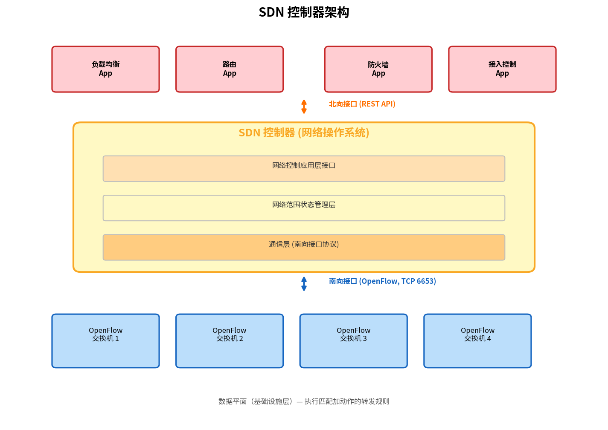

# SDN 控制平面

> 参考：Kurose §5.5

SDN 控制平面是控制 SDN 设备间分组转发的网络范围逻辑。SDN 体系结构有四个关键特征：

**基于流的转发（Flow-based Forwarding）**：SDN 控制的分组转发可基于运输层、网络层或链路层首部中任意数量的字段值。这与传统路由器仅基于目的 IP 地址转发形成鲜明对比。

**数据平面与控制平面分离**：数据平面由相对简单（但快速）的交换机组成，执行"匹配加动作"规则。控制平面由确定和管理交换机流表的服务器和软件组成。

**网络控制功能在数据平面交换机外部**：SDN 控制平面在**与交换机分离和远程**的服务器上执行。控制平面本身包含两个组件——SDN 控制器（或网络操作系统）和一组网络控制应用。

**可编程网络**：通过网络控制应用编程——这些应用使用 SDN 控制器提供的 API 来指定和控制网络设备中的数据平面。

## SDN 控制器架构

SDN 控制器的功能可以组织为三个层次：

### 通信层（Communication Layer）

SDN 控制器与受控网络设备之间通信的协议。设备必须能够向控制器通信本地观察到的事件（如链路状态变化、设备加入、心跳）。该协议构成控制器架构的最底层，跨越所谓的**"南向"接口（Southbound Interface）**。**OpenFlow** 是提供此功能的具体协议。

### 网络范围状态管理层（Network-wide State Management Layer）

控制平面的最终决策（如配置所有交换机中的流表以实现端到端转发、负载均衡或防火墙功能）要求控制器拥有关于网络中主机、链路、交换机和其他 SDN 控制设备状态的最新信息。

### 网络控制应用层接口（Northbound Interface）

控制器通过其**"北向"接口**与网络控制应用交互。此 API 允许应用读/写网络状态和流表、注册状态变化事件通知。常用的 SDN 控制器使用 **REST 请求-响应接口**与应用通信。

## OpenFlow 协议

OpenFlow 协议在 SDN 控制器和 SDN 控制交换机之间运行，默认使用 **TCP 端口 6653**。

**控制器到交换机的消息**：
- **Configuration**：查询和设置交换机配置参数
- **Modify-State**：添加/删除/修改交换机流表中的条目，设置端口属性
- **Read-State**：从流表和端口收集统计数据和计数器值
- **Send-Packet**：在指定端口发送特定分组

**交换机到控制器的消息**：
- **Flow-Removed**：通知控制器流表条目已被删除
- **Port-status**：通知控制器端口状态变化
- **Packet-in**：将不匹配任何流表条目的分组（或匹配后动作要求发送的分组）发送给控制器

## SDN 控制平面运行示例

以链路状态变化场景为例，使用 Dijkstra 算法作为网络控制应用：

1. 交换机 s1 经历与 s2 的链路故障，通过 OpenFlow **port-status** 消息通知 SDN 控制器
2. 控制器收到消息，通知链路状态管理器更新链路状态数据库
3. 实现 Dijkstra 链路状态路由的网络控制应用（之前已注册接收链路状态变化通知）收到通知
4. 链路状态路由应用与链路状态管理器交互获取更新的链路状态，也可能咨询状态管理层的其他组件，然后计算新的最低代价路径
5. 应用与流表管理器交互，确定需要更新的流表
6. 流表管理器使用 OpenFlow 协议更新受影响交换机的流表条目

## SDN 控制器实例

### OpenDaylight（ODL）

ODL 控制器提供了与通用架构模型紧密对应的组件。ODL 有两种应用接口：外部应用通过 **REST API** 通信；内部应用通过**服务抽象层（Service Abstraction Layer, SAL）**相互通信。SAL 是控制器的神经中枢，允许控制器组件和应用调用彼此的服务、订阅事件，并为底层通信协议（包括 OpenFlow、SNMP 和 OVSDB）提供统一抽象接口。

### ONOS

ONOS 控制器的一个独特特性是其**意图框架（Intent Framework）**——允许应用请求高层服务（如"在主机 A 和 B 之间建立连接"）而无需知道具体实现细节。ONOS 的分布式核心维护网络状态并运行在一组互连服务器上，为上层应用和下层设备提供逻辑集中式核心服务的抽象。

- [[通用转发与SDN数据平面]]
- [[网络层控制平面概述]]
- [[LS路由算法]]
- [[BGP]]
- [[网络管理与SNMP]]
