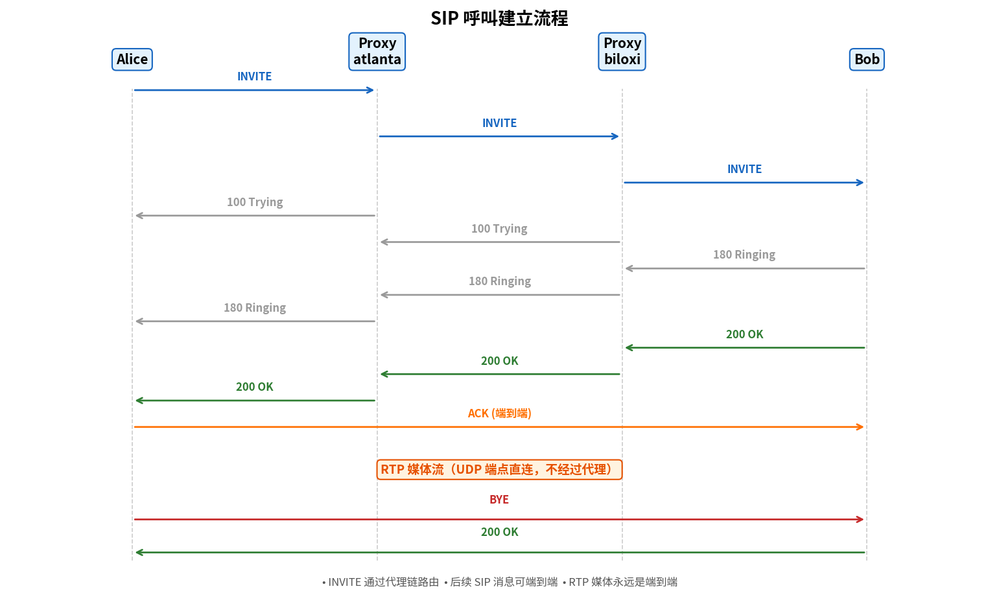

# SIP（会话发起协议）

> 参考：Kurose §9.4.2

**SIP（Session Initiation Protocol, 会话发起协议）**是 IETF 标准（RFC 3261），用于在 IP 网络中**建立、修改和终止**多媒体会话。SIP 在 VoIP 和视频会议中扮演"信令"角色——类似传统电话网中的电话信令，但更灵活和可扩展。

## SIP 的功能

SIP 解决的核心问题：**如何在 IP 网络中定位被叫方并建立会话？** 在传统电话网中，电话号码有固定的地理层级，呼叫路由基于区号-局号-用户号。在 IP 网络中，用户可以在任何地方从任何设备登录，没有固定的 IP 地址甚至没有固定的设备。

SIP 提供的核心功能：
- **用户定位**：确定被叫方当前使用的终端系统的 IP 地址
- **用户可用性**：确定被叫方是否愿意参与通信（是否在线、是否忙）
- **用户能力协商**：协商双方支持的媒体编码格式
- **会话建立**：建立呼叫，包括振铃提示
- **会话管理**：转移、终止会话

## SIP 体系结构

SIP 系统中的实体：

| 实体 | 作用 |
|------|------|
| **用户代理（User Agent）** | 终端设备（SIP 电话、软电话），发起或接收 SIP 请求 |
| **代理服务器（Proxy Server）** | 中继 SIP 请求，向被叫方路由请求。可串联多个代理 |
| **注册服务器（Registrar）** | 接受用户的 **REGISTER** 请求，维护**用户 SIP URI → 当前 IP 地址**的绑定 |
| **重定向服务器（Redirect Server）** | 不中继请求，而是**告诉呼叫方**被叫方的当前位置（让呼叫方直接联系） |

## SIP 地址

SIP 使用 **SIP URI**（Uniform Resource Identifier）标识用户：`sip:bob@example.com`。这看起来像电子邮件地址——SIP 复用因特网的现有地址体系。

## SIP 消息

SIP 是**文本协议**（类似 HTTP），由请求行/状态行 + 首部行 + 消息体组成。

### 请求（方法）

| 方法 | 用途 |
|------|------|
| **INVITE** | 邀请用户加入会话（发起呼叫） |
| **ACK** | 确认最终响应（三次握手最后一步） |
| **BYE** | 终止已建立的会话（挂断） |
| **CANCEL** | 取消尚未完成的请求 |
| **REGISTER** | 向注册服务器注册当前 IP 地址 |
| **OPTIONS** | 查询服务器能力 |

### 响应（状态码）

类似 HTTP 状态码：
- **1xx** 临时（Trying / Ringing）
- **2xx** 成功（OK）
- **3xx** 重定向
- **4xx** 客户端错误
- **5xx** 服务器错误
- **6xx** 全局失败

## SIP 呼叫建立流程

典型的 SIP 呼叫流程（Alice 呼叫 Bob，通过双方的代理服务器）：

```
Alice         proxy.atlanta.com          proxy.biloxi.com          Bob
  |                   |                        |                   |
  |── INVITE ────────>|                        |                   |
  | (携带 SDP 描述    |                        |                   |
  |  Alice 支持的编码)  |                        |                   |
  |                   |── INVITE ──────────────>|                   |
  |                   |                        |── INVITE ────────>|
  |<── 100 Trying ────|                        | (携带 Alice SDP)  |
  |                   |<── 100 Trying ──────────|                   |
  |                   |                        |<── 180 Ringing ───|
  |<── 180 Ringing ───|<── 180 Ringing ─────────|                   |
  |                   |                        |<── 200 OK ────────|
  |<── 200 OK ────────|<── 200 OK ──────────────| (携带 Bob SDP)    |
  | (携带 Bob SDP)     |                        |                   |
  |── ACK ────────────────────────────────────────────────────────>|
  |                   |                        |                   |
  |<════════════ RTP 媒体流（UDP，端点直连）══════════════════════>|
  |                   |                        |                   |
  |── BYE ────────────────────────────────────────────────────────>|
  |<── 200 OK ──────────────────────────────────────────────────────|
```

关键点：
1. **INVITE 经过代理服务器链**路由到被叫方（各代理服务器逐跳转发请求）
2. **ACK 和后续 SIP 消息可直接端到端发送**，不必经过代理链
3. **RTP 媒体流始终在端点之间直接传输**（不经过 SIP 代理服务器）
4. INVITE 携带 **SDP（Session Description Protocol）**，描述呼叫方支持的媒体编码

## SDP（会话描述协议）

SDP 不是传输协议，而是**描述多媒体会话参数的格式**，携带在 SIP 消息体中。典型 SDP 内容包括：

- 会话名称和目的
- 会话持续时间
- 媒体类型（音频/视频）
- 传输协议（RTP/UDP/IP）
- 媒体编码格式（如 PCMU、G.729）
- 接收媒体的 IP 地址和端口号

## SIP 地址注册

用户如何在移动中保持可达？SIP 通过 **REGISTER** 机制解决：

1. Bob 启动 SIP 客户端，向**注册服务器**发送 `REGISTER sip:registrar.biloxi.com` 请求
2. 注册服务器将 Bob 的 **SIP URI**（`sip:bob@biloxi.com`）绑定到他的**当前 IP 地址**
3. 当 Alice 呼叫 Bob 时，代理服务器向注册服务器查询 Bob 的 IP 地址，然后将 INVITE 路由到该地址
4. 注册有**有效期**（通过 Expires 首部），超时需重新注册



这实现了**用户移动性**——Bob 可以在不同地点、用不同设备登录，其他人始终通过 Bob 的 SIP URI 找到他。

## SIP 与 H.323

SIP 的主要替代标准是 **H.323**（ITU-T 标准）。SIP vs H.323 的关键差异：

| | SIP | H.323 |
|---|-----|-------|
| **设计哲学** | 因特网风格（类 HTTP/文本） | 电信风格（类 ISDN/Q.931/二进制 ASN.1） |
| **复杂度** | 简单、轻量 | 复杂、重量 |
| **扩展性** | 易于扩展（自由添加首部） | 扩展需标准化 |
| **普及程度** | 占主导，IMS/LTE 语音（VoLTE）基于 SIP | 早期视频会议，逐渐被 SIP 取代 |

- [[IP语音]]
- [[SDP]]
- [[RTP与RTCP]]
- [[去抖动缓冲区]]
- [[NAT]]
- [[多媒体网络应用概述]]
- [[应用层协议原理]]
- [[HTTP]]
- [[服务质量]]
