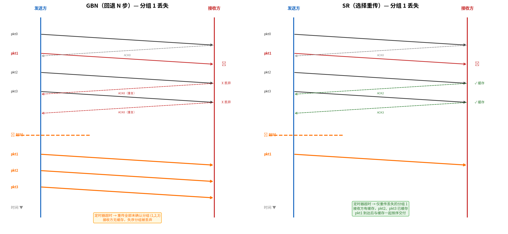

# SR（选择重传）

> 参考：Kurose §3.4.5

**选择重传（Selective Repeat, SR）** 是流水线可靠数据传输的第二种基本方法。与 GBN 不同，SR 让发送方**仅重传那些它怀疑在接收方出了错（丢失或损坏）的分组**，避免不必要的重传。每个分组需要独立的确认和单独的定时器。

## SR 发送方

SR 发送方维护一个大小为 $N$ 的**窗口**，限制未确认分组的数量。发送方处理以下事件：

1. **上层调用**：如果 `nextseqnum` 在窗口内，创建分组并发送，为该分组启动独立的定时器；如果窗口已满，拒绝或缓冲上层数据
2. **收到 ACK**：为每个被确认的分组标记为"已确认"。如果该分组的序号等于 `send_base`，将窗口的 `send_base` 向前滑动到**最小序号的未确认分组**
3. **超时**：每个分组拥有**独立的定时器**。仅超时的分组被重传

## SR 接收方

SR 接收方**缓存失序的分组**——与 GBN 的关键区别。接收方维护一个大小为 $N$ 的接收窗口，窗口左边界为 $rcv\_base$（尚未交付的最小序号）。

### 接收方看到的序号空间

对于任意到达的分组（序号为 $seq$），接收方根据它落在序号空间的**哪个区间**来决定动作。$N \leq 2^{k-1}$ 的约束保证了以下三个区间互不重叠：

```
序号空间（环状，0 到 2^k-1）：

  区间二                 区间一                 区间三
  [rcv_base - N,         [rcv_base,             (区间一、二之外
   rcv_base - 1]          rcv_base + N - 1]      的所有序号)
  ↑                      ↑
  已收过但需重发 ACK      当前接收窗口
  （可能 ACK 丢了）       （接受新分组）
```

### 三种区间的判断与动作

| 区间 | 判定条件 | 含义 | 动作 |
|---|---|---|---|
| **区间一**（窗口内） | $\text{in\_range}(seq,\; rcv\_base,\; (rcv\_base+N-1)\bmod 2^k)$ | 期望收到的新分组（或失序但可接受） | **接收**，缓存，发 ACK。若 $seq = rcv\_base$，将 $rcv\_base$ 连同连续已缓存的分组一起交付，窗口右移 |
| **区间二**（窗口下方） | $\text{in\_range}(seq,\; (rcv\_base-N)\bmod 2^k,\; (rcv\_base-1)\bmod 2^k)$ | 接收方之前已收过且发过 ACK，但发送方的 ACK 可能丢了 | **不交付**（已交过），**重新发 ACK**——否则发送方收不到这个 ACK 就永远卡住 |
| **区间三**（其他） | 不满足上述任一条件 | 超前太多或滞后太远 | **忽略** |

### 为什么区间二是必须的？

考虑这个场景：接收方已正确收到 pkt0、pkt1、pkt2，都发了 ACK，但 **pkt0 的 ACK 丢了**。发送方超时后重传 pkt0。

此时接收方的 $rcv\_base$ 已经是 3（0、1、2 都已交付），pkt0 的序号落在了区间二（$[3-N,\; 2] = [1,\; 2]$… 等等，$N$ 多大？

假设 $k=3$（序号 0-7），$N=4$。$rcv\_base=3$。区间二 = $[3-4,\; 3-1] \bmod 8 = [7,\; 2]$（回绕），包含 7、0、1、2。pkt0 落在区间二 → 重发 ACK0。

发送方收到这个重发的 ACK0 后，知道 pkt0 已确认，$send\_base$ 可以从 0 移到 1。如果接收方不发这个重复 ACK，发送方永远收不到 pkt0 的确认，窗口永远卡住。

### 区间一的窗口确认示例

$k=3$，$N=4$，$rcv\_base=3$：

> 区间一 = $[3,\; 6]$，能接受 3、4、5、6
> 区间二 = $[7,\; 2]$（回绕），属于「已收过」的范围，重发 ACK
> 区间三 = 无（因为 $N=4=2^{3-1}$，区间一和区间二恰好瓜分整个序号空间）

如果收到 pkt5（失序），落在区间一内 → 缓存，发 ACK5，但不交付（因为 3、4 还没到）。等 3、4 都到了，把 3、4、5 一起交付，$rcv\_base$ 跳到 6。

## 序号空间与窗口大小的约束

SR 协议存在一个关键的序号混淆问题。假设序号范围 $[0, 1, 2, 3]$（$k=2$ 位，模 4），窗口大小 $N=3$。考虑以下场景：

1. 发送方发送分组 0、1、2
2. 接收方接收并按序交付分组 0、1、2。接收窗口现在是 3、0、1
3. 所有三个分组的 ACK 都丢失
4. 发送方重传分组 0
5. 接收方此时无法区分这个分组的序号 0 是**新分组的序号 0**（发送方窗口前移后发送的新的第 4 个分组）还是**旧分组的序号 0 的重传**

为了避免接收方将重传分组误认为新分组，**窗口大小必须满足以下条件**：
$$N \leq 2^{k-1}$$

对于 $k=2$ 位序号的 SR 协议，最大窗口大小为 $2^{2-1}=2$。

直觉解释：发送方的窗口和接收方的窗口之间不存在交叠。如果窗口大小不超过序号空间的一半，接收方就能区分窗口中的序号和新一轮的序号。



## GBN 与 SR 对比

| | GBN | SR |
|---|-----|-----|
| **重传策略** | 重传窗口内所有未确认分组 | 仅重传超时的分组 |
| **接收方缓存** | 不缓存失序分组 | 缓存失序分组 |
| **ACK 类型** | 累积确认（ACK n = ≤n 全部确认） | 选择确认（仅确认该分组） |
| **定时器** | 单个（仅对最旧未确认分组） | 每个分组独立定时器 |
| **接收方复杂度** | 极简单 | 较复杂（缓存 + 排序） |
| **带宽效率** | 低（不必要重传多） | 高（仅重传丢失的分组） |
| **TCP 关系** | TCP 使用累积确认（类似 GBN），但也缓存失序分组（类似 SR） | — |

- [[流水线可靠传输]]
- [[GBN]]
- [[可靠数据传输原理]]
- [[TCP可靠数据传输]]
- [[TCP往返时间估计]]
