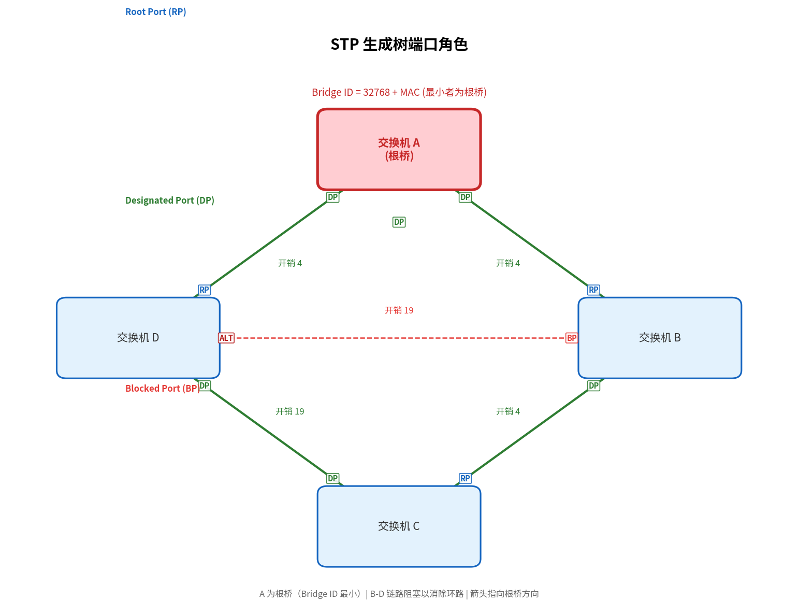

# 生成树协议（STP）

> 参考：IEEE 802.1D；Kurose §6.4.4

生成树协议（Spanning Tree Protocol, STP）是运行在[[链路层交换机|交换机]]上的一种链路层协议，用于在具有冗余链路的交换式网络中构建**无环（loop-free）**的逻辑拓扑。STP 由 Radia Perlman 于 1985 年发明，是 IEEE 802.1D 标准的核心内容。

## 为什么需要 STP

交换式网络的设计者通常会部署**冗余链路**来提高可靠性——当一条链路或一台交换机故障时，冗余路径可以保证连通性。但冗余链路引入了一个严重问题：**广播帧在网络中无限循环**。

### 广播风暴

考虑三台交换机 A、B、C 通过冗余链路两两相连。假设主机 H1 向交换机 A 发送一个广播帧（目的 MAC `FF-FF-FF-FF-FF-FF`）：

1. 交换机 A 收到广播帧，泛洪到除接收端口外的所有端口——帧被转发到 B 和 C
2. 交换机 B 收到来自 A 的广播帧，泛洪到所有其他端口——帧被转发到 C（以及可能连接的其他主机）
3. 交换机 C 从 A 收到广播帧，同样泛洪——帧又被转发回 B
4. 交换机 B 和 C 交替收到来自对方的同一广播帧副本，继续无休止地转发

这个过程就是**广播风暴（broadcast storm）**——网络带宽被循环广播帧完全耗尽，所有主机无法进行任何正常通信。更糟的是，由于交换机每收到一个帧就更新 MAC 地址表，循环帧会导致 MAC 地址表不断被改写（源 MAC → 不同端口的映射持续翻转），这就是 **MAC 地址表颠簸（MAC table thrashing）**。

STP 的根本任务就是：**将物理上有环的交换式网络拓扑转化为逻辑上无环的生成树**，同时保留冗余链路的故障切换能力。

## STP 的核心机制

STP 通过四个步骤构建生成树：

### 1. 选举根桥（Root Bridge）

网络中所有交换机通过交换 **BPDU（Bridge Protocol Data Unit）** 选举出一台**根桥**。每台交换机的 Bridge ID 由两部分组成：

- **Bridge Priority**：2 字节的可配置优先级，默认值 32768
- **MAC Address**：6 字节的交换机 MAC 地址

Bridge ID 最小的交换机成为根桥。默认情况下所有交换机优先级相同，因此**MAC 地址最小**的交换机胜出。

### 2. 计算到根桥的最短路径

每台非根交换机确定到根桥的**最低开销路径**。端口开销（Port Cost）基于链路带宽：

| 链路速率 | 原始开销 (802.1D-1998) | 修订开销 (802.1D-2004/RSTP) |
|---------|----------------------|---------------------------|
| 10 Mbps | 100 | 2,000,000 |
| 100 Mbps | 19 | 200,000 |
| 1 Gbps | 4 | 20,000 |
| 10 Gbps | 2 | 2,000 |
| 100 Gbps | — | 200 |

### 3. 分配端口角色

每台交换机为每个端口分配一个角色：

- **根端口（Root Port, RP）**：交换机上到达根桥路径开销最低的端口。每台非根交换机**只有一个**根端口。
- **指定端口（Designated Port, DP）**：每个网段上，到达根桥路径开销最低的交换机的端口成为指定端口。根桥上所有端口都是指定端口。
- **阻塞端口（Blocked Port, BP）**：既不是根端口也不是指定端口的端口。阻塞端口**不转发帧**，只侦听 BPDU。

### 4. BPDU 交换

BPDU 是 STP 的工作语言。交换机定期（默认每 2 秒）发送**配置 BPDU（Configuration BPDU）**，包含以下关键字段：

| 字段 | 说明 |
|------|------|
| Root Bridge ID | 发送方认为的根桥 ID |
| Root Path Cost | 发送方到根桥的路径开销 |
| Sender Bridge ID | 发送方自身的 Bridge ID |
| Sender Port ID | 发送此 BPDU 的端口 ID |
| Message Age | BPDU 自根桥生成后经过的时间 |
| Max Age | 超时时间（默认 20 秒） |
| Hello Time | 根桥发送 BPDU 的间隔（默认 2 秒） |
| Forward Delay | 侦听和学习状态的持续时间（默认 15 秒） |

收到 BPDU 的交换机根据以下四步比较决定是否更新自己记录的"最优"BPDU：

1. 收到的 Root Bridge ID < 本地记录的 Root Bridge ID → 替换
2. Root Bridge ID 相同，收到的 Root Path Cost < 本地记录的 → 替换
3. Root Bridge ID 和 Root Path Cost 都相同，收到的 Sender Bridge ID < 本地记录的 → 替换
4. 前三项都相同，收到的 Sender Port ID < 本地记录的 → 替换

初始时每台交换机认为自己是根桥，通过持续交换 BPDU 收敛到一致的生成树。

## 端口状态与收敛

STP 端口在收敛过程中经历五种状态：

| 状态 | 持续时间 | 接收 BPDU | 学习 MAC | 转发帧 |
|------|---------|-----------|----------|--------|
| **Disabled**（禁用） | — | — | — | — |
| **Blocking**（阻塞） | 0–20 s | 是 | — | — |
| **Listening**（侦听） | 15 s | 是 | — | — |
| **Learning**（学习） | 15 s | 是 | 是 | — |
| **Forwarding**（转发） | 持续 | 是 | 是 | 是 |

从 Blocking 进入 Forwarding 需要经历 Listening（15 s）和 Learning（15 s）两个中间状态，因此总收敛时间为 **Forward Delay × 2 = 30 秒**。Listening 阶段仅侦听 BPDU 不学习 MAC，Learning 阶段学习 MAC 但不转发——分两步的原因是确保 MAC 地址表在开始转发前已充分学习，避免瞬间泛洪环路。

**拓扑变更通知（Topology Change Notification, TCN）**：当链路状态发生变化（如端口 up/down），检测到的交换机向根桥发送 TCN BPDU。根桥收到后在下一轮配置 BPDU 中设置 TC（Topology Change）标志位，通知全网交换机缩短 MAC 地址表的老化时间（从 300 秒缩短到 Forward Delay 的 15 秒），加速收敛。

## RSTP（802.1w）的改进

传统 STP 的 30 秒收敛时间在当今网络中不可接受。**快速生成树协议（Rapid Spanning Tree Protocol, RSTP）** 在 IEEE 802.1w 中标准化，将收敛时间缩短到亚秒级：

| 改进 | STP | RSTP |
|------|-----|------|
| 端口状态 | 5 种（Disabled/Blocking/Listening/Learning/Forwarding） | 3 种（Discarding/Learning/Forwarding） |
| 端口角色 | 3 种（RP/DP/BP） | 4 种（RP/DP/Alternate/Backup） |
| 收敛机制 | 定时器驱动（被动等待 30 s） | Proposal/Agreement 握手（主动协商） |
| BPDU | 根桥发起，逐跳中继 | 每台交换机主动发送（每 Hello Time） |
| 链路故障检测 | Max Age 超时（20 s） | 3 个连续 Hello 丢失（6 s） |
| 边缘端口 | 无 | PortFast（直接进入 Forwarding，类似 STP 的 PortFast 扩展） |

RSTP 新增两种端口角色：
- **Alternate 端口**：到根桥的备用路径（替代根端口），相当于 STP 中的 UplinkFast
- **Backup 端口**：同一网段上的备用指定端口，仅存在于集线器连接的自环场景

## 与 VLAN 的关系

STP 最初没有考虑 VLAN。在 VLAN 环境中，不同 VLAN 可能需要不同的生成树拓扑。解决方案有两种：

- **CST（Common Spanning Tree）**：所有 VLAN 共享一棵生成树（802.1Q 默认），简单但不够灵活
- **PVST+（Per-VLAN Spanning Tree Plus）**：每个 VLAN 运行独立的 STP 实例（Cisco 专有），可做负载均衡
- **MSTP（Multiple Spanning Tree Protocol, 802.1s）**：将多个 VLAN 映射到少数几个生成树实例，兼顾灵活性与可扩展性

## 现代实践

在现代数据中心和大规模交换式网络中，STP 的使用正在减少，替代方案包括：

- **链路聚合（LAG/LACP）**：将多条物理链路捆绑为一条逻辑链路，消除环路的同时增加带宽
- **VXLAN + EVPN**：在第 3 层之上构建覆盖网络，底层使用 ECMP 实现无环多路径转发
- **SPB（Shortest Path Bridging, 802.1aq）**：使用 IS-IS 链路状态协议替代 STP，实现最短路径转发

尽管如此，STP/RSTP 在企业园区网络和中小型交换式网络中仍然广泛部署，是网络工程师必须掌握的基础知识。

- [[链路层交换机]]
- [[以太网]]
- [[VLAN]]
- [[链路层概述]]
- [[数据中心网络]]
