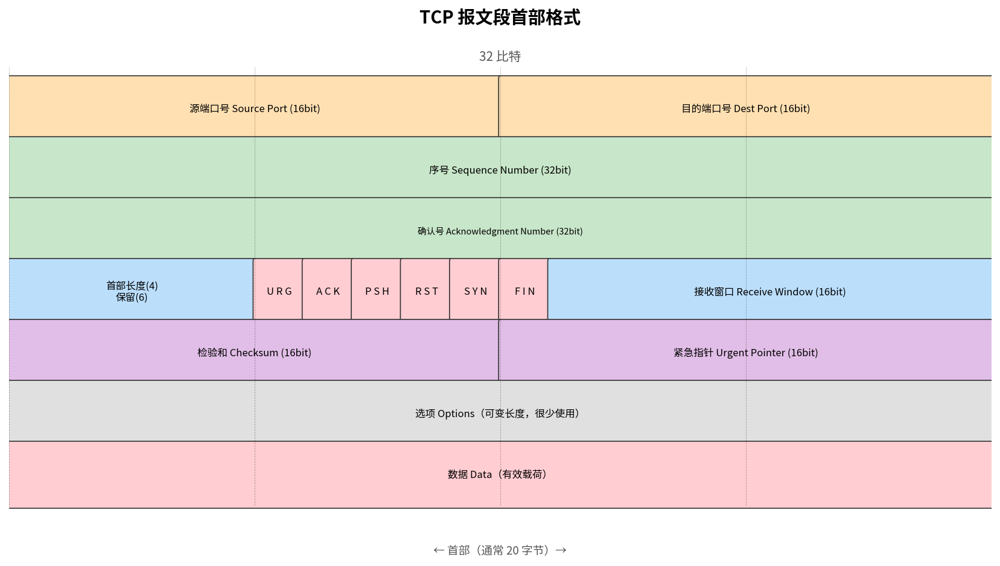

# TCP 报文段结构

> 参考：Kurose §3.5.1

TCP 报文段由 **20 字节固定首部**（可选可变长选项字段）和**数据字段**组成。数据字段包含一块应用数据。MSS 限制了报文段数据字段的最大长度。

## TCP 报文段格式

## 各字段说明

### 源端口号与目的端口号（各 16 比特）

用于多路复用/多路分解。源端口号标识发送进程，目的端口号标识接收进程。

### 序号（32 比特）

TCP 将数据视为一个无结构的、有序的**字节流**。**序号（sequence number）是报文段中首字节在字节流中的编号**，而非报文段的编号。

例如：一个文件大小为 500,000 字节，MSS 为 1,000 字节。TCP 为该数据流构造 500 个报文段。第一个报文段的序号为 0，第二个为 1000，第三个为 2000……每个序号被随机初始值 `Initial Sequence Number`（并非总是从零开始）偏移。

具体对应关系如下表（假设 ISN = 0，仅用于教学演示）：

| 报文段 | 携带字节范围 | 序号（首字节编号） | 报文段长度 |
|--------|-------------|-------------------|-----------|
| 第 1 个 | 0 ~ 999 | **0** | 1000 字节 |
| 第 2 个 | 1000 ~ 1999 | **1000** | 1000 字节 |
| 第 3 个 | 2000 ~ 2999 | **2000** | 1000 字节 |
| … | … | … | … |
| 第 500 个 | 499000 ~ 499999 | **499000** | 1000 字节 |

可以看到，序号不是 1, 2, 3, … 这样的报文段编号，而是 **0, 1000, 2000, …** 这样的字节偏移量。这体现了 TCP "面向字节流" 的本质——序号标记的是每个字节在流中的位置，而非报文段的编号。

> **为什么用字节序号而非报文段序号？** 因为 TCP 报文段的长度不是固定的——受 MSS、拥塞窗口（cwnd）和接收窗口（rwnd）的共同影响，同一连接中不同报文段的长度可以变化。字节流序号使得确认也变得直观：**确认号 = 期望接收的下一个字节序号**。例如接收方回复 ACK=1500 意味着"字节 0~1499 已收到，下一个请发字节 1500"。

与 [[GBN]] 和 [[SR]] 的对比值得注意：这两个可靠传输**理论模型**通常以"分组"为单位讲授序号，而 TCP 实际使用的是**字节流序号**——这是 TCP 区别于教学模型的重要实现细节，也是常见考点。

### 确认号（32 比特）

TCP 使用**累积确认**——确认号是主机**期望接收的下一个字节的序号**。更具体地说：确认号 n 意味着接收方已成功收到序号不超过 n-1 的所有字节。确认号只有在首部的 **ACK 标志**为 1 时才有效。

### 首部长度（4 比特）

TCP 首部的实际长度 = 该字段值 × 4 字节。因为字段为 4 比特，取值范围 0~15，但合法值必须 ≥ 5（首部至少 20 字节），因此最小 5 × 4 = 20 字节，最大 15 × 4 = 60 字节。典型的 TCP 首部为 20 字节（该字段 = 5，无选项）。如果选项字段存在，首部长度相应增大。

### 标志字段（6 比特）

| 标志 | 含义 |
|------|------|
| **URG** | 紧急指针字段有效——指示有"紧急数据"需优先处理 |
| **ACK** | 确认号字段有效——除了初始的 SYN 报文段外，所有 TCP 报文段都设置此标志 |
| **PSH** | 接收方应立即将数据推送给应用层，不需等待填满缓冲区 |
| **RST** | 重置连接——用于拒绝无效的报文段或拒绝打开连接 |
| **SYN** | 用于建立 TCP 连接（三次握手） |
| **FIN** | 用于释放 TCP 连接（四次挥手）——发送方已无数据要发送 |

两个常见的标志组合：
- **SYN=1, ACK=0**：连接请求报文段（三次握手的第一个报文段）
- **FIN=1**：连接释放报文段

### 接收窗口（16 比特）

接收窗口字段用于**流量控制**——指示发送方希望接收的字节数（从确认号开始）。这是接收方当前可用的缓冲区空间量 `rwnd`。16 比特意味着最大窗口大小为 65,535 字节（TCP 窗口缩放选项可将窗口大小扩展到更大值）。

### 检验和（16 比特）

类似于 [[UDP]]，TCP 检验和用于端到端差错检测。计算时包括 TCP 首部、TCP 数据和来自 IP 层的**伪首部**（源 IP、目的 IP、协议号 = 6、TCP 报文段长度）。伪首部详细机制见 [[UDP#检验和的覆盖范围：伪首部（Pseudo-Header）]]。

### 紧急指针（16 比特）

当 URG 标志为 1 时，紧急指针指示最后一个紧急数据字节相对于当前序号的偏移量。用于标记需要立即处理的数据。

### 选项字段（可变长度）

在 TCP 连接建立期间，可以协商可选功能：
- **MSS 选项**：告知对方自己可接受的最大报文段大小
- **窗口缩放选项**：允许接收窗口超过 65,535 字节（通过左移位数实现）
- **时间戳选项**：用于更好地估算 RTT 和防止序号回绕
- **SACK（Selective ACK）选项**：允许接收方告知发送方哪些不连续的数据块已收到

- [[TCP概述]]
- [[TCP可靠数据传输]]
- [[TCP流量控制]]
- [[TCP连接管理]]
- [[MTU与MSS]]
- [[SACK]]
