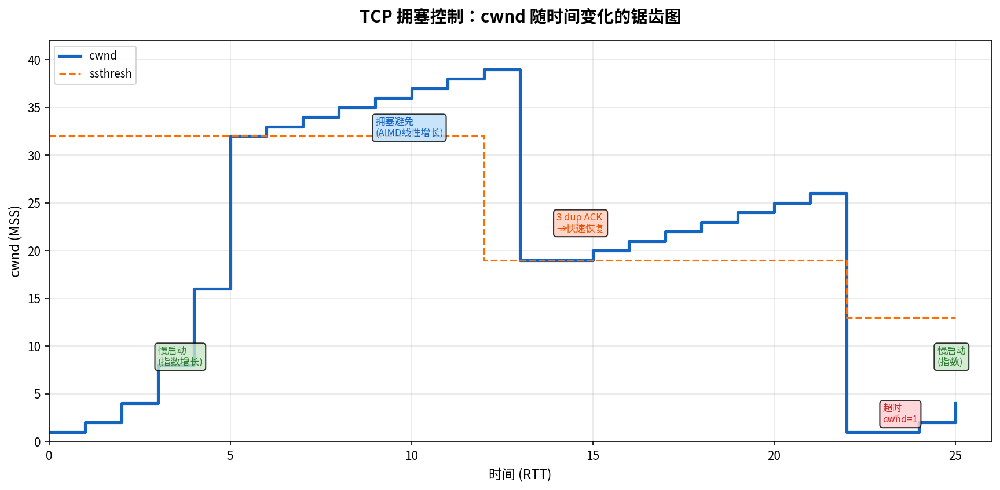

# TCP 拥塞控制

> 参考：Kurose §3.7

TCP 使用**端到端拥塞控制**——端系统通过丢包（超时或三个重复 ACK）作为网络拥塞的隐式信号，自主调整发送速率。TCP 的拥塞控制算法由 **RFC 5681** 定义，包含四个核心组件：慢启动、拥塞避免、快速重传和快速恢复。

## TCP 发送方限制

TCP 发送方的实际发送速率由两个窗口共同决定：

$$\text{发送窗口} = \min(\text{cwnd}, \text{rwnd})$$

- **cwnd（拥塞窗口，Congestion Window）**：发送方根据网络拥塞自行估算的限制
- **rwnd（接收窗口，Receive Window）**：接收方通告的流量控制限制

发送方未确认的数据量 $\text{LastByteSent} - \text{LastByteAcked}$ 不能超过发送窗口。

## 慢启动（Slow Start）

当 TCP 连接刚建立时，发送方对网络状况一无所知——突然以高带宽发送可能导致立即拥塞。**慢启动**的目的：**探测可用带宽，从低速率开始，指数增长直到感受到拥塞**。

慢启动的行为：

1. 初始 **cwnd = 1 MSS**（通常 1 MSS ≈ 1460 字节）；在更新的标准（RFC 6928）中，初始 cwnd 被提高到 **10 MSS** 以加快小文件的传输启动
2. 每收到一个 ACK，cwnd 增加 1 MSS——导致**每 RTT cwnd 翻倍**（指数增长）
   - RTT 1：发送 1 个报文段，收到 ACK → cwnd = 2
   - RTT 2：发送 2 个报文段，收到 2 个 ACK → cwnd = 4
   - RTT 3：发送 4 个报文段，收到 4 个 ACK → cwnd = 8
3. 慢启动有三个终止条件（Kurose §3.7, p.314–315）：
   - **超时发生**（指示严重拥塞）：ssthresh = cwnd/2, **cwnd = 1 MSS**，重新开始慢启动
   - **cwnd ≥ ssthresh**（达到阈值）：结束慢启动，进入**拥塞避免**模式
   - **3 个重复 ACK**（指示轻度拥塞）：执行快速重传，ssthresh = cwnd/2, cwnd = ssthresh + 3 MSS，进入**快速恢复**模式

**ssthresh（Slow Start Threshold，慢启动阈值）** 是慢启动与拥塞避免之间切换的界限。初始值通常设为一个很大的数。当超时发生时，ssthresh 被设为 cwnd/2（在减小 cwnd 之前）。

慢启动的名字"慢"有些误导——实际上 cwnd 以指数速度增长，非常快。它被称为"慢"是相对于 TCP 的原始版本（没有拥塞控制，使用 rwnd 直接发送）而言的。

## 拥塞避免（Congestion Avoidance）

一旦 cwnd 达到 ssthresh，TCP 进入**拥塞避免**模式。此时 cwnd 接近上次发生拥塞时的值——增长需要更谨慎。

拥塞避免的行为：

- **每 RTT，cwnd 增加 1 MSS**（**线性增长**，而非指数增长）
  - 实践中：每收到一个 ACK，cwnd 增加 $( \text{MSS} \times \text{MSS} ) / \text{cwnd}$ 字节
- 终止条件：
  - **超时**：ssthresh = cwnd/2, cwnd = 1 MSS，重新开始慢启动
  - **3 个重复 ACK**：ssthresh = cwnd/2, cwnd = ssthresh + 3 MSS，进入**快速恢复**

## 快速重传（Fast Retransmit）

在之前（TCP 可靠数据传输）已经讨论过：收到第三个重复 ACK 时，不等超时立即重传丢失的报文段。

## 快速恢复（Fast Recovery）

快速恢复处理**3 个重复 ACK** 事件（轻度的拥塞信号，因为后续报文段仍在到达）：

1. ssthresh = **cwnd / 2**（减半，乘法减小 MD）
2. cwnd = ssthresh + 3 MSS（补偿已收到的 3 个重复 ACK 对应的已离开网络的报文段）
3. 每收到一个额外的重复 ACK（即发送的报文段在继续到达接收方）：cwnd += 1 MSS
4. 当收到**新的 ACK**（覆盖了丢失分组及其后所有数据的累积确认）时：**cwnd = ssthresh**，退出快速恢复，进入拥塞避免

如果在快速恢复期间发生超时：行为与上述相同（ssthresh = cwnd/2, cwnd = 1 MSS, 慢启动）。

## 超时 vs 3 个重复 ACK 的不同处理

TCP 区分两种丢包事件，认为它们意味着不同程度的拥塞：

| 事件 | 隐含的拥塞程度 | TCP 响应 |
|------|---------------|---------|
| **超时** | 严重拥塞（几乎所有报文段都丢失了） | ssthresh = cwnd/2, **cwnd = 1 MSS**，重新慢启动 |
| **3 dup ACK** | 轻度拥塞（后续报文段仍在到达） | ssthresh = cwnd/2, cwnd = ssthresh + 3 MSS, **快速恢复** |

## TCP 拥塞控制的状态转换总览

```
                    ┌──────────────┐
                    │   慢启动 (SS)  │
                    │ cwnd每ACK+1MSS│
                    │  (指数增长)    │
                    └──────┬───────┘
                           │ cwnd ≥ ssthresh
                           ▼
                    ┌──────────────┐
            ┌──────▶│  拥塞避免 (CA) │◀──────────┐
            │       │ cwnd每RTT+1MSS│           │
            │       │  (线性增长)    │           │
            │       └──┬───────┬───┘           │
            │ 3dup ACK │       │ 超时           │ 收到新ACK
            │          ▼       ▼               │ (cwnd=ssthresh)
            │  ┌──────────┐  ┌──────────┐      │
            │  │ 快速恢复   │  │ ssthresh= │      │
            │  │(FR)      │  │ cwnd/2    │      │
            │  │cwnd减半   │  │ cwnd=1MSS │      │
            │  │+3MSS     │  │ 回到SS    │      │
            │  └──────────┘  └──────────┘      │
            │                                  │
            └──────────────────────────────────┘
```



## TCP Tahoe 与 TCP Reno

上述包含快速恢复的算法是 **TCP Reno**（大多数现代操作系统默认使用）。早期的 **TCP Tahoe** 不区分超时和 3 dup ACK——两种事件均将 cwnd 重置为 1 MSS，重新进入慢启动。Reno 引入快速恢复是对 Tahoe 的关键改进，避免在轻度拥塞时不必要的慢启动。

## 现代拥塞控制算法

除经典的 Reno 外，现代 TCP 实现中使用了多种改进的拥塞控制算法：

- **CUBIC**：Linux 内核的默认算法。使用三次函数（而非 AIMD 的线性函数）调整 cwnd，在高带宽-延迟积（BDP）网络中比 Reno 更快地恢复和收敛。CUBIC 是目前因特网中使用最广泛的拥塞控制算法。
- **BBR（Bottleneck Bandwidth and Round-trip propagation time）**：由 Google 开发，基于瓶颈带宽和 RTT 的估算（而非丢包）来调整发送速率，在高丢包网络上显著改善吞吐量。

## AIMD 公平性

TCP 拥塞避免中使用的是 **AIMD（Additive Increase, Multiplicative Decrease）**算法：

- **加性增（AI）**：每 RTT，cwnd += 1 MSS（所有连接以相同速率扩展）
- **乘性减（MD）**：丢包时，cwnd = cwnd / 2（比例减小）

AIMD 的一个关键属性是：当 $K$ 条 TCP 连接共享一条容量为 $R$ 的瓶颈链路时，长期来看每条连接将大致收敛到公平份额 $R/K$。加性增使各连接缓慢竞争更多带宽，乘性减在拥塞时按比例退让——反复的 AI 和 MD 使连接在公平分配点附近来回波动。

然而，具有**较小 RTT 的连接**可以更快地从拥塞中恢复，从而获得超过公平份额的带宽——这是 TCP 公平性的一个内在局限性。

## TCP 吞吐量的宏观模型

> **注意**：以下推导是一个简化模型，仅考虑 3 dup ACK 触发的丢包事件，忽略超时丢包和慢启动阶段。在丢包率较高（超时频繁发生）的场景下，实际吞吐量低于此公式的预测值。

TCP 连接的平均吞吐量可以通过以下简化的周期丢包模型推导得出。假设在拥塞避免阶段，cwnd 在 W 和 W/2 之间线性振荡（AIMD 锯齿波），每个周期的开始发生一次丢包事件（3 dup ACK）。

### 推导步骤

**1. 平均拥塞窗口**

在拥塞避免阶段，cwnd 从 W/2（丢包后的窗口）线性增长到 W（丢包时的窗口），再因丢包减半到 W/2。这一锯齿波的平均值为：

$$\text{平均 cwnd} = 0.75 \times W$$

**2. 一个周期的分组数 / 丢包率**

在一个完整的锯齿波周期中，cwnd 从 W/2 开始每 RTT 增加 1 MSS，到达 W 时发生丢包。总共增加了 $W/2$ 次，因此周期包含 $W/2$ 个 RTT。每个 RTT 内发送的分组数从 W/2 线性增长到 W，总分组数近似为三角形面积：

$$\text{总分组数} \approx \frac{W}{2} \times \frac{3}{4}W = \frac{3}{8}W^2$$

每周期丢失 1 个分组，因此丢包率 $p$ 为：

$$p = \frac{1}{\text{总分组数}} = \frac{1}{\frac{3}{8}W^2} = \frac{8}{3W^2}$$

解得最大窗口 W 与丢包率 $p$ 的关系：

$$W = \sqrt{\frac{8}{3p}} \approx \frac{1.633}{\sqrt{p}}$$

**3. 吞吐量公式**

将 W 代入平均吞吐量（用分数 $0.75 = \frac{3}{4}$）：

$$
\begin{aligned}
\text{平均吞吐量} &= \frac{3}{4}W \times \frac{\text{MSS}}{\text{RTT}}
= \frac{3}{4} \times \sqrt{\frac{8}{3p}} \times \frac{\text{MSS}}{\text{RTT}} \\[6pt]
&= \sqrt{\frac{9}{16} \times \frac{8}{3}} \times \frac{\text{MSS}}{\text{RTT} \times \sqrt{p}}
= \sqrt{\frac{3}{2}} \times \frac{\text{MSS}}{\text{RTT} \times \sqrt{p}} \\[6pt]
&\approx \frac{1.22 \times \text{MSS}}{\text{RTT} \times \sqrt{p}}
\end{aligned}
$$

其中 $p$ 为丢包率。这个公式揭示了：吞吐量**反比于 RTT 和丢包率的平方根**。具有较大 RTT 的连接（如跨洲连接）在相同丢包率下的吞吐量低于 RTT 较小的连接。

- [[TCP概述]]
- [[TCP流量控制]]
- [[拥塞控制原理]]
- [[TCP可靠数据传输]]
- [[ECN]]
- [[无线与移动性对TCP的影响]]
