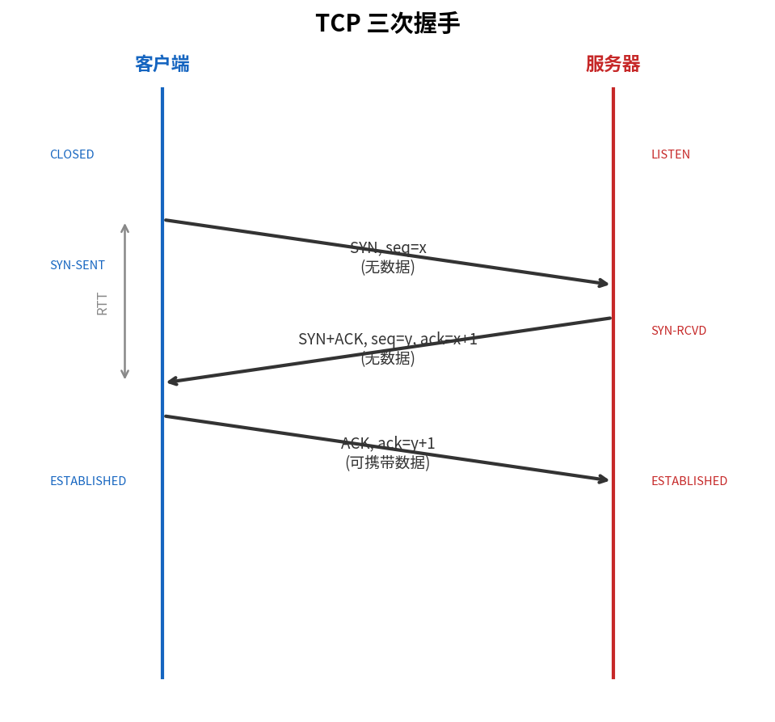
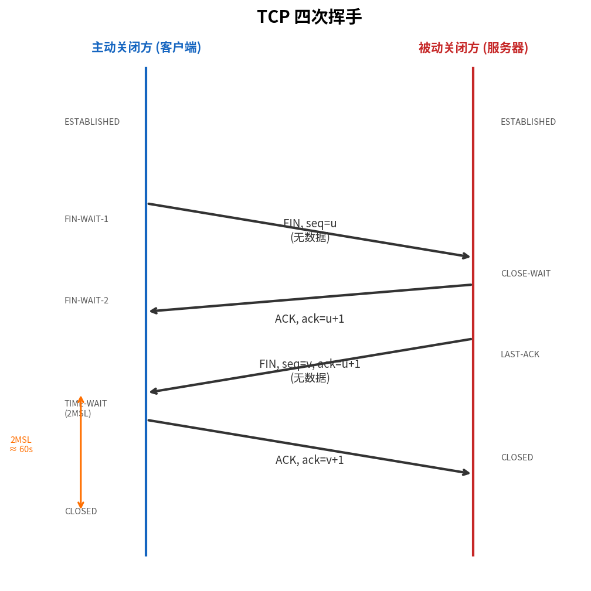

# TCP 连接管理

> 参考：Kurose §3.5.6

TCP 是面向连接的协议——在数据交换之前，通信双方必须建立 TCP 连接。连接建立、使用和拆除的整个过程由 TCP 连接管理处理。本节详细描述三次握手是如何工作的、为什么需要三次（而非两次或四次）握手，以及连接拆除的过程。

## 三次握手（Three-Way Handshake）

TCP 连接的建立通过以下三个步骤完成：

### 步骤 1：客户端发送 SYN

客户端 TCP 向服务器 TCP 发送一个特殊的 TCP 报文段——不包含应用层数据，但首部中的 **SYN 标志位置 1**。此外，客户端随机选择一个**初始序号（client_isn）**，将其放入报文段的序号字段中。

### 步骤 2：服务器发送 SYN+ACK

服务器收到包含 SYN 的报文段后：
- 为该 TCP 连接分配 TCP 缓冲区和变量（为连接做好准备）
- 向客户端发送一个**允许连接**的报文段——同样不含应用层数据，但设置 **SYN = 1** 和 **ACK = 1**
- 服务器选择自己的随机初始序号（server_isn），放入序号字段
- 将确认号设为 `client_isn + 1`

这个 SYN+ACK 报文段有时被称为 **SYNACK**。

### 步骤 3：客户端发送 ACK

客户端收到 SYN+ACK 报文段后：
- 为连接分配缓冲区和变量
- 向服务器发送另一个报文段——**ACK = 1**，确认号 = `server_isn + 1`，序号 = `client_isn + 1`
- 这个报文段**可以承载应用数据**

完成这三个步骤后，两端进入 **ESTABLISHED（已建立）**状态，可以交换包含应用数据的报文段。

## 为什么是三次握手而不是两次

三次握手设计有两个核心理由：

### 1. 确认双方的收发能力

每次握手确认了一方的某种能力：
- **第一个 SYN**：证明客户端有发送能力
- **第二个 SYN+ACK**：证明服务器有接收能力和发送能力
- **第三个 ACK**：证明客户端有接收能力

两次握手下，服务器无法确认客户端的接收能力（客户端可能只发不收）。三次握手下，经过完整的三步，双方都确认了对方的收发能力均正常。

### 2. 防止过期连接请求产生半开连接

考虑以下场景：客户端发送了一个 SYN（seq=x），但由于网络拥塞该 SYN 在路由器中滞留了很长时间。客户端超时，重新发送一个新的 SYN（seq=y），成功建立了连接、传输数据并关闭连接。之后，**过期的 SYN（seq=x）**终于到达服务器。如果使用两次握手，服务器看到 SYN 后就分配资源并回复 SYN+ACK（认为一个新连接正在建立），客户端此时已不需要该连接——客户端不会确认它，导致服务器为一个不存在的连接浪费资源。

三次握手中，客户端必须明确确认服务器的 SYN。如果客户端没有发起连接却收到了服务器的 SYN+ACK（例如因为一个过期的旧 SYN 触发了服务器响应），客户端会发送 **RST** 给服务器，指示服务器关闭这个不想要的半开连接。这样，过期的 SYN 不会导致服务器为无用的连接长期保留资源。

## SYN 泛洪攻击与 SYN Cookie

### SYN 泛洪（SYN Flood）

三次握手的一个经典安全缺陷是 **SYN 泛洪攻击**。攻击者（Trudy）向服务器发送大量 TCP SYN 报文段，每个报文段的源 IP 地址都是伪造的（且各不相同）。服务器为每个 SYN 分配 TCP 缓冲区并发送 SYN+ACK，但 SYN+ACK 被发往伪造的 IP 地址——服务器永远收不到最终 ACK。

服务器为这些"半开连接"保留的资源（TCB，传输控制块）不断积累，最终耗尽所有可用内存，无法响应合法用户的连接请求。这是一种经典的 **DoS（拒绝服务）攻击**。

### SYN Cookie 防御

**SYN Cookie** 是防御 SYN 泛洪的标准技术，核心思想是**服务器不在收到 SYN 时分配资源**：

1. 服务器收到 SYN 时不创建 TCB，而是根据客户端的 IP 地址、端口号、服务器自身的秘密密钥等信息计算一个哈希值
2. 服务器将此哈希值编码到 SYN+ACK 的初始序号（Initial Sequence Number）中——这个 ISN 就是 "cookie"
3. 收到客户端的最终 ACK 时，服务器验证 ACK 中的确认号（= cookie + 1）是否与自己秘密密钥匹配
4. 只有验证通过的连接，服务器才真正分配资源

SYN Cookie 使服务器无需为半开连接维护状态，从根本上消除了 SYN 泛洪攻击的资源耗尽效果。现代操作系统（Linux、FreeBSD 等）默认启用 SYN Cookie。

## TCP 连接拆除（四次挥手）

TCP 连接的拆除需要**四个步骤**——因为 TCP 连接是全双工的，每个方向的数据流需要独立关闭：

### 步骤 1：客户端发送 FIN

客户端应用进程发出关闭连接命令。客户端 TCP 向服务器发送一个特殊的报文段，其中 **FIN = 1**。序号 $x$ 是客户端最后一个数据字节序号 + 1。

### 步骤 2：服务器发送 ACK

服务器收到 FIN 后，回复一个 **ACK**（确认号 = $x+1$）。客户端到服务器的方向现已关闭——客户端不再发送数据，但仍可接收来自服务器的数据。

### 步骤 3：服务器发送 FIN

服务器也完成了数据的发送后，发送自己的 **FIN** 报文段（序号 $y$）。

### 步骤 4：客户端发送 ACK

客户端确认服务器的 FIN（确认号 = $y+1$），然后进入 **TIME_WAIT 状态**，等待 **2 MSL**（Maximum Segment Lifetime，最大报文段生存期）。

MSL 是 TCP 报文段在网络中存活的最长时间。RFC 793 规定 MSL 最大为 2 分钟，现代实现通常取 30 秒。因此 TIME_WAIT 持续 30–60 秒。

等待 2 MSL 的原因：如果最后的 ACK 丢失，服务器会重传其 FIN——客户端因在 TIME_WAIT 状态中会收到并重新确认它。两倍 MSL 确保了重传的 FIN 和重传的 ACK 都有时间在网络中消散，不会干扰后续使用相同端口的新连接。

- [[TCP概述]]
- [[TCP报文段结构]]
- [[TCP可靠数据传输]]
- [[Web请求的一天]]
- [[MTU与MSS]]
