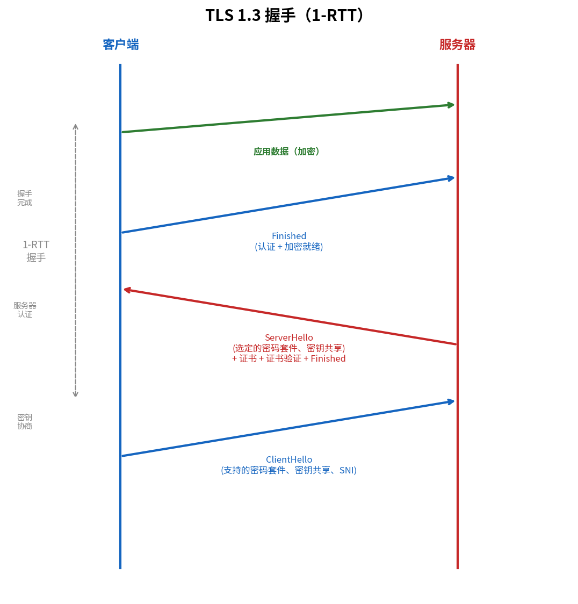

# TLS（传输层安全）

> 参考：Kurose §8.6

**传输层安全协议（Transport Layer Security, TLS）**是用于因特网通信加密的事实标准。它位于应用层和运输层之间，在 TCP 之上提供**加密、数据完整性和端点认证**。TLS 的前身是 **SSL（Secure Sockets Layer）**，由 Netscape 开发。TLS 1.3（RFC 8446, 2018）是目前的最新版本。

## TLS 在协议栈中的位置

```
┌────────────┐      ┌────────────┐
│   HTTP     │      │   HTTP     │
├────────────┤      ├────────────┤
│   TLS      │ ←→   │   TLS      │
├────────────┤      ├────────────┤
│   TCP      │ ←→   │   TCP      │
├────────────┤      ├────────────┤
│   IP       │ ←→   │   IP       │
└────────────┘      └────────────┘
```

TLS 对应用层透明——HTTP 发出与没有 TLS 时相同的报文，只是报文在交给 TCP 之前被 TLS 加密。这就是 **HTTPS**：HTTP over TLS。

## TLS 提供的安全服务

| 服务 | 实现方式 |
|------|---------|
| **加密（Confidentiality）** | 对称加密（AES、ChaCha20），数据无法被中间人读取 |
| **完整性（Integrity）** | MAC（消息认证码），数据被篡改后能被检测到 |
| **认证（Authentication）** | 证书体系（X.509）+ 数字签名（RSA、ECDSA），验证对方身份 |

## TLS 握手

TLS 握手在两个端点之间**协商密码套件、交换密钥并认证身份**。TLS 1.2 完整握手需要 2-RTT，TLS 1.3 简化为 1-RTT。

### TLS 1.3 握手流程

1. **ClientHello**：客户端发送支持的密码套件（AEAD 算法列表）、密钥交换参数（DH 临时公钥）、随机数
2. **ServerHello + 加密扩展**：服务器选择密码套件、发送 DH 公钥参数、发送证书（certificate）和数字签名（CertificateVerify）、计算会话密钥
3. **客户端完成**：客户端验证证书、计算会话密钥、发送 Finished 消息（加密的应用数据可以紧随 Finished 之后发送）



TLS 1.3 相比 TLS 1.2 减少了 1 次往返，也移除了所有不安全的老旧密码套件（如 RSA 密钥交换、CBC 模式、MD5、SHA-1）。

### TLS 1.2 传统握手（简要）

Kurose §8.6 详细描述了 TLS 1.2 的握手流程（2-RTT）：

1. ClientHello → ServerHello：协商密码套件，交换随机数
2. Server → Client：证书 + ServerKeyExchange（DH 参数）+ CertificateRequest（可选）+ ServerHelloDone
3. Client → Server：ClientKeyExchange（加密的**预主密钥 Pre-Master Secret**）+ ChangeCipherSpec + Finished
4. Server → Client：ChangeCipherSpec + Finished

客户端和服务器各自从预主密钥和两个随机数派生**主密钥（Master Secret）**，再从主密钥派生四把密钥：客户端 MAC 密钥、服务器 MAC 密钥、客户端加密密钥、服务器加密密钥。**Finished 消息**包含所有握手消息的 HMAC——若 Trudy 在握手中篡改了任何消息（如删除了强密码套件），Finished 的 MAC 验证会失败。

### 密码套件命名

Kurose 以 `TLS_RSA_WITH_AES_128_CBC_SHA` 为例展示命名约定：

| 段 | 含义 |
|----|------|
| TLS | 协议 |
| RSA | 密钥交换算法 |
| AES_128_CBC | 对称加密算法（含密钥长度和模式） |
| SHA | MAC 算法 |

TLS 1.3 统一使用 AEAD（如 `TLS_AES_128_GCM_SHA256`），移除了独立 MAC 字段。

### 会话恢复

为减少重复握手的开销，TLS 支持**会话恢复**：客户端缓存上次会话的会话 ID 或**会话票证（Session Ticket）**，后续连接时在 ClientHello 中携带，服务器验证后可跳过证书和密钥交换，直接将旧主密钥与新的随机数结合派生新会话密钥。TLS 1.3 将此机制统一为 0-RTT 模式。

## 证书与 PKI

TLS 的身份认证依赖 **X.509 数字证书**和**公钥基础设施（PKI）**：

- 服务器向**证书颁发机构（CA, Certificate Authority）**申请证书
- CA 用自己的私钥对服务器的公钥和身份信息进行数字签名
- 客户端内置了信任的根 CA 的列表（Root CA），通过验证签名信任链来确认服务器身份
- 证书包含：服务器域名、公钥、有效期、颁发者签名等

信任模型的核心：**信任根 CA → 信任中间 CA → 信任服务器证书**。

## SSL/TLS 记录（Record）格式

> 以下描述的是 TLS 1.2 及更早版本的记录格式（先 MAC 后加密）。TLS 1.3 统一使用 AEAD（如 AES-GCM），加密与认证一体化，不再有独立的 MAC 字段。

TLS 将应用数据流分割为**记录（record）**，每个记录附加 MAC 后加密（先 MAC 后加密），再传递给 TCP。TLS 1.2 记录格式：

| 字段 | 加密？ | 说明 |
|------|--------|------|
| **类型（Type）** | 否 | 握手消息、应用数据、连接关闭 |
| **版本（Version）** | 否 | TLS 版本号 |
| **长度（Length）** | 否 | 数据字段的字节数，接收端据此从 TCP 字节流中提取记录边界 |
| **数据（Data）** | 是 | 应用层数据 |
| **MAC** | 是 | 对数据 + MAC 密钥 + **序号** 的哈希值 |

**序号（Sequence Number）**：发送方为每个记录维护一个计数器（从 0 开始递增），它在记录自身中不出现，但**参与 MAC 计算**。这防止了 Trudy 的**重排序攻击**和**重放攻击**——即使 Trudy 截获记录并调整 TCP 序号（TCP 序号不加密），接收方因序号不匹配会发现 MAC 验证失败。

## 连接重放攻击与 Nonce 的作用

TLS 握手期间交换的 **nonce** 用于防御**连接重放攻击（Connection Replay Attack）**：

- Trudy 嗅探整个 TLS 会话的所有消息
- 第二天，Trudy 冒充 Bob 向 Alice 重放完全相同的消息序列
- 如果 Alice 没有使用 nonce，她会以相同的消息序列回应，以为 Bob 下了第二笔订单
- 使用 nonce 后，Alice 每个会话发送不同的 nonce，导致加密密钥不同。Trudy 重放的旧记录无法通过完整性检查

结论：**nonce 防连接重放，序号防单个会话内的分组重放/重排序**。

## 连接关闭与截断攻击

TLS 使用专门的**关闭记录（Closure Record）**来安全地结束会话：

- **截断攻击（Truncation Attack）**：Trudy 在会话中途注入伪造的 TCP FIN，使接收方误以为数据已全部收到（实际上只收到一部分）
- **防御**：TLS 在类型字段中标记关闭记录。接收方收到 TCP FIN 前必须先收到有效的关闭记录（其 MAC 通过了认证），否则可检测到截断

## 握手消息的 MAC 保护

在真实 TLS 握手的最后两步，客户端和服务器各发送一个**所有握手消息的 MAC**：
- 防止**算法降级攻击**：Trudy 可能在 ClientHello（明文）中删除强算法，只留弱算法。接收方通过比对完整握手消息的 MAC 可检测到此类篡改

## TLS 1.3 的改进

| | TLS 1.2 | TLS 1.3 |
|---|---------|---------|
| 握手往返 | 2-RTT | 1-RTT（0-RTT 可选） |
| 密钥交换 | RSA 或 (EC)DHE | 仅 (EC)DHE（前向安全性） |
| 对称加密 | CBC / GCM | 仅 AEAD（AES-GCM、ChaCha20-Poly1305） |
| 协议简化 | 数十个密码套件 | 5 个密码套件 |
| 已知漏洞 | BEAST、POODLE、Lucky13 等 | 无已知的重大漏洞 |

## HTTPS

HTTPS 就是 HTTP over TLS。浏览器地址栏中的锁图标表示与服务器之间建立了 TLS 加密连接。HTTPS 使用 TCP 端口 **443**（HTTP 使用端口 80）。

TLS 只保护数据传输过程，不涉及应用层数据安全（如 XSS、SQL 注入等），这些问题仍需应用层自行的安全措施。

- [[HTTP]]
- [[HTTP报文格式]]
- [[应用层协议原理]]
- [[TCP连接管理]]
- [[对称密钥密码学]]
- [[公开密钥密码学]]
- [[消息认证码]]
- [[密码学哈希函数]]
- [[数字签名]]
- [[端点认证]]
- [[安全电子邮件]]
- [[IPsec与VPN]]
- [[计算机网络安全概述]]
