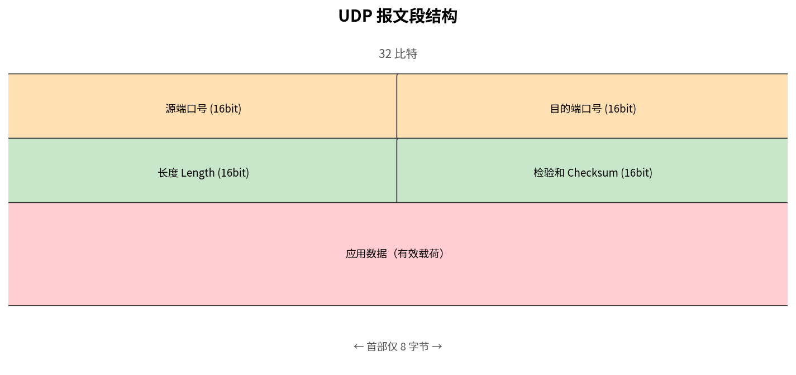
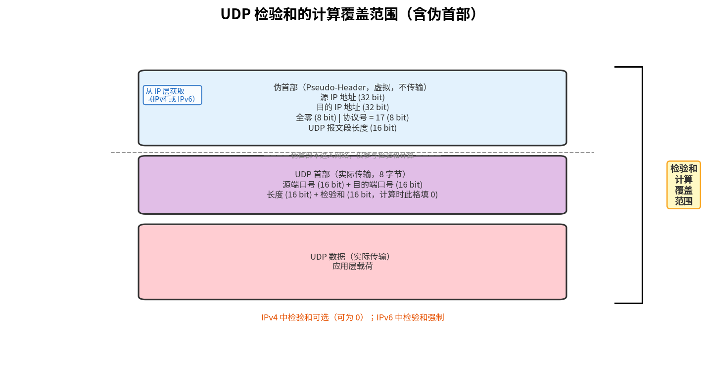

# UDP（用户数据报协议）

> 参考：Kurose §3.3

**UDP（User Datagram Protocol）**是一种轻量级的运输层协议。它只提供了运输层协议最基本的功能——多路复用/多路分解和轻度的差错检测——除此之外几乎没有在 IP 之上增加任何东西。UDP 是无连接的：发送数据前不需要建立连接。UDP 提供不可靠的数据传输——不保证报文段到达目的地，也不保证报文段按序到达。

## 为何存在 UDP

既然 TCP 提供了可靠的数据传输服务，为什么还需要一个不可靠的 UDP？主要有以下原因：

### 无需建立连接

TCP 在开始数据传输之前使用三次握手建立连接。UDP 没有连接建立延迟——应用想发送数据时，直接将数据交给 UDP，UDP 立即构造报文段并传递给网络层。这对于 DNS 这种请求-响应风格的协议至关重要——DNS 查询通常只包含一个请求和一个响应，建立 TCP 连接的 RTT 开销远大于实际数据传输时间。

### 无连接状态

TCP 在端系统中维护连接状态——包括收发缓冲区、拥塞控制参数、序号和确认号参数等。UDP 不需要维护任何连接状态。因此，一个 UDP 服务器可以支持的活跃客户端远多于 TCP 服务器（在应用层实现适当的多路分解后）。这对于需要服务海量客户端的应用（如 DNS 服务器）非常重要。

### 首部开销小

UDP 报文段的首部仅 **8 字节**，而 TCP 的首部为 **20 字节**。对于短报文（如 DNS 查询），首部开销的比例差异尤为显著。

### 无拥塞控制

UDP 没有拥塞控制——应用可以以任何速率向网络中注入数据。这对于某些实时应用（如 VoIP、视频会议、在线游戏）具有优势——这些应用容忍一定程度的丢包，但无法承受 TCP 因拥塞控制（特别是慢启动）导致的速率骤降。当然，缺乏拥塞控制也可能导致 UDP 发送方在拥塞时淹没网络，造成 TCP 流的严重惩罚。近年来，一些 UDP 应用（如 QUIC 协议，HTTP/3 基于该协议）开始在应用层实现自己的拥塞控制。

## UDP 报文段结构



报文段首部只有四个字段，每个 2 字节（16 比特）：

- **源端口号（Source Port）**：发送进程的端口号。不需要回复时可为 0。
- **目的端口号（Dest Port）**：接收进程的端口号。用于多路分解。
- **长度（Length）**：UDP 报文段的总字节数（首部 + 数据）。最小 8 字节（仅首部，无数据）。
- **检验和（Checksum）**：用于差错检测。

## UDP 检验和

UDP 检验和提供**端到端**的差错检测——它保护了报文段在从源到目的地的整个路径上是否发生了比特差错。UDP 检验和**只能检测差错，无法纠正差错**。当 UDP 检测到差错时，它简单地**丢弃**该报文段，不向上层交付，也不发送错误报告。

需要注意的是，UDP 检验和在 **IPv4 中是可选的**（发送方可以将其设为全 0 跳过），但在 **IPv6 中是强制性的**。虽然 IP 首部也有检验和，但 IP 检验和只覆盖 IP 首部而非数据部分——UDP 检验和覆盖了 UDP 首部和**数据**，提供了端到端的额外保护。

### 检验和的覆盖范围：伪首部（Pseudo-Header）

UDP 检验和实际覆盖的内容**不止** UDP 首部和数据。在计算检验和时，UDP 会在报文段前面**逻辑上拼接**一个从 IP 层获取的伪首部，共同参与计算：



**伪首部**包含以下字段（组成 6 个 16 比特字）：

| 字段 | 长度 | 说明 |
|------|------|------|
| 源 IP 地址 | 32 比特 | 发送方的 IP 地址（IPv4 或 IPv6），来自 IP 首部 |
| 目的 IP 地址 | 32 比特 | 接收方的 IP 地址，来自 IP 首部 |
| 全零填充 | 8 比特 | 固定为 0，用于 32 比特对齐 |
| 协议号 | 8 比特 | 协议类型标识，UDP = **17**（十进制） |
| UDP 长度 | 16 比特 | UDP 报文段的总字节数（首部 + 数据），等于 UDP 首部中的长度字段 |

**伪首部的关键特性：**

1. **不实际传输**：伪首部只存在于内存中，用于检验和计算。它不出现在任何网络线缆上发送的比特中。
2. **从 IP 层获取**：源 IP、目的 IP 和协议号均由 IP 层提供。UDP 本身不携带 IP 地址——这正是引入伪首部的原因。
3. **检测 IP 错误路由**：如果目的 IP 地址在传输过程中被篡改（例如因路由器配置错误导致分组投递到错误的主机），接收方计算出的检验和将会不匹配，报文段会被丢弃。伪首部将运输层的差错保护范围扩展到了 IP 层的寻址信息。
4. **协议号作为双重确认**：协议号 17 的存在确保该报文段确实被 IP 辨认为 UDP 报文段——若协议号在 IP 首部传输中被损坏(例如变成 6→TCP)，接收方也能检测出来。

> TCP 同样使用伪首部机制进行检验和计算，区别仅在于协议号为 6 且长度字段为 TCP 报文段长度。

### 检验和的计算过程

将上述覆盖范围（伪首部 + UDP 首部 + UDP 数据）视为一系列 **16 比特字**，按以下步骤计算：

1. **检验和字段暂填 0**：在开始计算前，发送方将 UDP 首部的检验和字段**临时设为全 0**（`0000 0000 0000 0000`）。这确保检验和字段自身不干扰求和结果。
2. **反码求和**（ones' complement sum）：将所有 16 比特字做反码加法累加——每次做普通二进制加法，若最高位产生进位（第 17 比特），则**进位回卷**（carry wrap-around）：将进位加回到最低位。反码求和 = 二进制加法 + 进位回卷，两者是同一步操作，不可割裂理解。
3. **取反码**：对最终结果逐位取反，得到检验和，填入 UDP 首部的检验和字段（覆盖之前的全 0）
4. **全零替换**：如果检验和计算结果恰好是 `0x0000`（反码和中的 +0），发送方**必须将其改为 `0xFFFF`（全 1，反码和中的 −0）**再填入。这是因为 IPv4 中 `0x0000` 已被约定为"未计算检验和"的标志——若不替换，接收方将误认为发送方跳过了检验和。两者在反码加法的验证效果上是等价的。

在接收端，将所有 16 比特字（包括检验和字段）按同样方式相加。若结果为**全 1**（`1111 1111 1111 1111`），说明无差错；若结果包含任意 0 比特，说明出现差错。差错报文段被静默丢弃。

#### 计算示例

以下用具体数字演示反码求和与进位回卷的计算过程（为简化表达，只展示三个 16 比特字的求和，此时检验和字段已置全 0——它们可能来自伪首部、UDP 首部或数据中的任意部分）：

$$
\begin{align}
\text{字 1:}&\quad 0110\;0110\;0110\;0000 \\
\text{字 2:}&\quad 0101\;0101\;0101\;0101 \\
\text{字 3:}&\quad 1000\;1111\;0000\;1100
\end{align}
$$

**第一步：字 1 + 字 2（普通二进制加法）**

```
  0110 0110 0110 0000
+ 0101 0101 0101 0101
─────────────────────
  1011 1011 1011 0101
```

**第二步：上一步结果 + 字 3**

```
  1011 1011 1011 0101
+ 1000 1111 0000 1100
─────────────────────
1 0100 1010 1100 0001   ← 最高位产生进位 1
```

**第三步：进位回卷（carry wrap-around）**——溢出到第 17 位的进位必须加回到最低位：

```
  0100 1010 1100 0001
+ 0000 0000 0000 0001   ← 回卷的进位
─────────────────────
  0100 1010 1100 0010
```

**第四步：取反码（1 的补码）**——将所有比特翻转：

```
  0100 1010 1100 0010
  ↓↓↓↓ ↓↓↓↓ ↓↓↓↓ ↓↓↓↓  逐位取反
  1011 0101 0011 1101   ← 这就是检验和
```

发送方将 `1011 0101 0011 1101` 填入 UDP 首部的检验和字段。

**接收端验证：** 接收方同样按反码加法逐步求和（包括检验和字段），同样执行进位回卷：

**字 1 + 字 2：**

```
  0110 0110 0110 0000
+ 0101 0101 0101 0101
─────────────────────
  1011 1011 1011 0101   (无进位)
```

**+ 字 3：**

```
  1011 1011 1011 0101
+ 1000 1111 0000 1100
─────────────────────
1 0100 1010 1100 0001   (进位 1，回卷)
         ↓
  0100 1010 1100 0010
```

**+ 检验和：**

```
  0100 1010 1100 0010
+ 1011 0101 0011 1101
─────────────────────
  1111 1111 1111 1111   ← 全 1 → 无差错 ✓
```

如果传输过程中任何比特被翻转，最终反码和中必定出现 0 比特——接收方检测到差错后**静默丢弃**该报文段，不向发送方报告。

### 为什么用反码求和？

反码（1 的补码）求和有两个实际优势：

1. **对字节序（endianness）不敏感**：无论发送方是大端（big-endian）还是小端（little-endian），反码加法结果相同——进位回卷消除了字节序差异。
2. **硬件实现简单**：反码求和只需普通加法器加上进位回卷逻辑，比补码（2 的补码）的溢出处理更简单，适合早期路由器/网卡的硬件实现。

## 常见 UDP 应用

| 应用                       | 为什么使用 UDP                            |
| ------------------------ | ------------------------------------ |
| **[[DNS]]**              | 查询和响应短，避免 TCP 连接建立的三次握手开销；单 RTT 完成   |
| **[[网络管理与SNMP]]**        | 管理查询是短请求-响应交换，无需连接开销；网络拥塞时无连接协议仍可能送达 |
| **[[RIP]]（路由协议）**        | 定期广播路由信息，丢包可容忍                       |
| **[[IP语音\|VoIP / 流媒体]]** | 容忍少量丢包，但无法承受 TCP 重传延迟和速率波动           |
| **在线游戏**                 | 低延迟优先于可靠性                            |
| **QUIC / HTTP/3**        | 利用 UDP 的无连接特性，在应用层实现可靠性、拥塞控制和安全      |

- [[运输层概述]]
- [[多路复用与多路分解]]
- [[TCP概述]]
- [[可靠数据传输原理]]
- [[QUIC]]
