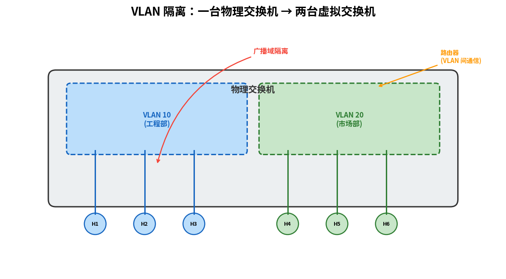

# VLAN

> 参考：Kurose §6.4.4

虚拟局域网（Virtual Local Area Network, VLAN）允许在**单个物理交换机**上定义多个逻辑上隔离的 LAN。VLAN 解决了传统交换式 LAN 面临的问题：所有连接到同一交换机的端口属于同一广播域，任何广播帧会被泛洪到所有端口。

## VLAN 解决的问题

在一个典型的三层办公室网络中（三个部门共享一台交换机），如果所有端口都属于同一个广播域，就会出现以下问题：

1. **广播风暴**：ARP 查询、DHCP 发现等广播帧会到达所有主机，随着网络的扩大会消耗大量带宽
2. **安全与隔离缺失**：缺乏部门之间的流量隔离，任何主机都可以访问其他部门的广播流量
3. **管理不灵活**：如果某人从一个部门调到另一个部门，需要物理上重新布线

## VLAN 的工作原理

VLAN 允许交换机的端口被**逻辑地**分配到不同的 VLAN 组。每个 VLAN 构成独立的广播域——一个 VLAN 中的广播帧只在同 VLAN 的端口间转发。部门之间如需通信，必须经过**路由器**（即使物理上连接到同一台交换机），这就像各端口被分组到多台虚拟交换机一样。

**端口分配模式**：
- **接入端口（Access Port）**：属于单个 VLAN，连接终端设备
- **Trunk 端口（Trunk Port）**：承载多个 VLAN 的流量，通过交换机间链路或交换机-路由器链路连接

## 802.1Q VLAN 标签

当帧通过 **Trunk 链路**在交换机间传输时，需要在帧中附加 **VLAN 标签**以标识帧属于哪个 VLAN。**IEEE 802.1Q** 标准定义了 VLAN 标签的格式：

| 字段 | 大小 | 说明 |
|------|------|------|
| TPID（Tag Protocol Identifier）| 2 字节 | 固定 `0x8100`，表示这是一个 802.1Q 帧 |
| PCP（Priority Code Point）| 3 比特 | 服务质量优先级（802.1p） |
| DEI（Drop Eligible Indicator）| 1 比特 | 丢弃适格指示 |
| VID（VLAN Identifier）| 12 比特 | VLAN ID，范围 1–4094（0 和 4095 保留） |

802.1Q 标签插入在源 MAC 地址和类型/长度字段之间，因此帧的最大长度从 1518 字节变为 **1522 字节**。

## VLAN 间通信

不同 VLAN 之间是**链路层隔离**的，必须通过**网络层设备（路由器）**才能通信。这与不同物理交换机上的子网需要路由器互连同理。实践中通常使用**路由器-on-a-stick**配置：路由器通过单条 Trunk 链路连接交换机，在路由器上为每个 VLAN 创建子接口，实现 VLAN 间路由。

## VLAN 的实际应用

- **部门隔离**：将财务、工程、行政部分配到不同的 VLAN，实现流量分离，无需购买多台交换机
- **跨楼宇 VLAN**：位于不同楼层的同一部门成员可以属于同一 VLAN（通过交换机间 Trunk 连接），无缝通信
- **访客网络**：将访客 WiFi 流量划分到单独的 VLAN，与内部网络完全隔离

- [[链路层交换机]]
- [[以太网]]
- [[IPv4编址]]
- [[路由器体系结构]]
- [[数据中心网络]]
- [[STP]]
