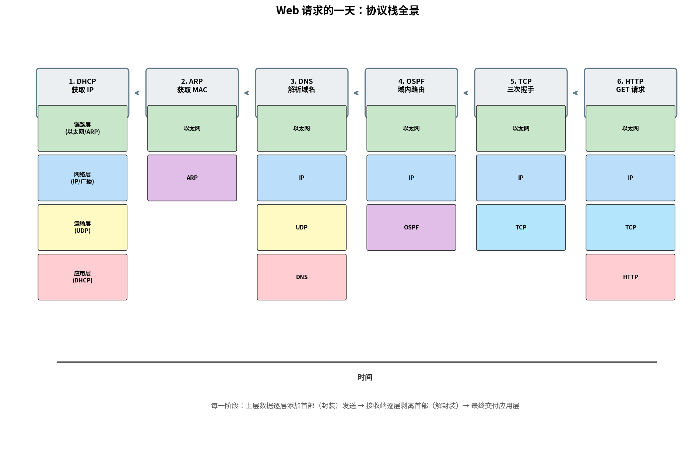

# Web 请求的一天

> 参考：Kurose §6.7

本节通过一个端到端的场景——从一台刚启动的笔记本电脑请求一个网页——串联本书所学的**全部协议层次**。所有涉及的网络设备、协议以一种具体的方式相互作用，展示因特网协议栈如何协同工作。

## 场景设定

某学生将一台运行 DHCP 的笔记本电脑通过以太网电缆连接到大学网络，启动浏览器并输入 `www.example.com`，回车。以下逐步展开整个过程。

## 第一阶段：获取 IP 地址——DHCP

笔记本电脑刚接入网络时还没有 IP 地址，本地 DNS 服务器的地址也未知。操作系统运行 **DHCP 客户端**。

1. **DHCP 发现**：笔记本电脑创建 DHCP 发现报文并通过 UDP 发送，目的地址为广播地址 `255.255.255.255:67`。该 UDP 段封装在广播 IP 数据报（`0.0.0.0 → 255.255.255.255`）中，再封装在广播以太网帧（`FF-FF-FF-FF-FF-FF`）中。

2. **DHCP 提供**：DHCP 服务器通过广播响应（源 IP：DHCP 服务器地址 `68.85.2.101`，目的：广播），提供一个可用的 IP 地址（DHCP 包含：**推荐 IP `68.85.2.102`**、网络掩码、默认网关地址 `68.85.2.1`、本地 DNS 服务器地址 `68.87.71.226`）。

3. **DHCP 请求**：学生选择该 IP，发送 DHCP 请求正式申请。

4. **DHCP ACK**：DHCP 服务器通过 DHCP ACK 确认，同时填入 DNS 服务器地址等参数。

现在笔记本电脑有了 IP 地址、网络掩码、默认网关和本地 DNS 服务器地址。

## 第二阶段：DNS 解析——ARP + DNS

浏览器需要 `www.example.com` 的 IP 地址，通过 DNS 查询获取。但笔记本电脑需要先知道网络层地址（DNS 服务器 IP = `68.87.71.226`）对应的 MAC 地址。

1. **ARP 查询**：笔记本电脑需要将 DNS 查询发送到本地 DNS 服务器，但 DNS 服务器（`68.87.71.226`）不在同一子网，需要通过默认网关转发。笔记本电脑构造 ARP 查询帧，广播到子网所有节点，询问"谁的 IP 是 `68.85.2.1`（默认网关地址）？"

2. **ARP 响应**：默认网关路由器（`68.85.2.1`）收到 ARP 查询，用自己的 MAC 地址回复 ARP 响应。笔记本电脑将 `<IP: 68.85.2.1, MAC: router_mac>` 存入 ARP 表。注意：ARP 是对默认网关 IP 的查询，路由器不会为其他子网中的 IP（如 DNS 服务器地址）代理 ARP 响应。

3. **DNS 查询（同一子网→路由器）**：笔记本电脑向 DNS 服务器发送 DNS 查询。"www.example.com 的 IP 是什么？"
   - DNS 查询通过 UDP 段发送，目的端口 53
   - UDP 段封装在 IP 数据报（源 = 笔记本 IP，目的 = DNS 服务器 IP）
   - 该数据报封装在以太网帧中，目的 MAC = 路由器 MAC
   - 路由器收到后解封装，查转发表，沿路由路径转发

4. **DNS 响应**：DNS 服务器返回 `www.example.com` 的 IP 地址（如 `9.1.1.1`）。

## 第三阶段：域内路由到 DNS 服务器

DNS 查询从笔记本电脑到本地 DNS 服务器需要经过多跳路由。在校园网内部，路由器使用域内路由协议（如 **OSPF**）计算到达 DNS 服务器的路径。每个路由器在转发表中查找到下一跳的最长前缀匹配，逐跳转发。在同一子网的链路内，使用 **ARP** 获取下一跳路由器的 MAC 地址。

## 第四阶段：TCP + HTTP

现在笔记本电脑知道 `www.example.com` 的 IP 地址，可以发起 Web 请求。

1. **TCP 三次握手**：笔记本电脑创建 TCP SYN 段（源端口 = 随机端口，目的端口 = 80），通过 TCP 套接字发送。

2. **HTTP GET**：三次握手完成（建立全双工连接）后，笔记本电脑发送 HTTP GET 请求报文：
   ```
   GET / HTTP/1.1
   Host: www.example.com
   Connection: keep-alive
   ```

3. **HTTP 响应**：服务器发送 HTTP 响应（`200 OK`），包含页面内容（HTML 文本）。

## 协议栈全景

下表总结了本场景中每一阶段涉及的协议和层次：

| 阶段 | 协议 | 涉及的层次（自下而上） |
|------|------|---------------------|
| DHCP（获取IP） | DHCP | 以太网 → IP → UDP → DHCP |
| ARP（获取MAC） | ARP | 以太网 → ARP |
| DNS（解析域名） | DNS | 以太网 → IP → UDP → DNS |
| DNS 路由 | OSPF | 以太网 → IP → OSPF（控制平面） |
| TCP 连接 | TCP | 以太网 → IP → TCP |
| HTTP 请求 | HTTP | 以太网 → IP → TCP → HTTP |



这幅端到端全景图展示了因特网协议栈的分层协作：**链路层**（以太网、ARP）负责跳到跳的数据传输；**网络层**（IP、OSPF、BGP）负责源到目的地的路由；**运输层**（UDP、TCP）负责进程间的传输；**应用层**（DHCP、DNS、HTTP）实现特定网络应用。

- [[DHCP]]
- [[DNS]]
- [[链路层寻址与ARP]]
- [[HTTP]]
- [[TCP连接管理]]
- [[OSPF]]
- [[协议层次与服务模型]]
