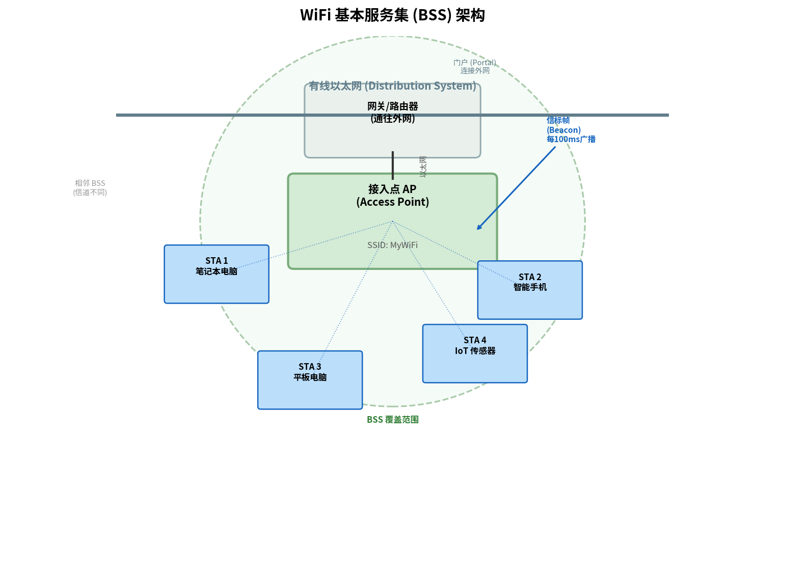

# WiFi 与 802.11

> 参考：Kurose §7.3

WiFi（Wireless Fidelity）是 IEEE 802.11 无线局域网标准的商业名称，也是全球最普及的无线网络技术。从咖啡厅热点到家庭路由器到企业无线网，WiFi 是无处不在的最后一跳接入方式。

## 802.11 体系结构

802.11 体系结构的基本构建块是**基本服务集（Basic Service Set, BSS）**。一个 BSS 包含一个**接入点（Access Point, AP）**和若干个与之关联的**无线站点（Station, STA）**。

AP 是 BSS 的中心节点，通常通过有线以太网连接到更广泛的网络（如企业局域网或 DSL/光纤调制解调器连接 ISP）。

每个 BSS 有一个**服务集标识符（Service Set Identifier, SSID）**——即用户扫描 WiFi 时看到的网络名称。SSID 由 AP 在信标帧（beacon frames）中周期性广播。

802.11 标准也允许**自组织模式**的部署——多个无线站点在没有 AP 的情况下组成一个**独立 BSS（Independent BSS, IBSS）**，站点之间直接通信。但在实践中，99% 的 Wi-Fi 使用是基础设施模式。

## 信道与关联

### 2.4 GHz 与 5 GHz 频段

802.11 运行在 ISM（工业、科学、医疗）免许可频段：

| 频段 | 频率范围 | 可用信道数 | 特点 |
|------|---------|----------|------|
| 2.4 GHz | 2.400–2.4835 GHz | 11/13 个（部分重叠） | 覆盖广、穿墙好，但干扰多（蓝牙/微波炉） |
| 5 GHz | 5.170–5.835 GHz | 多达 24 个（非重叠） | 干扰少、速率高，但穿墙弱、覆盖略小 |
| 6 GHz | 5.925–7.125 GHz | 多个 160 MHz 宽信道 | WiFi 6E/7，极低干扰，超大带宽 |

在 2.4 GHz 频段中，802.11 定义了 11 个重叠信道（在北美）。信道 1、6 和 11 是唯一三个**非重叠**的信道——相邻 AP 必须选择不同的非重叠信道以避免干扰。

### 关联（Association）

无线站点在使用 AP 之前必须与之建立关联：

1. **被动扫描**：AP 周期性地（典型每 100 ms）广播**信标帧（beacon frame）**——包含 AP 的 SSID 和 MAC 地址
2. **主动扫描**：无线站点主动广播**探测请求帧（probe request frame）**，范围内的 AP 以探测响应帧回复
3. 选择 AP 后，无线站点向选定的 AP 发送**关联请求帧（association request frame）**
4. AP 以**关联响应帧（association response frame）**回复，确认关联成功

关联过程可能包含身份认证（开放式、[[无线局域网安全|WPA2、WPA3]]）过程，具体取决于 AP 的安全配置。

## 802.11 标准的演进

| 标准 | 年份 | 频段 | 最大物理速率 | 调制技术 | 说明 |
|------|------|------|------------|---------|------|
| 802.11b | 1999 | 2.4 GHz | 11 Mbps | DSSS/CCK | 普及的第一代 WiFi |
| 802.11a | 1999 | 5 GHz | 54 Mbps | OFDM | 速率高但覆盖差，较少部署 |
| 802.11g | 2003 | 2.4 GHz | 54 Mbps | OFDM | 兼容 b，广泛部署 |
| 802.11n | 2009 | 2.4/5 GHz | 600 Mbps | OFDM + MIMO | 引入 MIMO（多天线），40 MHz 信道 |
| 802.11ac | 2013 | 5 GHz | 6.9 Gbps | OFDM + MU-MIMO | 更宽信道（80/160 MHz），下行 MU-MIMO |
| 802.11ax | 2019 | 2.4/5 GHz | 9.6 Gbps | OFDMA + MU-MIMO | WiFi 6，基于 OFDMA 的多用户接入 |
| 802.11be | 2024 | 2.4/5/6 GHz | 46 Gbps | OFDMA + MLO | WiFi 7，多链路操作（MLO） |

从 802.11n 开始的增幅不仅来自更高的符号率，更重要的是**MIMO（多输入多输出）**——AP 和站点使用多根天线同时传输多个空间流，在不增加带宽的情况下提升吞吐量。802.11ax（WiFi 6）进一步引入**OFDMA**（将信道划分为子载波组分配给不同用户），使 AP 可以同一时刻向多个站点发送数据。

## 802.11 的高级特性

### 速率自适应（Rate Adaptation）

由于无线信道的 SNR 随时变化（人走动、门开关等等），802.11 站点**动态选择物理层调制方案**。当 SNR 较低时，使用较低阶调制（BPSK/QPSK）确保可靠性；当 SNR 较高时，切换到高阶调制（64-QAM/256-QAM）提高吞吐量。

速率自适应算法不是 802.11 标准的一部分，由各厂商自行实现，但通常基于 ACK 的接收情况——连续丢失多个 ACK → 降低速率；连续成功 → 尝试提高速率。

### 功率管理（Power Management）

电池供电的无线设备需要尽量减少无线接口的功耗。802.11 的功率管理允许站点**进入睡眠状态**——通知 AP 它正在休眠，AP 为其缓冲到达的数据帧。站点周期性唤醒，监听 AP 的信标帧中的 **TIM（Traffic Indication Map）**字段，如果 AP 指示有缓存数据，站点发送 PS-Poll 帧请求 AP 发送。

### 蓝牙与802.15

**蓝牙（Bluetooth）**是 IEEE 802.15.1 定义的无线个域网（WPAN）标准，覆盖范围极短（1–10 米），功耗极低。在物理层，蓝牙使用**跳频扩频（Frequency Hopping Spread Spectrum, FHSS）**——传输过程中按伪随机序列在 79 个 1 MHz 信道间快速跳变（每秒 1600 次），有效抵抗窄带干扰。在 MAC 层采用 TDM 方式划分信道，主设备控制时隙分配，从设备只在被轮询或指定时隙才能发送。

**Zigbee** 是 IEEE 802.15.4 定义的低功耗无线个域网标准，专为物联网（IoT）应用设计。相比于蓝牙（面向音频/外围设备通信，典型速率 1–3 Mbps），Zigbee 的极端低功耗使其能够通过电池供电运行数月甚至数年。Zigbee 速率极低（250 kbps），但支持大规模网状组网（mesh network），使用 CSMA/CA 进行信道接入，广泛应用于智能家居传感器、工业监控等场景。WiFi、蓝牙和 Zigbee 构成了覆盖不同范围和功耗需求的完整无线个域网生态。

- [[802.11 MAC协议]]
- [[802.11帧]]
- [[无线网络概述]]
- [[无线链路特性]]
- [[无线与移动性对TCP的影响]]
- [[OFDM与OFDMA]]
- [[MIMO]]
- [[多路访问协议]]
- [[随机访问协议]]
- [[无线局域网安全]]
- [[链路层概述]]
- [[差错检测与纠错]]
- [[物理介质]]
