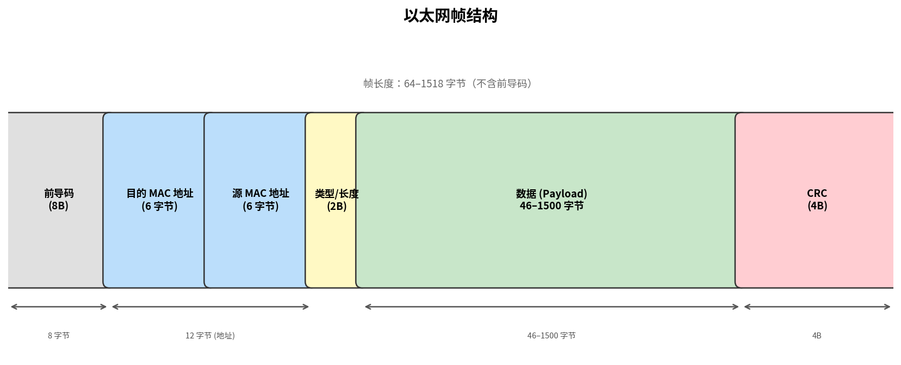

# 以太网

> 参考：Kurose §6.4.2

以太网（Ethernet）几乎是**唯一存活下来的有线 LAN 技术**——它击败了所有竞争对手（令牌环、FDDI、ATM），成功适应了从最早的 10 Mbps 共享总线到今日 100 Gbps 交换式全双工网络的演进。以太网成功的核心原因在于：简单、成本低、向后兼容。

## 以太网帧结构

| 字段 | 大小 | 说明 |
|------|------|------|
| 前导码（Preamble） | 8 字节 | 前 7 字节为 `10101010` 模式，用于"唤醒"接收适配器并同步时钟；最后 1 字节 `10101011` 为 SFD（Start Frame Delimiter） |
| 目的 MAC 地址 | 6 字节 | 接收方的 MAC 地址，可以是单播或广播 |
| 源 MAC 地址 | 6 字节 | 发送方的 MAC 地址 |
| 类型（Type）/长度 | 2 字节 | 上层协议类型（如 `0x0800` = IPv4, `0x86DD` = IPv6, `0x0806` = ARP） |
| 数据（Payload） | 46–1500 字节 | 承载上层协议数据报（IP 数据报等），最小 46 字节以确保帧总长 ≥ 64 字节（用于碰撞检测） |
| CRC | 4 字节 | 循环冗余检验，检测帧中比特差错 |

**帧间间隔（Inter-Frame Gap, IFG）**：连续发送的帧之间需要 96 比特时间的间隔（如 100 Mbps 下为 960 ns）。

## 以太网标准演进

以太网的演进展示了惊人的可扩展性：

| 标准 | 速率 | 介质 | 最大距离 |
|------|------|------|---------|
| 10BASE-T（802.3i） | 10 Mbps | 双绞铜线 | 100 m |
| 100BASE-TX（802.3u） | 100 Mbps | 双绞铜线 | 100 m |
| 1000BASE-LX（802.3z） | 1 Gbps | 光纤 | 5000 m |
| 1000BASE-T（802.3ab） | 1 Gbps | 双绞铜线 | 100 m |
| 10GBASE-T（802.3an） | 10 Gbps | 双绞铜线 | 100 m |
| 40GBASE-CR4 | 40 Gbps | 铜缆 | 10 m |
| 100GBASE-SR10 | 100 Gbps | 光纤 | 100 m |

以太网标准在物理介质层面进行了创新，但**帧格式保持不变**——这是向后兼容的关键。

## CSMA/CD 与全双工演进

**传统以太网（半双工，共享总线）**：所有节点共享同一条广播总线，使用 CSMA/CD 协议协调访问。碰撞发生时使用二进制指数退避。

**现代以太网（全双工，交换式）**：节点通过点对点链路直接连接交换机，不存在碰撞的可能。因此交换机式以太网**不使用 CSMA/CD**——适配器可以随时发送帧，无需载波侦听或碰撞检测。全双工使吞吐量翻倍（双向同时传输）。

## 以太网的服务模型

以太网向网络层提供**无连接、不可靠**的服务：
- **无连接**：发送方和接收方之间无需握手即可传输帧
- **不可靠**：接收方收到帧时不发送 ACK，也不对丢失的帧发 NAK。仅通过 CRC 检测差错并丢弃差错帧。丢失数据的恢复由上层协议（如 TCP）完成

## 曼彻斯特编码

**10 Mbps 以太网（10BASE-T）**使用**曼彻斯特编码（Manchester encoding）**进行比特传输——每个比特由两次电平变化表示：0 编码为从高到低的跳变，1 编码为从低到高的跳变。曼彻斯特编码确保每个比特都有一个跳变，使接收方容易与发送时钟同步。代价是带宽利用率仅为 50%（"波特率"是比特率的两倍）。更高速率的以太网使用更高效的编码方案：100BASE-TX 使用 4B/5B + MLT-3，1000BASE-T 使用 4D-PAM5，10GBASE-T 使用 PAM-16 + LDPC。

- [[链路层交换机]]
- [[链路层寻址与ARP]]
- [[随机访问协议]]
- [[VLAN]]
- [[IP分片]]
- [[差错检测与纠错]]
- [[物理介质]]
- [[OFDM与OFDMA]]
- [[STP]]
