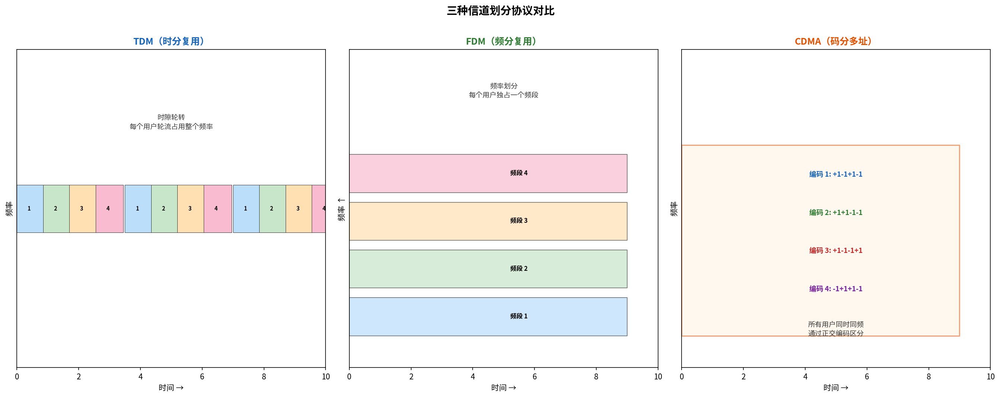

# 信道划分协议

> 参考：Kurose §6.3.1

信道划分协议（channel partitioning protocols）将广播信道带宽静态地划分给共享该信道的所有节点。主要有三种技术：TDM、FDM 和 CDMA。

## TDM（时分复用）

**时分复用（TDM, Time-Division Multiplexing）**将时间划分为**时间帧（time frame）**，再将每个时间帧划分为 N 个**时隙（time slot）**，每个时隙分配给一个节点。每次节点有分组要发送时，在属于自己的时隙内传输。

以四节点 TDM 为例：时隙 1 分配给节点 1，时隙 2 分配给节点 2……轮流分配。每个节点获得 $R/N$ bps 的专用传输速率。

**优点**：完全消除碰撞，高度公平。

**缺点**：
- 节点即使在是唯一活动节点时，平均速率也受限于 $R/N$ bps
- 节点必须**始终等待**其轮次（即使只有它在发送）

用鸡尾酒会类比：TDM 像规定每人轮流发言固定时长——是公平的，但即使只有一个人想说，也必须等轮到自己才能说一分钟。

## FDM（频分复用）

**频分复用（FDM, Frequency-Division Multiplexing）**将 R bps 的信道划分为 N 个不同频率的子信道，每个带宽为 $R/N$，分配给一个节点。FDM 创建了 N 个较小的独立信道。

**优点与缺点与 TDM 相同**：无碰撞、公平，但单节点速率受限为 $R/N$。

## CDMA（码分多址）

**码分多址（CDMA, Code Division Multiple Access）**给每个节点分配不同的**编码（code）**。节点用其唯一编码对发送的数据比特进行编码。如果编码选择得当，不同节点可以**同时传输**，各接收方仍能正确接收对应发送方的编码数据（前提是接收方知道发送方的编码），即使存在其他节点的干扰。

CDMA 最初用于军事系统（具有抗干扰特性），现在广泛应用于蜂窝移动通信。由于 CDMA 与无线信道紧密相关，技术细节将在[[无线链路特性]]中讨论。

- [[多路访问协议]]
- [[随机访问协议]]
- [[轮流协议与DOCSIS]]
- [[OFDM与OFDMA]]
- [[无线链路特性]]
