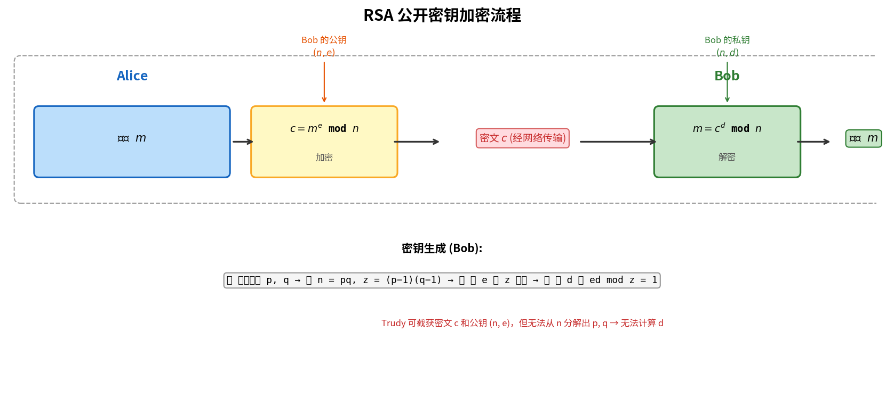

# 公开密钥密码学

> 参考：Kurose §8.2.2

**公开密钥密码学（Public Key Cryptography）**解决了对称密钥体制的根本难题——密钥分发。在对称密钥体制中，通信双方必须事先共享秘密密钥，但在网络环境中双方可能从未见面。Diffie 和 Hellman 于 1976 年提出了公钥密码学的概念（Diffie-Hellman 密钥交换），Rivest、Shamir 和 Adleman 于 1978 年提出了 **RSA 算法**，使其成为公钥密码学的事实标准。

## 基本原理

公钥密码学中，每个通信方拥有一对密钥：

- **公钥 $K_B^+$**：对全世界公开（包括攻击者 Trudy）
- **私钥 $K_B^-$**：仅自己知道，严格保密

加密和解密过程：

1. Alice 获取 Bob 的公钥 $K_B^+$
2. Alice 用 Bob 的公钥加密消息：$K_B^+(m)$
3. Bob 用自己的私钥解密：$K_B^-(K_B^+(m)) = m$

核心数学性质：**$K_B^-(K_B^+(m)) = K_B^+(K_B^-(m)) = m$**——加密和解密操作可以互换顺序。这个性质不仅支持加密，还支持数字签名。

## RSA 算法

RSA 的安全性基于**大数分解的困难性**——已知 $n = pq$，从 $n$ 中分解出素数 $p$ 和 $q$ 在计算上不可行（当 $n$ 足够大时）。

### 密钥生成

Bob 执行以下步骤生成公钥和私钥：

1. **选择两个大素数 $p$ 和 $q$**。RSA 实验室建议 $n = pq$ 的长度至少为 **1024 比特**（目前更推荐 2048 比特）
2. **计算 $n = pq$** 和 **$z = (p-1)(q-1)$**
3. **选择 $e$**（用于加密），满足 $e < n$ 且 $e$ 与 $z$ 互素（无公因子）
4. **计算 $d$**（用于解密），满足 $ed \bmod z = 1$（即 $ed - 1$ 能被 $z$ 整除）
5. 公钥 $K_B^+ = (n, e)$，私钥 $K_B^- = (n, d)$

### 加密与解密

- **加密**：Alice 计算 $c = m^e \bmod n$
- **解密**：Bob 计算 $m = c^d \bmod n$

### 数值示例

取 $p=5, q=7$（实际使用中过小，仅用于演示）：
- $n = 35,\ z = 4 \times 6 = 24$
- 选择 $e=5$（5 与 24 互素）
- 选择 $d=29$（$5 \times 29 - 1 = 144$ 能被 24 整除）
- 公钥 $(35, 5)$，私钥 $(35, 29)$

加密 `love`（字母按 a=1..z=26 编码）：

| 字母 | $m$ | $m^5$ | $c = m^5 \bmod 35$ |
|------|-----|-------|---------------------|
| l | 12 | 248832 | **17** |
| o | 15 | 759375 | **15** |
| v | 22 | 5153632 | **22** |
| e | 5 | 3125 | **10** |

解密：

| $c$ | $c^{29} \bmod 35$ | 字母 |
|-----|---------------------|------|
| 17 | **12** | l |
| 15 | **15** | o |
| 22 | **22** | v |
| 10 | **5** | e |

### RSA 正确性证明

需要证明 $m^{ed} \bmod n = m$。由 $ed \bmod z = 1$（密钥生成步骤 4），存在整数 $k$ 使得 $ed = kz + 1$，故：
$$m^{ed} \equiv m^{kz + 1} \equiv m \cdot (m^z)^k \pmod{n}$$

由欧拉定理（Euler's theorem）：若 $\gcd(m, n) = 1$，则 $m^{\phi(n)} \equiv 1 \pmod{n}$。其中 $\phi(n) = (p-1)(q-1) = z$，因此 $m^z \equiv 1 \pmod{n}$，代入得 $m^{ed} \equiv m \pmod{n}$。

若 $\gcd(m, n) \neq 1$（即 $m$ 是 $p$ 或 $q$ 的倍数——实际中概率可忽略，因 $n$ 极大且 $m < n$），可借助中国剩余定理证明结论仍成立。因此 RSA 解密总能正确恢复明文。

## 为什么运算可互换

模运算的性质也保证了先解密后加密同样能恢复原文：
$$(m^d \bmod n)^e \bmod n = m^{de} \bmod n = m^{ed} \bmod n = (m^e \bmod n)^d \bmod n$$

这一性质是**数字签名**的数学基础——Bob 可以用私钥"加密"（签名），任何人用公钥"解密"（验证）。

## 会话密钥（Session Key）

RSA 的指数运算非常耗时。DES 比 RSA 快至少 **100 倍**（软件）到 **10,000 倍**（硬件）。实际应用中，RSA 与对称密钥加密组合使用：

1. Alice 随机生成一个**会话密钥 $K_S$**（用于对称加密，如 AES）
2. Alice 用 Bob 的公钥加密会话密钥：$c = (K_S)^e \bmod n$
3. Bob 用私钥解密获得 $K_S$
4. 此后，Alice 用 $K_S$（对称加密）加密大量数据发送给 Bob

这种混合方案兼具了**公钥加密的密钥分发便利性**和**对称加密的高效性**。TLS、PGP、IPsec 等协议均采用此模式。

## RSA 的安全性

RSA 的安全性依赖于**没有已知的快速算法能分解大整数 $n$ 为 $p$ 和 $q$**。若有人能从 $n$ 中分解出 $p$ 和 $q$，就可以计算 $z = (p-1)(q-1)$，进而从公开的 $e$ 推导出私钥 $d$。需要强调的是，尚未证明不存在快速分解算法——RSA 的安全性是**计算性**的，而非**信息论**的。

- [[对称密钥密码学]]
- [[数字签名]]
- [[消息认证码]]
- [[TLS]]
- [[安全电子邮件]]
