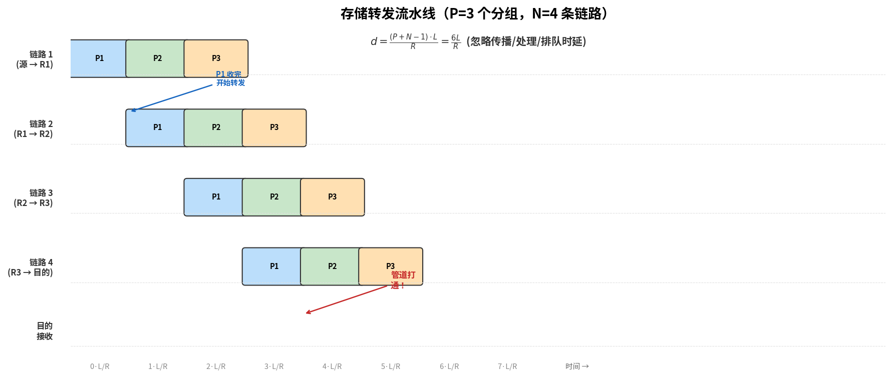

# 分组交换

> 参考：Kurose §1.3.1

分组交换（packet switching）是因特网采用的数据传输方式。在网络应用中，端系统交换**报文（message）**——报文可以是控制信息（如"你好"消息），也可以是应用数据（如电子邮件、JPEG 图片、MP3 音频文件）。源端系统将长报文分割为较小的数据块，称为**分组（packet）**。每个分组在源与目的地之间通过通信链路和分组交换机（路由器或链路层交换机）传输，每个分组以链路的**全传输速率**发送。

## 存储转发传输

大多数分组交换机在输入端使用**存储转发传输（store-and-forward transmission）**机制。这意味着分组交换机在开始向出链路传输第一个比特之前，必须先**接收完整个分组**。

以一个简单网络为例：源端系统通过一个路由器连接到目的端系统，路由器的功能是将分组从一条（入）链路交换到唯一另一条（出）链路。源端要将三个各含 L 比特的分组发送到目的地。

- 在时刻 0，源开始发送分组 1
- 在时刻 $L/R$ 秒（R 为链路传输速率），源发送完整个分组 1，分组 1 全部到达并存储在路由器中（此处忽略传播时延）
- 在时刻 $L/R$，路由器开始向目的地转发分组 1
- 在时刻 $2L/R$，路由器完成分组 1 的转发，目的端收到完整分组 1

对于 **一个分组穿过 N 条链路**（即 N-1 个路由器）的一般情况，端到端时延为：

$$d_{\text{end-end}} = N \times \frac{L}{R}$$

（此处忽略传播时延和其他时延）

如果交换机采用**直通转发（cut-through forwarding）**——即一收到比特就立即转发（无需接收完整个分组）——总时延将是 $L/R$，因为比特不在路由器中停留。但现实中的路由器必须先**接收、存储并处理整个分组**后再转发，因为需要验证检验和、查找转发表等。

对于 **P 个分组穿过 N 条链路**的一般情况，总时延为：

$$d = \frac{(P + N - 1) \times L}{R}$$

### 流水线过程解析

以上图为例（$P=3$ 个分组，$N=4$ 条链路，即 3 个路由器）：横轴为时间（每格 $L/R$），竖轴为五条链路（最后一跳是目的主机接收链路）。每一条彩色横条代表一个分组在某条链路上的传输过程，长度为 $L/R$。

**存储转发的约束**：路由器必须收完整个分组（横条填满当前行）才能开始向下一跳转发（横条出现在下一行）。因此相邻两行的同一颜色的横条不会重叠——下一行的起点就是上一行的终点。

**流水线的形成**：

| 时刻 | 事件 |
|------|------|
| 0 | 源开始发送 P1 |
| $L/R$ | R1 收完 P1，开始向 R2 转发 P1；同时源开始发送 P2 |
| $2L/R$ | R2 收完 P1 开始转发；R1 收完 P2 开始转发；源开始发送 P3 |
| $3L/R$ | R3 收完 P1 开始转发；R2 收完 P2 开始转发；R1 收完 P3 |
| $4L/R$ | 目的收完 P1——**第一条路径走通**，耗时 $N \cdot L/R$ |
| $5L/R$ | 目的收完 P2——距 P1 到达恰好 $L/R$ |
| $6L/R$ | 目的收完 P3——全部传输完成 |

**关键洞察**：第一个分组花费 $N \cdot L/R$ "打通管道"后，流水线填满——后续分组每隔 $L/R$ 就有一个到达目的地。因此总时延 = 打通管道的时间 + 后续分组排队的时间：

$$d = \underbrace{N \cdot \frac{L}{R}}_{\text{第一个分组}} + \underbrace{(P-1) \cdot \frac{L}{R}}_{\text{剩余 } P-1 \text{ 个分组}} = \frac{(P + N - 1) \times L}{R}$$

如果没有存储转发（直通转发），最理想情况下每跳仅延迟 1 比特而非整个分组，总时延远小于此公式。但实际路由器必须先**收完、检验、查表**才能转发，因此必须按整个分组为粒度处理。

## 排队时延与丢包

每个分组交换机为每条出链路维护一个**输出缓冲区（output buffer）**或**输出队列（output queue）**，用于存放即将向该链路发送的分组。

如果到达的分组需要沿某条链路传输，但发现该链路正忙于传输另一个分组，则到达的分组必须在输出缓冲区**排队等待**。这种等待产生了**排队时延（queuing delay）**，其长短取决于先期到达且已在排队的分组数量。

输出缓冲区的容量是有限的。如果缓冲区已满，新到达的分组将无处存放——路由器将**丢弃（drop）**该分组，即发生**丢包（packet loss）**。丢失的分组在端系统视角中表现为发送了但没有到达目的地的分组。可靠数据传输协议（如 [[TCP可靠数据传输|TCP]]）可以检测丢包并触发重传。

## 转发表与路由选择协议

路由器如何知道将每个分组转发到哪条出链路？在因特网中，每个分组首部包含目的地的 IP 地址。每个路由器维护一个**转发表（forwarding table）**，将目的地 IP 地址（或其前缀）映射到出链路。

当分组到达路由器时：

1. 路由器检查分组首部中的目的地 IP 地址
2. 在转发表中查找匹配项
3. 将分组转发到匹配项对应的出链路

转发表的内容由**路由选择协议（routing protocol）**自动配置，路由协议负责确定网络中端系统之间的最优路径。路由选择协议在[[网络层控制平面概述|网络层控制平面]]中详细讨论。

## 分组交换的优势

分组交换相对于电路交换的关键优势在于效率。考虑一个有多个用户共享 1 Mbps 链路的情景。在电路交换中，每个活跃用户被分配固定带宽（如 100 kbps），在任何时刻只能支持 10 个同时活跃的用户；当用户空闲时，分配的带宽被浪费。在分组交换中，用户的流量按需统计复用——如果有 10 个以上用户活跃，仅需少量排队；如果只有少数活跃用户，他们可以使用全部 1 Mbps 带宽。分组交换按需分配链路使用，链路传输容量由实际有数据需要发送的用户按分组共享。

- [[网络核心]]
- [[电路交换]]
- [[时延丢包与吞吐量]]
- [[路由器排队与调度]]
- [[计算机网络历史]]
- [[协议层次与服务模型]]
- [[网络的网络]]
