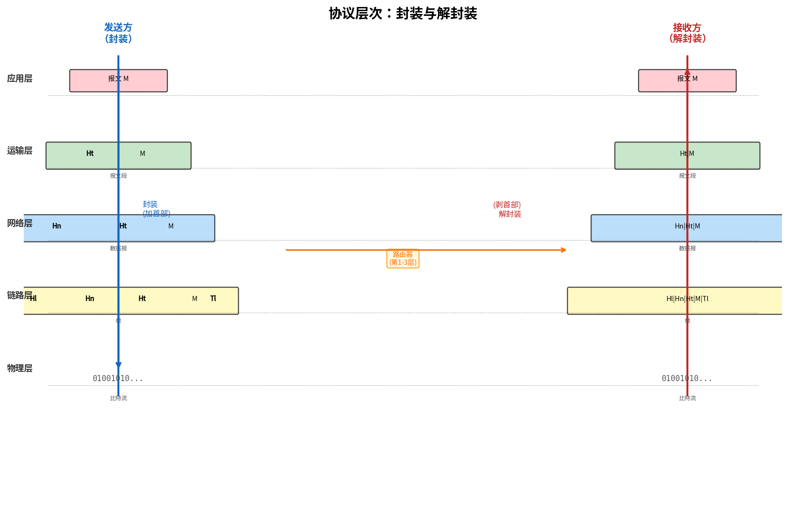

# 协议层次与服务模型

> 参考：Kurose §1.5

因特网是一个极其复杂的系统，涉及众多的应用程序和协议、各种类型的端系统、分组交换机和多种链路层介质。面对如此庞大的复杂性，**分层（layering）**是组织和理解网络体系结构的基本方法。

## 分层的动机：航空系统类比

设想描述航空系统的复杂性——机票代理、行李托运、登机口人员、飞行员、飞机、空中交通管制和全球航线路由系统。一种有效的描述方法是将航空旅行分解为一系列分层的动作：

| 层 | 航空动作 |
|----|----------|
| 票务层 | 购票 |
| 行李层 | 托运行李 |
| 登机口层 | 检票登机 |
| 起飞/着陆层 | 跑道操作 |
| 飞行路由层 | 航线控制 |
| 到达层 | 下机取行李 |

每层执行特定的功能，依赖下层提供的服务，并为上层提供服务。例如，行李层的服务是"将行李从出发地运送到目的地"，该服务由票务层使用，并通过下层的飞行路由功能来实现。

这个类比揭示了分层架构的核心思想：**协议是水平的（同一层之间的通信规则），服务是垂直的（下层提供给上层的功能），接口是层与层之间的服务访问点**。

## 因特网协议栈（TCP/IP 模型）

因特网协议栈由五个层次组成，从顶到底依次为：

### 应用层（Application Layer）

应用层是网络应用程序及其应用层协议所在之处。应用层协议分布在多个端系统上——一个端系统中的应用程序使用协议与另一个端系统中的应用程序交换信息分组。应用层的信息分组称为**报文（message）**。

常见应用层协议：HTTP（Web）、SMTP（电子邮件）、FTP（文件传输）、DNS（域名解析）。应用层协议在第 2 章详细讨论。

### 运输层（Transport Layer）

运输层在应用程序端点之间传送应用层报文。因特网中有两种运输协议：

- **TCP（Transmission Control Protocol）**：面向连接，提供可靠交付、流量控制、拥塞控制，将长报文分割为短报文段
- **UDP（User Datagram Protocol）**：无连接，不提供可靠性保证、流量控制或拥塞控制

运输层分组称为**报文段（segment）**。运输层在第 3 章详细讨论。

### 网络层（Network Layer）

网络层负责将称为**数据报（datagram）**的网络层分组从一台主机移动到另一台主机。运输层将报文段和目的地址交给网络层，网络层将报文段封装为数据报，通过路径上的路由器逐跳交付到目的运输层。

网络层包含著名的 **IP 协议**，它定义了数据报中的字段以及端系统和路由器如何作用于这些字段。网络层也包含决定路由的路由选择协议。网络层通常被称为 **IP 层**。网络层在第 4 章和第 5 章详细讨论。

### 链路层（Link Layer）

因特网的网络层通过一系列路由器在源和目的地之间路由数据报。要将分组从一个节点（主机或路由器）移动到路径上的下一个节点，网络层依赖链路层的服务。链路层将数据报封装为链路层**帧（frame）**，沿路径将帧传递给下一个节点。在该节点，链路层将帧解封装交还网络层。

链路层提供的服务取决于具体的链路层协议。例如，Ethernet 在一个链路上提供的服务与 WiFi（802.11）在另一个链路上提供的服务不同。链路层在第 6 章详细讨论。

### 物理层（Physical Layer）

物理层的任务是将帧中的每个比特从一个节点移动到下一个节点。物理层的协议依赖于具体的物理介质（双绞铜线、光纤等），对每种介质定义了不同的比特传输方式。物理层在第 6 章中讨论。

## OSI 参考模型

在因特网协议栈诞生之前，**OSI（Open Systems Interconnection）七层参考模型**由国际标准化组织（ISO）提出。OSI 模型在因特网协议栈的应用层和运输层之间增加了两个额外的层次：

| OSI 层 | 名称 | 因特网协议栈对应 |
|--------|------|-----------------|
| 7 | 应用层 | 应用层 |
| 6 | **表示层（Presentation Layer）** | 应用层 |
| 5 | **会话层（Session Layer）** | 应用层 |
| 4 | 运输层 | 运输层 |
| 3 | 网络层 | 网络层 |
| 2 | 数据链路层 | 链路层 |
| 1 | 物理层 | 物理层 |

- **表示层**：提供使通信应用可以解释交换的数据含义的服务——包括数据压缩、数据加密以及数据描述。应用程序不必担心数据内部表示格式的差异。
- **会话层**：提供数据交换的定界和同步功能，包括构建检查点和恢复方案的方法。

因特网协议栈中没有这两个层次——这些服务如果被应用需要，由应用程序开发者决定在应用层中实现。这也是因特网协议栈更简洁、更成功的原因之一。

## 封装

数据在协议栈中从上向下传递时，每一层添加自己的**首部信息（header）**。在接收端，数据从下向上传递时，每一层剥离对应的首部。这一过程称为**封装（encapsulation）**。

在接收端，数据**解封装（decapsulation）**的过程相反：物理层接收比特流还原为帧 → 链路层剥除以太网首部还原为 IP 数据报 → 网络层剥离 IP 首部还原为 TCP 报文段 → 运输层剥离 TCP 首部还原为 HTTP 请求报文 → 应用层接收 HTTP 请求报文。

## 分层的缺点

虽然分层是组织网络协议的基本方法，但它也有若干缺点：

1. **功能重复**：一个低层可能已经实现了高层需要的功能。例如，链路层和运输层都提供差错检测，这在多层中重复执行。
2. **信息隐藏过度**：某层可能需要访问另一层的特定信息（如链路层的重传信息）来实现最佳性能，但分层模型不允许这种跨层访问。例如，无线链路的丢包与有线网络的拥塞丢包原因不同，TCP 在两种情况下都以相同方式减少发送速率——如果 TCP 能知道丢包发生在"下面的链路层"，就能做出更精准的响应。
3. **协议栈僵化**：层次结构的严格界定使新协议或改进难以部署——中间设备（如路由器、防火墙）假定某层首部的某字段保持不变，导致协议演进困难（TCP "僵化"问题和 QUIC 的诞生正是对此的回应）。

这些缺点解释了为什么某些现实现代系统（如 QUIC、跨层设计）在一定程度上"违反"了严格的分层原则。

### 封装的关键认识

- 每个分组包含两种类型的字段：**首部字段**和**有效载荷字段（payload）**。有效载荷通常来自上一层的分组。
- 路由器实现**物理层、链路层和网络层**（第 1–3 层），能够解析 IP 首部来转发数据报，但不触及运输层和应用层的内容。
- 链路层交换机实现**物理层和链路层**（第 1–2 层），能够解析以太网首部来转发帧。

- [[计算机网络与因特网概述]]
- [[协议]]
- [[应用层协议原理]]
- [[FTP]]
- [[运输层概述]]
- [[Web请求的一天]]
