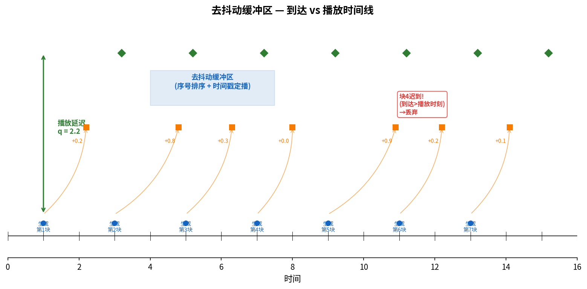

# 去抖动缓冲区

> 参考：Kurose §9.3.1

**去抖动缓冲区（jitter buffer / playout buffer）**是接收方用于消除网络时延抖动（jitter）的缓冲区。它是 [[IP语音|VoIP]]、实时音频和视频流系统的核心组件——发送方以固定间隔生成媒体块，但因网络各分组经历的排队延迟不同，到达时间参差不齐；去抖动缓冲区将到达的块暂存后以**固定速率**取出播放，将不均匀的到达间隔恢复为平滑的输出序列。

## 问题：时延抖动

发送方以固定间隔 $T$（如每 20 ms）生成并发送一个语音块。理想网络中所有分组经历相同的端到端延迟 $\Delta$，到达间隔恒为 $T$——接收方只需在收到第一个分组后等待 $\Delta$ 即可平滑播放。

但在真实 IP 网络中，各分组经历的**排队延迟不同**。如果第一个分组延迟 50 ms，第二个分组延迟 200 ms，第三个分组延迟 60 ms——直接播放会导致第一个分组结束到第二个分组开始之间出现 150 ms 的无声间隙，即使所有分组最终都到达了。

## 解决方案：播放延迟

接收方不立即播放每个到达的分组，而是维护一个**去抖动缓冲区**：到达的语音块先进入缓冲区，接收方以**固定的播出速率**从缓冲区取出播放。播放开始时间比第一个分组的生成时间晚 $q$ 毫秒——这个 $q$ 就是**播放延迟（playout delay）**。

播放延迟 $q$ 是核心设计参数：
- $q$ 过大 → 端到端延迟不必要地增加，对话自然度下降
- $q$ 过小 → 大量分组因"迟到"（到达时播放时刻已过）被丢弃

## 序号与时间戳

去抖动缓冲区依赖两个关键字段（通常由 [[RTP与RTCP|RTP]] 首部提供）：

- **序号（Sequence Number）**：发送方为每个媒体块递增编号。接收方据此检测丢失和恢复乱序。
- **时间戳（Timestamp）**：记录媒体块的采样时刻（而非发送时刻）。接收方据此确定正确的播放时间点。

配合使用：即使分组乱序到达，缓冲区先按序号排序，再按时间戳确定播放时刻。

## 固定播放延迟

最简单的方案是使用固定值 $q$。设计者选择一个 $q$，期望绝大部分分组的网络延迟不超过 $q$。

如果网络延迟的分位统计已知（如 99% 的分组延迟 < 150 ms），可据此设置 $q$。但问题是：实际网络延迟的分布随时间变化（不同时间段、不同网络路径），固定 $q$ 无法适应。

固定 $q$ 的取舍：$q$ 每增加 1 ms，就减少约 0.5% 的丢包率（具体取决于延迟分布）——但增加了所有用户的端到端延迟。

## 自适应播放延迟

**自适应播放延迟（adaptive playout delay）**动态调整 $q$ 以跟踪网络延迟变化：

记第 $i$ 个分组的**网络延迟**为 $d_i$（接收时间 − 发送时间，需时钟同步或近似）。接收方维护两个 EWMA 估计量：

1. **平均延迟**：$\bar{d}_i = \alpha \cdot \bar{d}_{i-1} + (1-\alpha) \cdot d_i$，典型 $\alpha = 0.9$
2. **平均偏差**：$v_i = \beta \cdot v_{i-1} + (1-\beta) \cdot |d_i - \bar{d}_i|$，典型 $\beta = 0.9$

播放延迟设为：$q_i = \bar{d}_i + K \cdot v_i$

$K$ 通常取 4。由于 $v_i$ 估计的是平均偏差（约 0.8σ 对于正态分布），$K=4$ 对应于约 3.2 个标准差，覆盖约 99.93% 的分组。

**调整策略**：在**静默期（talkspurt silence）**调整 $q$——语音有自然停顿（词与词之间的间隙），在这些间隙中改变播放延迟不会引入可感知的失真。具体而言：
- 若当前 $q$ 显著大于计算值 → 在静默期缩短播放延迟（减少缓冲区积压）
- 若当前 $q$ 显著小于计算值 → 在静默期拉长播放延迟（填充缓冲区）

## 与 TCP 缓冲的对比

去抖动缓冲区和 [[TCP拥塞控制|TCP 缓冲区]]虽然都是"缓冲"，但目的完全不同：

| | 去抖动缓冲区 | TCP 接收缓冲区 |
|---|------------|--------------|
| **目的** | 消除**时延抖动**，平滑播放 | 吸收**到达速率波动**，防止接收方溢出 |
| **度量** | 时间（毫秒） | 字节数 |
| **丢弃条件** | 分组到达晚于播放时刻 | 缓冲区满（由 [[TCP流量控制|rwnd]] 通告） |
| **自适应参数** | 网络延迟统计量 | 应用读取速率 |

- [[IP语音]]
- [[RTP与RTCP]]
- [[服务质量]]
- [[多媒体网络应用概述]]
- [[TCP流量控制]]
