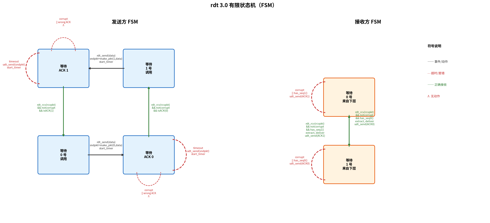

# 可靠数据传输原理

> 参考：Kurose §3.4

可靠数据传输（Reliable Data Transfer, RDT）是计算机网络中最基本、最重要的问题之一。运输层需要在不可靠的网络层（IP 提供尽力而为服务，可能丢失、损坏、重排分组）之上为应用提供可靠的数据交付。本节自底向上地构建越来越复杂的可靠数据传输协议，从理想信道逐步过渡到真实的丢包信道。

## 可靠数据传输的框架

为简化讨论，只考虑单向数据传输，但控制信息双向流动。数据从发送方通过 `rdt_send()` 接口交给可靠数据传输协议，协议通过 `udt_send()`（不可靠数据传输）将分组发送到信道上。在接收端，分组到达后通过 `rdt_rcv()` 被协议处理，数据通过 `deliver_data()` 交付给上层。

## rdt 1.0：完全可靠信道

rdt 1.0 假设底层信道**完全可靠**：无比特差错、无丢包、分组按序到达。发送方和接收方的**有限状态机（FSM）**都只有一个状态——发送方等待来自上层的数据，接收方等待来自下层的数据。

- 发送方：从上层接收数据 → 创建分组（`make_pkt(data)`） → 发送分组（`udt_send(packet)`） → 返回等待状态
- 接收方：从下层接收分组（`rdt_rcv(packet)`） → 提取数据交付上层（`extract(packet, data)` → `deliver_data(data)`） → 返回等待状态

在这个简单的协议中，不需要 ACK/NAK、不需要定时器、不需要序号。

## rdt 2.0：比特差错信道

rdt 2.0 假设底层信道可能造成**比特差错**（分组中某些比特翻转），但**不会丢包**。

### 新增的三个机制

相比 rdt 1.0，rdt 2.0 增加了三个机制来应对比特差错：

1. **差错检测**：分组携带检验和（checksum）。接收方重新计算检验和，如果对不上，说明分组在传输中损坏。
2. **接收方反馈**：接收方收到分组后，根据检验和的结果向发送方回复：
   - **ACK**（肯定确认）——分组正确
   - **NAK**（否定确认）——分组损坏
3. **重传**：发送方收到 NAK 后，重新发送同一个分组。

### 基本工作过程

```
发送方                        接收方
  │                            │
  │── 数据分组 ─────────────▶ │ 检验和 ✓
  │◀── ACK ──────────────── │ → 交付上层，发 ACK
  │                            │
  │── 数据分组 ─────────────▶ │ 检验和 ✗
  │◀── NAK ──────────────── │ → 丢弃，发 NAK
  │── 数据分组 (重传) ──────▶ │ 检验和 ✓，交付
```

### rdt 2.0 的致命缺陷：ACK/NAK 本身也可能损坏

ACK 和 NAK 也是通过底层信道传输的分组，它们同样可能遭遇**比特差错**。当发送方收到一个损坏的 ACK/NAK 时，它完全不知道接收方到底收了还是没收到数据：

```
发送方                        接收方
  │                            │
  │── 数据分组 ──────────────▶│ 正确收到，发 ACK
  │◀── 损坏 ────────────────│ ACK 在传输中损坏！
  │                            │
  │  😵 两难：                 │
  │  重传 → 接收方可能重复交付  │
  │  不发 → 接收方可能没收到    │
```

发送方无法区分「ACK 损坏了但数据已收到」和「NAK 损坏了但数据确实到了」——rdt 2.0 在这里卡住了。

## rdt 2.1：应对 ACK/NAK 损坏

rdt 2.1 在 rdt 2.0 的基础上增加 **1 比特序号**来解决 ACK/NAK 损坏问题。

### 为什么 1 比特就够了？

rdt 是**停止-等待**协议——同一时刻只有一个分组在传输中。接收方面对每一个到达的分组，只需要回答一个问题：

> 「这是**新的**分组，还是上一个的**重传**？」

这是一个二选一的问题，1 比特（0 或 1）足以区分。接收方记住**上一次正确收到的序号**，新分组到达时比对即可。

### 分组结构

序号不是独立存在的——它和数据打包在同一个分组里，受检验和共同保护：

```
┌──────────────┬─────────────────────────┐
│ 序号 (1 bit) │     数据                │
├──────────────┴─────────────────────────┤
│         检验和覆盖全部                   │
└────────────────────────────────────────┘
```

这意味着：如果序号的比特在传输中翻转，检验和**一定会**检测出来（分组被判为损坏，接收方发 NAK，发送方重传）。序号不是在防比特差错——那归检验和管。序号解决的是检验和**管不到**的情况（见下文场景三）。

### 接收方的判断规则

收到一个检验和通过的分组时：

| 序号 vs 上次正确收到的 | 判断 | 动作 |
|---|---|---|
| **不同** | 新分组 | 交付给上层，更新记录，发 ACK |
| **相同** | 重传（重复） | **不交付**（已交付过），发 ACK |

### 三种典型场景

**场景一：一切顺利**

```
发送方                         接收方 (上次收到: 无)
  │── data{seq=0} ───────────▶│ ✓ 检验和通过，seq=0
  │                            │ → 新数据，交付，记录 seq=0
  │◀── ACK ──────────────────│
  │                            │
  │── data{seq=1} ───────────▶│ ✓ 检验和通过，seq=1 ≠ 0
  │                            │ → 新数据，交付，记录 seq=1
  │◀── ACK ──────────────────│
```

**场景二：数据分组损坏 → NAK 触发重传**

```
发送方                         接收方 (上次收到: seq=1)
  │── data{seq=0} ───────────▶│ ✗ 检验和失败
  │                            │ → 丢弃，发 NAK
  │◀── NAK ──────────────────│
  │                            │
  │── data{seq=0} (重传) ────▶│ ✓ 检验和通过，seq=0 ≠ 1
  │                            │ → 新数据，交付，记录 seq=0
  │◀── ACK ──────────────────│
```

**场景三：ACK/NAK 损坏 → 序号发挥作用**

这是 rdt 2.1 解决的核心问题：

```
发送方                         接收方 (上次收到: seq=1)
  │── data{seq=0} ───────────▶│ ✓ 检验和通过，seq=0 ≠ 1
  │                            │ → 新数据！交付，记录 seq=0
  │◀── 损坏 ────────────────│ ACK 在传输中损坏！
  │                            │
  │ 😵 ACK 坏了，保守起见重传   │
  │                            │
  │── data{seq=0} (重传) ────▶│ ✓ 检验和通过，但 seq=0 = 0
  │                            │ → 序号没变，我已经交过了
  │                            │ → 不交付！只回 ACK
  │◀── ACK ──────────────────│
  │                            │
  │ ✓ 收到 ACK，可以发下一个   │
```

关键：因为有序号，即使 ACK 损坏导致发送方**不必要地重传**，接收方也能识别出重复分组，**不会向应用层重复交付**。这就是序号的作用——它不防差错（检验和防），它防的是「反馈丢失后不知道重传有没有造成重复」。

### rdt 2.1 的状态

发送方和接收方各有两个状态，对应序号 0 和 1。发送方交替使用两个序号发送新分组；接收方根据序号判定新旧。分组中的序号字段、ACK/NAK 分组中的确认字段，都是普通二进制比特，由发送方/接收方构造并写入分组中，通过底层信道传输。

### rdt 2.2：无 NAK 协议

rdt 2.2 实现了与 rdt 2.1 相同的功能，但**删掉了 NAK**——协议只使用一种反馈类型：ACK。复杂度降低，接收方和发送方的状态机都更简洁。

#### ACK 的编号约定

rdt 2.2 的 ACK 分组包含一个序号，含义是**最后一个正确收到的分组的序号**（不是「下一个期待的序号」）。例如：

- 接收方刚刚正确收到了 seq=0 → 最后正确收到 = 0 → 发送 **ACK 0**
- 接收方刚刚正确收到了 seq=1 → 最后正确收到 = 1 → 发送 **ACK 1**

发送方通过收到的 ACK 序号判断状态：`isACK(n)` 检查 ACK 分组中的序号是否等于 $n$。

#### 接收方的工作逻辑

接收方始终记住**最后正确收到的序号**（初始值设为 $1$，因为一开始在等待 $0$）。处于某个状态时：

| 接收方的状态 | 收到正确分组（检验和通过） | 收到损坏或错误序号的分组 |
|---|---|---|
| **等待 0 号** | seq=0 → 交付数据，记录「最后正确=0」，**发 ACK 0**，进入「等待 1 号」 | **发 ACK 1**（重新确认最后正确收到的 seq=1），**留在**「等待 0 号」 |
| **等待 1 号** | seq=1 → 交付数据，记录「最后正确=1」，**发 ACK 1**，进入「等待 0 号」 | **发 ACK 0**（重新确认最后正确收到的 seq=0），**留在**「等待 1 号」 |

#### 发送方怎么理解「重复 ACK」？

这是 rdt 2.2 最关键的设计。没有 NAK 了，发送方怎么知道要重传？靠**重复 ACK**。

发送方每收到一个 ACK，比对它的序号和**自己刚发的分组的序号**：

| 发送方刚发了 | 收到的 ACK | 判断 |
|---|---|---|
| seq=0 | ACK 0 | ✓ 新 ACK → 接收方确认了 seq=0 → 可以发 seq=1 |
| seq=0 | ACK 1 | ✗ **重复 ACK** → 接收方还在确认 seq=1（上个分组）→ 说明 seq=0 没收到 → **等同于 NAK → 重传 seq=0** |

#### 完整场景演示

**场景：分组损坏 → 重复 ACK → 重传**

```
发送方 (刚发了 seq=0)        接收方 (等待0号, 最后正确=1)
  │                            │
  │── data{seq=0} ───────────▶│ ✗ 检验和失败
  │                            │ → 丢弃，最后正确仍是 1
  │◀── ACK 1 ────────────────│ → 发送 ACK 1（重复确认）
  │                            │
  │ "我刚发 seq=0，收到 ACK 1？ │
  │  这是重复 ACK → 等于 NAK"  │
  │                            │
  │── data{seq=0} (重传) ────▶│ ✓ 检验和通过，seq=0
  │                            │ → 交付，最后正确=0
  │◀── ACK 0 ────────────────│ → 进入等待 1 号
  │                            │
  │ "ACK 0！确认了 seq=0"      │
  │ 可以发 seq=1 了            │
```

**场景：ACK 本身损坏 → 发送方重复当前 ACK**

```
发送方 (刚发了 seq=0)        接收方 (等待0号, 最后正确=1)
  │                            │
  │── data{seq=0} ───────────▶│ ✓ 检验和通过
  │                            │ → 交付，最后正确=0
  │◀── 损坏 ────────────────│ ACK 0 在传输中损坏！
  │                            │
  │ 收到损坏的反馈，无法判断    │
  │ 保守起见重传 seq=0         │
  │                            │
  │── data{seq=0} (重传) ────▶│ ✓ 但从 seq=0 判断是重复
  │                            │ → 不交付！最后正确仍是 0
  │◀── ACK 0 ────────────────│ → 重新确认 seq=0
  │                            │
  │ 收到 ACK 0，确认完毕       │
```

#### 为什么 rdt 2.2 是 rdt 3.0 的基础

rdt 2.2 证明了**只用一种反馈类型（带序号的 ACK）就能完整代替 ACK+NAK**。rdt 3.0 直接继承了这个设计，只加了一个定时器来处理丢包——因为丢包场景下既没有 ACK 也没有 NAK 到达，唯一的探测手段就是超时。

## rdt 3.0：比特差错与丢包信道

在 rdt 3.0 中，底层信道可能**丢失分组**——这是对真实网络最准确的建模。rdt 3.0 在 rdt 2.2 的基础上增加了一个**定时器（timer）**。

发送方在发送一个分组后**启动一个定时器**——如果在定时器超时之前未收到该分组的 ACK，发送方**重传该分组**。

定时器设置的关键问题：
- 如果超时间隔太短，可能在不必要的重传上浪费网络带宽——分组可能仍在网络中正常传输但尚未到达
- 如果超时间隔太长，在分组确实丢失的情况下会增加不必要的等待时间
- 理想情况：定时器的超时间隔应略大于发送方到接收方的**往返时间（RTT）**

rdt 3.0 的发送方状态机包含了四个状态——每个状态对应等待 ACK 0 或 ACK 1，分别为无超时动作和超时动作。



rdt 3.0 是**实用的停止-等待可靠数据传输协议**，虽然正确实现了可靠数据传输，但性能极差——发送方大部分时间在空闲等待 ACK。

## 停止-等待协议的信道利用率

以发送方发送 1,000 字节分组到 1 Gbps 链路的场景为例：传输时延 $L/R = (8000\text{ bits}) / (10^9\text{ bps}) = 8$ 微秒。如果 RTT = 30 毫秒，则发送方只有 $8/30008 \approx 0.027\\%$ 的时间在有效发送数据，信道利用率为 $0.00027$——**99.97% 的时间链路空闲**。

停止-等待协议的利用率公式：
$$U_{\text{sender}} = \frac{L/R}{\text{RTT} + L/R}$$

- [[流水线可靠传输]]
- [[GBN]]
- [[SR]]
- [[SACK]]
- [[运输层概述]]
- [[TCP可靠数据传输]]
- [[UDP]]
