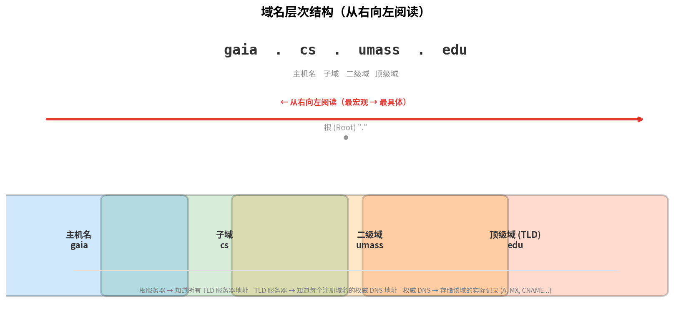

# 域名命名规则

> 参考：Kurose §2.4；RFC 1035

**域名（Domain Name）**是因特网上标识一台主机或一个组织的层次化名称。理解域名的结构与规则是理解 [[DNS]] 如何工作的前提。

## 域名的层次结构

域名是一个**从右向左**阅读的树状层次结构，层级之间用 `.` 分隔：

```
       gaia  .  cs  .  umass  .  edu
        │       │       │        │
      第四层   第三层   第二层    顶级域
     （主机名）（子域）（二级域）（TLD）
```



以 `gaia.cs.umass.edu` 为例：

| 层级 | 值 | 含义 | 由谁管理 |
|------|-----|------|----------|
| 根 | `.`（隐含） | DNS 的最终起点 | 13 个逻辑根服务器 |
| 顶级域（TLD） | `edu` | 教育机构 | `.edu` TLD 注册管理机构 |
| 二级域 | `umass` | 麻省大学 | `umass.edu` 的权威 DNS 服务器 |
| 三级域（子域） | `cs` | 计算机系 | `umass.edu` 自行划分子域 |
| 主机名 | `gaia` | 具体主机 | `cs.umass.edu` 子域的管理者 |

**阅读规则**：从右向左，每一级是上一级的"下属"。`edu` 管理哪些机构属于 `.edu`，`umass.edu` 管理 `umass.edu` 下有哪些子域和主机。

## 标签规则（RFC 1035）

域名的每一段称为一个**标签（label）**：

| 规则 | 限制 |
|------|------|
| 每个标签最大长度 | **63 个字符** |
| 完整域名最大长度 | **253 个字符**（含 `.`） |
| 允许字符 | 字母（a-z）、数字（0-9）、连字符（`-`） |
| 标签约束 | 不能以 `-` 开头或结尾 |
| 大小写 | **不敏感**（`EXAMPLE.COM` = `example.com`） |

## 顶级域（TLD）分类

| 类型 | 说明 | 例子 |
|------|------|------|
| **通用顶级域（gTLD）** | 按组织用途划分 | `.com`（商业）、`.org`（组织）、`.net`（网络服务）、`.edu`（美国教育机构）、`.gov`（美国政府）、`.mil`（美国军方） |
| **国家/地区顶级域（ccTLD）** | 两字母，按地理区域划分 | `.cn`（中国）、`.uk`（英国）、`.jp`（日本）、`.fr`（法国）、`.de`（德国） |
| **新通用顶级域（new gTLD）** | 2012 年后 ICANN 扩张引入 | `.app`、`.blog`、`.wiki`、`.dev` |

## 完全限定域名（FQDN）

技术上域名的根是一个点（`.`），称为**根（root）**。完全限定域名（Fully Qualified Domain Name, FQDN）是包含根的完整域名，末尾带点：

```
gaia.cs.umass.edu.    ← FQDN（末尾有点）
gaia.cs.umass.edu      ← 日常省略形式（末尾无点）
```

日常使用中末尾的点通常省略，但在 DNS 配置文件（如 zone file）中必须书写完整。

## 域名的注册与管理

域名注册采用**阶梯式委托**：

1. **ICANN** 负责管理根域和 TLD 的分配
2. **TLD 注册管理机构**（Registry，如 Verisign 管理 `.com`）维护该 TLD 下的所有二级域名注册信息
3. **注册服务机构**（Registrar，如 GoDaddy、阿里云）面向公众提供域名注册服务
4. **域名持有者**注册 `example.com` 后，自行管理 `*.example.com` 的子域

当你注册 `example.com` 时，需要在 `.com` 的 TLD 服务器中插入 NS 记录，将 `example.com` 的 DNS 查询指向你自己的**权威 DNS 服务器**。

### 子域委托（Delegation）

域名持有者可以通过 **NS 记录**将子域"切"给另一组权威 DNS 服务器管理。例如 `umass.edu` 的权威服务器中存放：

```
cs.umass.edu.           NS    dns.cs.umass.edu.
dns.cs.umass.edu.       A     128.119.40.100
```

这条 NS 记录告诉外界：`cs.umass.edu` 及其所有子域（`*.cs.umass.edu`）的权威查询请去问 `dns.cs.umass.edu`，而非 `umass.edu` 的权威服务器。DNS 查询会遵循这条 NS 记录继续向 `dns.cs.umass.edu` 发起迭代查询——这与 TLD→权威的委托是完全相同的机制，只是发生在更深层级。

常见委托场景：

| 场景 | 例子 | 原因 |
|------|------|------|
| 大学各系自管 DNS | `cs.umass.edu` 委托给 CS 系 | 各自维护主机记录，互不干扰 |
| 公司区域拆分 | `us.example.com` / `eu.example.com` | 不同区域独立管理 |
| 平台多租户 | `tenant1.saas.com` 委托给租户 | 租户自主管理自己的 DNS 记录 |
| CDN 委托 | `cdn.example.com CNAME provider.cdn.com` | 通过 CNAME 将流量引向 CDN 供应商 |

## 常见误解

- **`www` 不是域名的必要部分**——`www` 只是一个约定俗成的主机名（指向 Web 服务器），一个域可以有多个主机名（`mail.example.com`、`ftp.example.com` 等）
- **域名 ≠ URL**——域名是 `example.com`，而 `https://example.com/page` 是 URL（协议 + 域名 + 端口 + 路径）
- **`.com` 没有自己的权威 DNS 服务器**——`.com` 是 TLD，由 TLD 服务器管理；权威 DNS 服务器是每个注册域（如 `example.com`）自己的

- [[DNS]]
- [[本地DNS服务器]]
- [[应用层协议原理]]
- [[Web请求的一天]]
