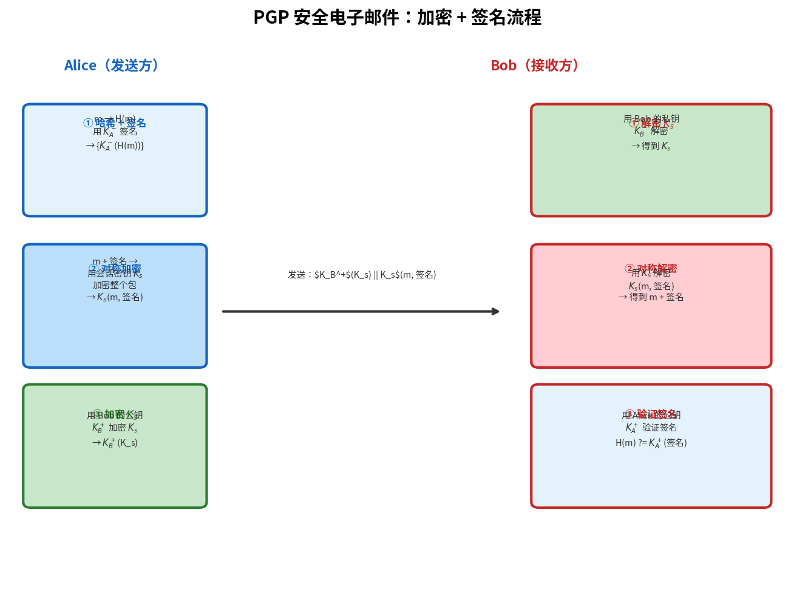

# 安全电子邮件

> 参考：Kurose §8.5

**安全电子邮件**使用密码学技术为电子邮件提供机密性、完整性和发件人认证。最著名的安全电子邮件标准是 **PGP（Pretty Good Privacy）**。

## 电子邮件安全需求

常规 SMTP 电子邮件以明文传输，面临以下威胁：
- **机密性泄露**：邮件内容可被中间节点读取
- **内容篡改**：邮件正文和附件可在传输中被修改
- **发件人冒充**：SMTP 不验证发件人身份，`MAIL FROM` 可随意填写

安全电子邮件需要提供：加密（机密性）、数字签名（认证与完整性）、以及两者的组合。

## PGP 加密流程

PGP 使用**会话密钥 + 公钥加密**的混合方案：

### 发送方（Alice）加密

1. Alice 生成一个随机的**对称会话密钥 $K_s$**
2. 用 $K_s$（对称加密，如 AES）加密邮件正文 $m$：$K_s(m)$
3. 用 Bob 的**公钥** $K_B^+$ 加密会话密钥：$K_B^+(K_s)$
4. 发送给 Bob：$\{K_B^+(K_s), K_s(m)\}$

### 接收方（Bob）解密

1. Bob 用自己的**私钥** $K_B^-$ 解密会话密钥：$K_B^-(K_B^+(K_s)) = K_s$
2. Bob 用 $K_s$ 解密邮件正文：$K_s^{-1}(K_s(m)) = m$

### 为什么使用混合方案

- 对称加密（AES）速度快，适合加密可能较长的邮件正文
- 公钥加密（RSA）只加密短的会话密钥，计算开销小
- 兼具密钥分发的便利和加密的效率

## PGP 数字签名

PGP 支持对邮件进行数字签名以提供**不可否认性**：

1. Alice 计算邮件正文 $m$ 的哈希值 $H(m)$（如 SHA-256）
2. Alice 用**自己的私钥** $K_A^-$ 加密哈希值：$K_A^-(H(m))$——这就是签名
3. 邮件附上签名：$\{m, K_A^-(H(m))\}$

Bob（或任何人）可以用 Alice 的公钥 $K_A^+$ 验证签名：计算 $K_A^+(K_A^-(H(m)))$，与自己对 $m$ 计算的 $H(m)$ 比较。

## 加密 + 签名组合

PGP 可以同时提供加密和签名：

1. Alice 先对邮件 $m$ 生成数字签名 $K_A^-(H(m))$
2. Alice 将 $(m, \text{签名})$ 打包成 $M$
3. Alice 用混合加密方案加密 $M$：生成 $K_s$，发送 $\{K_B^+(K_s), K_s(M)\}$

Bob 解密后获得 $m$ 和签名，再验证签名。这提供了**机密性**（只有 Bob 能读）、**完整性**（签名验证保证未篡改）和**不可否认性**（签名只能用 Alice 的私钥生成）。

## PGP 公钥分发

PGP 不使用集中式的 CA 体系，而是采用**信任网络（Web of Trust）**：
- 用户可以相互签署对方的公钥（我签名担保"这个公钥确实属于 Bob"）
- 如果我信任 Alice，而 Alice 签署了 Bob 的公钥，我也可以间接信任 Bob 的公钥
- 这是一种去中心化的信任模型，适合个人和小团体

## PGP 与 MIME

PGP 加密后的邮件是二进制数据，无法通过只支持 7-bit ASCII 的旧 SMTP 服务器。PGP 使用 **Radix-64（类似 Base64）**编码将二进制转换为可打印的 ASCII 字符。MIME 的 `Content-Type: multipart/encrypted` 也支持此功能。

- [[电子邮件与SMTP]]
- [[MIME]]
- [[公开密钥密码学]]
- [[数字签名]]
- [[密码学哈希函数]]
- [[对称密钥密码学]]
- [[端点认证]]
- [[TLS]]
- [[计算机网络安全概述]]
