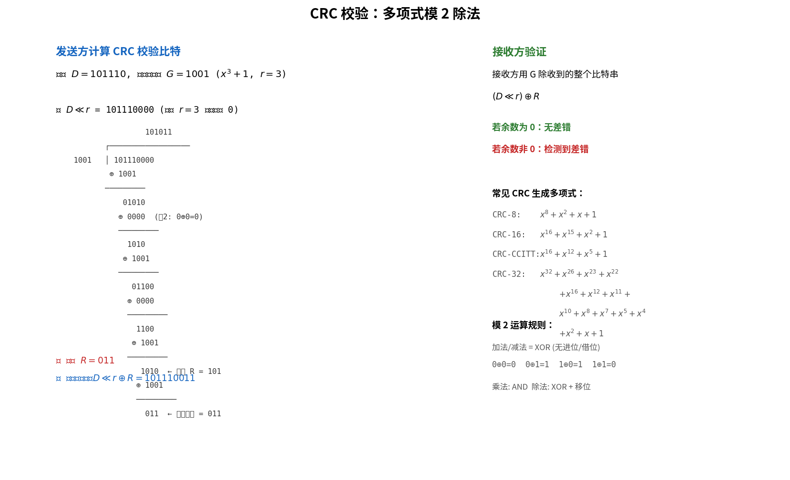

# 差错检测与纠错

> 参考：Kurose §6.2

差错检测与纠错（error detection and correction）是链路层的重要服务。在发送节点，待保护的数据 D 被附加上**差错检测与纠错位（EDC）**，D 和 EDC 一起通过链路发送给接收节点。接收方收到 D′ 和 EDC′（可能与原始 D 和 EDC 不同，因为传输中可能发生比特翻转），通过检查判断是否发生了差错。

差错检测技术不能保证 100% 检测所有差错——**未检测出的比特差错（undetected bit error）**仍然可能发生。目标是选择一种使未检测出差错的概率足够小的方案。一般而言，更复杂的差错检测方案开销更大（更少的计算、更大的 EDC 字段）。

## 奇偶校验（Parity Checks）

**一维奇偶校验**是最简单的差错检测方式。在偶校验（even parity）方案中，发送方添加单个比特，使 d+1 个比特中 1 的总数为偶数。接收方只需统计收到的 d+1 个比特中 1 的数量——奇数个 1 意味着发生了奇数个比特差错。

但一维奇偶校验的问题是：如果发生偶数个比特差错，差错将不会被检测到。在**突发差错（burst error）**条件下（即差错呈簇状出现而非独立），单比特奇偶校验的未检测差错概率可能接近 50%。

**二维奇偶校验（two-dimensional parity）**将 d 个比特排列成 i 行 j 列的矩阵，为每行和每列计算奇偶校验位，共产生 i+j 个校验位。其强大之处在于：单个比特差错不仅可被检测，还能通过出错的行和列索引**精确定位并纠正**——这就是**前向纠错（FEC）**。二维奇偶校验还能检测（但不能纠正）任意两个差错的组合。

## 检验和（Checksum）

检验和方法将 d 比特数据视为 k 比特整数的序列，求和后取反码作为差错检测位。**因特网检验和（Internet checksum）**基于此方法——字节视为 16 比特整数求和，其 1 的补码（反码）作为检验和放入段首部。接收方对收到的数据（包括检验和）求反码和，检查结果是否全为 1 位。

检验和的开销很小（TCP/UDP 仅用 16 位），但提供的保护相对较弱。**为什么运输层用检验和而链路层用 CRC？**因为运输层通常用软件实现（在主机操作系统中），需要简单快速的方案；而链路层的差错检测由适配器中的专用硬件实现，能快速完成更复杂的 CRC 操作。

## 循环冗余检验（CRC）

**循环冗余检验（Cyclic Redundancy Check, CRC）**，也称为**多项式编码（polynomial code）**，是计算机网络中广泛使用的差错检测技术。CRC 的核心思想：对于 d 比特数据 D，发送方和接收方先协商一个 r+1 比特的**生成多项式（generator）G**（最高位必须为 1）。发送方计算 r 个附加比特 R，使得扩展后的 d+r 比特模式（用模 2 算术解释）**恰好能被 G 整除**（无余数）。

### 计算过程

所有 CRC 计算使用**模 2 算术**——加法不进位，减法不借位，二者等价于按位异或（XOR）。因此：

$$1011 \oplus 0101 = 1110$$

CRC 的计算步骤：

1. 将 D 左移 r 位，得到 $D \cdot 2^r$（在数据末尾附加 r 个 0）
2. 用 $D \cdot 2^r$ 除以 G（模 2 除法），得到余数 R
3. 发送 $D \cdot 2^r \oplus R$（即 d 位数据 + r 位余数）

接收方将收到的 d+r 位整体除以 G。若余数为 0，数据正确；若非零，说明发生了差错。

### 示例

对于 $D = 101110, d = 6, G = 1001, r = 3$（CRC-3），计算余数 $R = 011$，最终发送的 9 个比特为 $101110011$。

### 常用的 CRC 标准

国际标准定义了 8、12、16、32 位生成多项式。**CRC-32** 被多个 IEEE 链路层协议采用，其生成多项式为：

$$G_{CRC-32} = 100000100110000010001110110110111$$

CRC 标准可以检测：
- 所有长度小于 $r+1$ 比特的突发差错
- 长度大于 $r+1$ 比特的突发差错，检测概率为 $1 - 0.5^r$
- 任意奇数个比特差错（当生成多项式 $G$ 包含因式 $x+1$ 时；CRC-32 不满足此条件，故不保证检测所有奇数个差错）

- [[链路层概述]]
- [[可靠数据传输原理]]
- [[UDP]]
- [[以太网]]
- [[802.11 MAC协议]]
