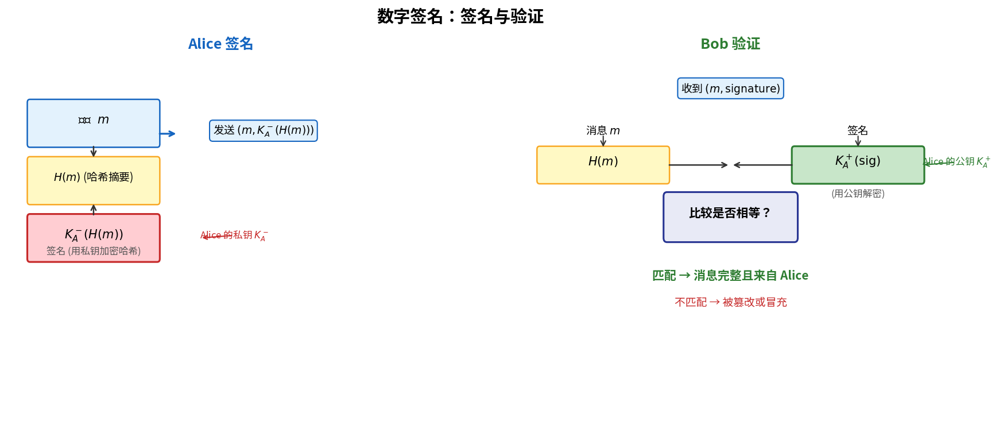

# 数字签名

> 参考：Kurose §8.3.3

**数字签名（Digital Signature）**是密码学中用于提供**消息完整性**、**来源认证**和**不可否认性（Non-repudiation）**的机制。与 MAC 不同，数字签名使用公钥密码学，签名者使用私钥签名，验证者使用公钥验证——任何人可以验证签名，但只有私钥持有者可以生成签名。

## 为什么需要数字签名

MAC 的局限在于双方共享同一密钥，任何一方都能生成另一方的"MAC"，因此：
- Bob 可以伪造"Alice 发给 Bob"的消息（Alice 无法否认，但 Bob 可以捏造）
- 无法向第三方（如法官）证明某条消息确实来自 Alice

数字签名利用公钥密码学的非对称性解决了这些问题：**只有 Alice 知道自己的私钥，因此只有 Alice 能生成签名**。

## 数字签名原理

利用 RSA 中加解密可互换的性质 $K_A^-(K_A^+(m)) = K_A^+(K_A^-(m)) = m$：

**签名**：Alice 用自己的**私钥** $K_A^-$ 对消息 $m$ 的哈希值进行"解密"运算：
$$\text{signature} = K_A^-(H(m))$$

**验证**：Bob 用 Alice 的**公钥** $K_A^+$ 对签名进行"加密"运算，并与自己计算的 $H(m)$ 比对：
$$K_A^+(\text{signature}) \stackrel{?}{=} H(m)$$

如果匹配，则证明：
- **消息完整性**：传输中未被修改（哈希值匹配）
- **来源认证**：签名只能用 Alice 的私钥生成（非对称性）
- **不可否认性**：Alice 不能否认自己签过这份文件（只有她持有私钥）

注意实际签名对象是 $H(m)$ 而非 $m$ 本身——因为哈希值长度固定且短，签名效率远高于直接签名整个消息。

## 公钥基础设施（PKI）

数字签名解决了"如何验证"的问题，但没有解决"公钥从哪里来"的问题。Trudy 可以声称自己是 Alice 并发布一个"Alice 公钥"（实际上是 Trudy 的）。**公钥基础设施（Public Key Infrastructure, PKI）**解决公钥的可信分发。

### 证书（Certificate）

**数字证书**将公钥与实体身份绑定，由**证书颁发机构（Certificate Authority, CA）**签发。证书包含：

- 主体的身份信息（如域名、组织名）
- 主体的公钥
- 证书有效期
- 颁发者（CA）的信息
- **CA 的数字签名**：CA 用自己的私钥对上述内容签名

### CA 与信任链

1. **根 CA（Root CA）**：最高信任锚点，其证书是**自签名**的。根 CA 的公钥预置在操作系统和浏览器中
2. **中间 CA（Intermediate CA）**：由根 CA 或其他中间 CA 签发证书
3. **终端实体证书**：由中间 CA（或根 CA）签发给网站、个人

信任模型：**信任根 CA → 信任中间 CA → 信任服务器证书**。验证证书时沿信任链逐级验证签名，直到到达信任的根 CA。

### 证书吊销

证书可能因私钥泄露等原因需要提前失效。CA 维护**证书吊销列表（CRL, Certificate Revocation List）**，列出已被吊销的证书序列号。OCSP（Online Certificate Status Protocol）允许实时查询单个证书的状态。

## 数字签名在网络安全中的应用

| 应用 | 签名内容 | 作用 |
|------|---------|------|
| **TLS 握手** | ServerHello 等握手参数 | 服务器用证书对应的私钥签名，客户端验证 |
| **PGP** | 电子邮件哈希值 | 发件人对邮件内容签名，收件人验证 |
| **DNSSEC** | DNS 资源记录 | 权威服务器对 DNS 数据签名，防止 DNS 污染 |
| **代码签名** | 可执行文件的哈希 | 开发者签名，OS 验证，防止运行恶意软件 |
| **BGPsec** | BGP 路由通告 | 防止路由劫持 |

- [[公开密钥密码学]]
- [[消息认证码]]
- [[密码学哈希函数]]
- [[TLS]]
- [[安全电子邮件]]
- [[端点认证]]
- [[计算机网络安全概述]]
