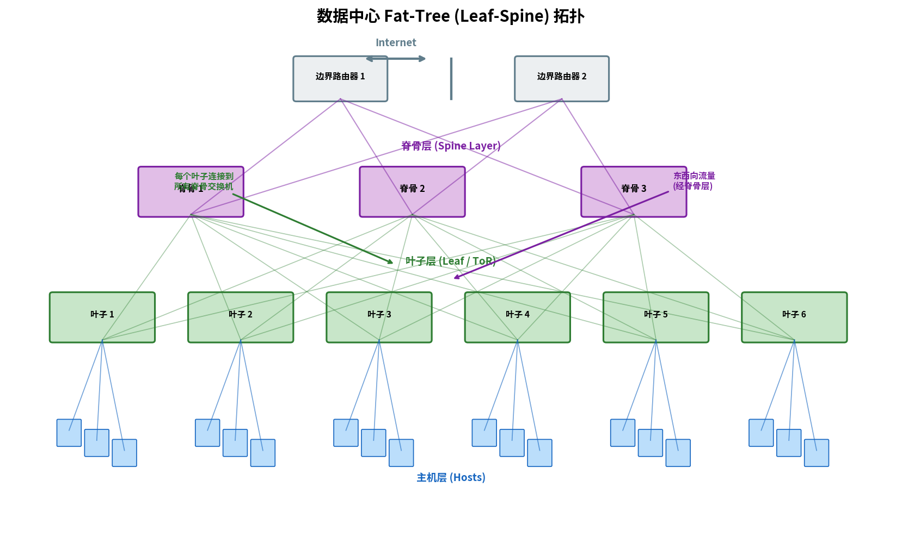

# 数据中心网络

> 参考：Kurose §6.6

数据中心（data center）是容纳数万至数十万台主机的设施，支撑着云服务、搜索、社交网络、电子商务等大规模因特网应用。数据中心网络（data center networking）需要满足极高的吞吐量、低延迟、高可用性和可扩展性要求。

## 工作负载类型

数据中心承载的工作负载（workload）种类多样：

- **外部请求（outward-facing）**：来自外部用户的网页请求、API 调用、视频流等
- **内部流量（internal traffic）**：分布式计算（如 MapReduce）、存储复制、虚拟机迁移等——数据中心的**东西向流量（east-west traffic）**往往远超**南北向流量（north-south traffic）**

## Fat-Tree（胖树）拓扑

数据中心网络最典型的拓扑结构是 **Fat-Tree（胖树）拓扑**，也称为**叶子-脊骨（Leaf-Spine）架构**：

```
          [Internet]
              |
        [Border Routers]
              |
    ====== 脊骨层（Spine）=======
      /    /    |    \    \
    [Leaf]...[Leaf]...[Leaf]
     /  \      /  \      / \
   Hosts    Hosts    Hosts
```



- **叶子交换机（Leaf Switch）**：直接连接主机（通常 24–48 端口），称为架顶交换机（ToR, Top-of-Rack）
- **脊骨交换机（Spine Switch）**：叶子交换机之间的互联，每个叶子连接到所有脊骨交换机
- **边界路由器（Border Router）**：连接数据中心到外部因特网

**关键特性**：
1. **多条等价路径**：任一叶子与另一叶子之间存在多条路径，通过等价多路径（ECMP）负载均衡，充分利用所有链路
2. **无过订阅或低过订阅**：传统的层次化拓扑越往上带宽越窄（过订阅），Fat-Tree 保证每层总带宽相等，提供全速率主机间通信

## 数据中心网络的设计目标

| 目标 | 实现方式 |
|------|---------|
| 高吞吐量 | Fat-Tree 无瓶颈，多路径 ECMP |
| 低延迟 | 浅层拓扑（通常 2-3 层），高速链路（10–100 Gbps） |
| 容错 | 多路径冗余，交换机/链路故障时自动切换 |
| 可扩展性 | 模块化增长，增加叶子/脊骨即可扩展 |
| 虚拟化与多租户 | VLAN、VXLAN、NVGRE 等覆盖网络（overlay network） |

## 覆盖网络与 VXLAN

大规模数据中心需要支持数十万租户（tenant），VLAN 仅支持 4094 个隔离域，不够用。**VXLAN（Virtual Extensible LAN）** 等覆盖网络技术通过**MAC-in-UDP 封装**将二层帧封装在 IP 数据报中传输，提供多达 1600 万个虚拟网络标识符（VNI, 24 比特），支持超大规模多租户隔离。

- [[链路层交换机]]
- [[VLAN]]
- [[网络的网络]]
- [[应用层协议原理]]
- [[STP]]
- [[路由器排队与调度]]
- [[通用转发与SDN数据平面]]
