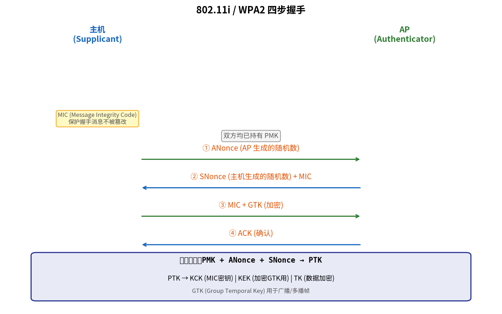

# 无线局域网安全

> 参考：Kurose §8.8

无线网络固有的广播特性使其比有线网络更容易受到**嗅探**和**未授权接入**的威胁。IEEE 802.11 标准经历了从脆弱的 **WEP** 到健壮的 **802.11i（WPA2）**的演进。

## WEP（Wired Equivalent Privacy）

**WEP** 是 802.11 早期标准（1999）中定义的安全机制。其设计目标是提供与有线网络"等效"的隐私保护。然而，WEP 存在严重的安全缺陷，2001 年即被证明可轻易破解。

### WEP 操作

1. 主机和 AP 共享一个 40 比特或 104 比特的**静态密钥 $K_s$**
2. 主机为每个数据帧生成 24 比特 **IV（Initialization Vector）**，附在帧中明文传输
3. 主机使用 $K_s$ 和 IV 生成密钥流（RC4 流密码），与数据 + CRC 校验和异或以产生密文

### WEP 的致命缺陷

| 缺陷 | 说明 |
|------|------|
| **IV 太短（24 比特）** | 仅 $2^{24}$ 个可能的 IV 值，高流量下很快重复；IV 重用导致密钥流重用，攻击者可恢复明文 |
| **使用 CRC 而非 MAC** | CRC 是线性函数，攻击者可修改密文并相应调整 CRC，接收方无法检测篡改 |
| **静态共享密钥** | 所有用户共享同一密钥，一个设备被攻破则全网络暴露；密钥不自动更新 |
| **无密钥分发机制** | 密钥需手动配置，管理困难 |

工具如 **Aircrack-ng** 可在数分钟内通过捕获足够帧后破解 WEP 密钥。

## IEEE 802.11i（WPA2）

2004 年，IEEE 发布了 **802.11i** 标准，Wi-Fi 联盟的商业认证名称为 **WPA2（Wi-Fi Protected Access 2）**。802.11i 从根本上重新设计了无线安全。

### 802.11i 的四步握手（4-Way Handshake）

四步握手用于在主机（Supplicant）和 AP（Authenticator）之间协商和安装加密密钥。它假设双方已知一个**成对主密钥（PMK, Pairwise Master Key）**——在企业网络中通过 802.1X/EAP 认证服务器（如 RADIUS）获得，在家庭网络中 PMK 即 Wi-Fi 密码（PSK 模式）。

**四步握手过程**（AP 和主机各生成自己的 nonce）：

1. **AP → 主机**：AP 发送自己的 **ANonce**
2. **主机 → AP**：主机发送自己的 **SNonce** + MIC（Message Integrity Code）
3. **AP → 主机**：AP 确认收到，发送 MIC + 必要时发送 GTK（Group Temporal Key）
4. **主机 → AP**：主机确认

双方用 PMK + ANonce + SNonce 推导出 **PTK（Pairwise Transient Key）**，PTK 进一步派生：
- **KCK（Key Confirmation Key）**：用于计算 MIC 以保护握手消息完整性
- **KEK（Key Encryption Key）**：用于加密分发的 GTK
- **TK（Temporal Key）**：用于实际数据帧的加密

GTK 是 AP 用于广播/多播帧的密钥。

### AES-CCMP

802.11i 使用 **AES-CCMP（Counter Mode with CBC-MAC Protocol）**替代 WEP 的 RC4 + CRC：

- 使用 **AES-128** 块密码
- **Counter Mode（CTR）**：提供加密（机密性）
- **CBC-MAC**：提供消息完整性认证
- CCMP = CTR + CBC-MAC，是 **AEAD（Authenticated Encryption with Associated Data）**的早期实现

每个数据帧使用独立的**包号（Packet Number, PN）**作为 nonce，48 比特的 PN 远大于 WEP 的 24 比特 IV，有效防止密钥流重用。

## WPA3

2018 年发布的 WPA3 进一步增强了安全：
- **SAE（Simultaneous Authentication of Equals）**：替代 PSK，抵抗离线字典攻击
- **前向安全性**：即使长期密钥泄露，历史通信也不被解密
- **192 比特安全级别**：适用于政府和国防场景

## 802.1X 与 RADIUS

企业级 WiFi 安全使用 **802.1X** 端口接入控制 + **RADIUS** 认证服务器：
1. 主机（Supplicant）关联到 AP（Authenticator）
2. AP 屏蔽所有非认证流量，仅转发 802.1X/EAP 认证消息
3. 主机通过 AP 向 RADIUS 服务器（Authentication Server）认证身份
4. 认证成功后，RADIUS 服务器向 AP 发送 PMK
5. AP 和主机执行四步握手，建立加密信道

这种架构将复杂的认证逻辑集中在认证服务器上，AP 仅作为中继，降低了 AP 的复杂度和成本。

- [[WiFi与802.11]]
- [[802.11 MAC协议]]
- [[802.11帧]]
- [[WiFi与802.11]]
- [[802.11 MAC协议]]
- [[802.11帧]]
- [[对称密钥密码学]]
- [[公开密钥密码学]]
- [[密码学哈希函数]]
- [[消息认证码]]
- [[IPsec与VPN]]
- [[防火墙与入侵检测系统]]
- [[计算机网络安全概述]]
