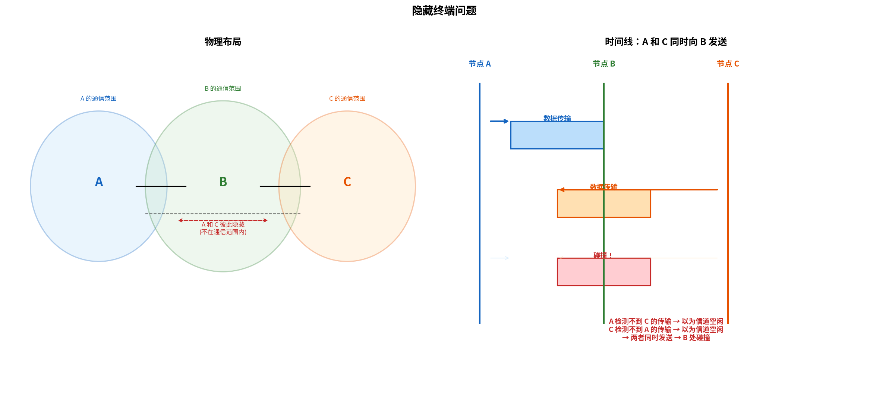

# 无线链路特性

> 参考：Kurose §7.2

无线链路与有线链路在传输特性上有本质不同，这些差异深刻影响了无线网络协议的每一层设计。理解无线链路的物理特性——信噪比、误码率、多径衰落、隐藏终端问题——是理解 WiFi CSMA/CA、蜂窝网络调度等上层机制的基石。

## 无线链路的本质差异

有线链路（如以太网）在精心设计的物理介质（双绞线、光纤）上传输信号，信号被有效限制在介质内部——干扰少、误码率极低（通常 $10^{-12}$ 以下）。无线链路则完全不同：

- **信号衰减（Attenuation）**：电磁波在空间传播时强度随距离迅速衰减（自由空间中与距离的平方成反比，室内环境中甚至与距离的 3–4 次方成反比），路径损耗限制了信号的覆盖范围
- **干扰（Interference）**：同一频段内其他无线发射源的信号混入接收端，成为噪声。干扰源可能是同一技术标准的其他设备（如相邻 Wi-Fi AP），也可以是跨技术标准的（如微波炉、蓝牙对 2.4 GHz Wi-Fi 的干扰）
- **多径传播（Multipath Propagation）**：电磁波被墙壁、地板、家具等物体反射，导致发送端发出的信号经多条不同长度路径到达接收端——各路径信号的相位叠加可能使信号增强，也可能使其自相抵消（多径衰落）

这些因素导致**无线链路的误码率远高于有线链路**——典型无线链路（Wi-Fi、蜂窝）的 BER 通常在 $10^{-6}$ 到 $10^{-4}$ 范围，而光纤为 $10^{-12}$ 或更低。

## 信噪比与误码率

**信噪比（Signal-to-Noise Ratio, SNR）**是衡量接收信号质量的核心指标，定义为接收信号功率与噪声功率之比：

$$\text{SNR} = \frac{\text{接收信号功率}}{\text{噪声功率}}$$

通常以分贝（dB）表示：$\text{SNR}_{\text{dB}} = 10 \log_{10}(\text{SNR})$。较大的 SNR 意味着更容易从噪声中提取信号。

**误码率（Bit Error Rate, BER）**是接收端错误解码比特的概率。BER 与 SNR 直接相关——对于给定的调制方案，更高的 SNR 对应更低的 BER。如果 SNR 低于一定阈值，BER 将高到无法可靠通信。

### 调制方案对 BER 的影响

物理层通过选择**调制方案**在给定 SNR 下平衡传输速率和 BER：

- **BPSK（二进制相移键控）**：每符号 1 比特，抗噪声能力强，但速率低
- **QPSK（四相移键控）**：每符号 2 比特
- **16-QAM（16 阶正交振幅调制）**：每符号 4 比特，速率高但需要更高 SNR
- **64-QAM**、**256-QAM**：更高速率，对 SNR 要求更严格

给定 SNR 下，发送方可动态选择调制方案：信道条件好时使用高阶 QAM 提高吞吐量；信道条件差时降阶为 BPSK 以保证可靠性。这就是 WiFi 中**速率自适应（Rate Adaptation）**的物理层基础。

## 隐藏终端问题（Hidden Terminal Problem）

**隐藏终端**是无线网络中最著名的问题之一，也是理解 WiFi 为什么需要 CSMA/CA（而非 CSMA/CD）的关键。

考虑三个节点 A、B、C：A 和 C 都在 B 的通信范围内，但 A 和 C **彼此不在对方的通信范围内**（如被墙壁隔离，或距离过远）。A 和 C 互相"隐藏"。

当 A 正在向 B 发送数据时，C 检测不到 A 的信号，认为信道空闲，也开始向 B 发送数据——导致在 B 处两个信号碰撞，两个传输都失败。

这与有线以太网中的碰撞检测（CSMA/CD）有本质不同：有线共享介质上，所有节点可以彼此听到对方传输。而在无线环境中，发送方无法可靠地检测到所有可能影响接收方的碰撞——这就是为什么 802.11 使用了基于避免（而非检测）的 CSMA/CA 协议。

## 信号衰落（Fading）

**衰落（Fading）**是多径传播导致的现象——同一信号经不同路径（反射、衍射、散射）到达接收端时，各路径信号具有不同的相位和幅度。在某些位置，多条路径的信号**相消干涉**使接收信号几乎为零。

衰落是无线信道中**时变的**——即使发送方和接收方保持不动，周围环境中的移动物体（行人、车辆）也会改变多径结构，导致信号强度随时间波动。这也是无线链路 BER 经常突升陡降的本质原因。

## CDMA（码分多址）

> CDMA 在信道划分协议（第 6 章）中已提及，本节给出无线网络语境下的完整技术讨论。

**码分多址（Code Division Multiple Access, CDMA）**是无线信道中的另一种共享技术。与 TDM（时间划分）和 FDM（频率划分）不同，CDMA 允许**所有用户同时在同一频段上传输**，通过编码来区分不同用户。

### CDMA 的基本原理

CDMA 为每个发送方分配一个唯一的 **$m$ 比特编码（chip sequence）**，编码长度为 $m$（通常 64 或 128）。要发送比特 "1"，发送方输出其编码本身；要发送比特 "0"，发送方输出编码的反码。编码的传输速率（称为 chip rate）是原始数据速率的 $m$ 倍。

在 CDMA 术语中，编码中的每个基本单元称为一个**码片（chip）**，以区分于数据比特。

### 编码的正交性

CDMA 编码选择的关键准则是：**不同发送方的编码必须正交**——即两个不同编码的内积为零——以便接收方能够在干扰中分离出目标信号。

如发送方 S 的编码为 $(+1, -1, +1, -1, +1, -1, +1, -1)$（8 位），发送方 T 的编码为 $(+1, +1, -1, -1, +1, +1, -1, -1)$。两个编码内积 = 0（正交）。当 S 发送比特 "1"（编码本身）且 T 发送比特 "0"（编码反码）时，接收方接收到的聚合信号 = S 的编码 + T 的反码。接收方要解码 S，将收到的信号与 S 的编码做内积——T 的贡献因正交性而抵消，只剩下 S 的信号。

### CDMA 在蜂窝网络中的应用

CDMA 曾是 3G 蜂窝网络的基础多址技术（W-CDMA、CDMA2000），具有以下独特优势：

- **软容量**：与 TDM/FDM 固定划分不同，CDMA 可以在信道条件允许时增加用户——代价是所有用户的 BER 略有上升（而非阻塞新用户）
- **抗干扰**：由于编码的正交性，CDMA 对窄带干扰有天然的抗性（最初为军用设计）
- **软切换**：移动台可以在过渡期与**多个基站同时通信**（利用不同编码），切换更加平滑

4G LTE 和 5G 网络已不再使用 CDMA 作为核心多址技术（改用 OFDMA），但 CDMA 的思想仍然深刻影响了扩频通信领域。

- [[无线网络概述]]
- [[WiFi与802.11]]
- [[信道划分协议]]
- [[MIMO]]
- [[OFDM与OFDMA]]
- [[多路访问协议]]
- [[蜂窝网络因特网接入]]
- [[无线与移动性对TCP的影响]]
