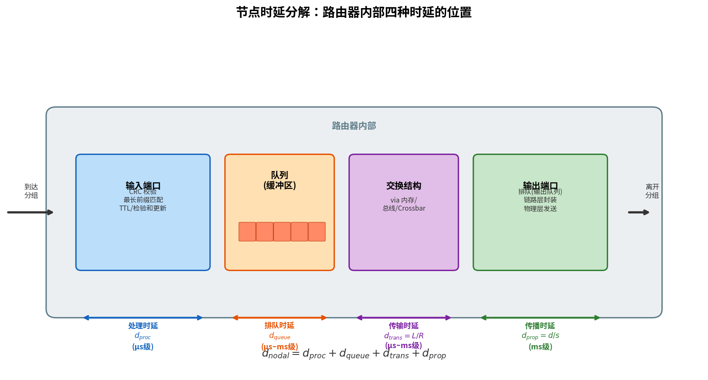

# 时延、丢包与吞吐量

> 参考：Kurose §1.4

理想情况下，因特网服务应该能在任意两个端系统之间即时、无损地传输任意数量的数据。但物理法则的限制使得计算机网络必然约束端系统之间的吞吐量、引入时延并可能丢失分组。理解这些约束及其量化模型是学习计算机网络的核心内容。

## 分组交换网中的时延

分组从源主机出发，经过一系列路由器，最终到达目的主机。沿途每个节点（主机或路由器）对分组施加多种时延。

### 四种时延

设在路由器 A 处测量时延，该路由器有一个通往路由器 B 的出链路。该链路前有一个队列（缓冲区）：

1. **处理时延（Processing Delay）**：路由器处理分组所需的时间，具体包括：（1）检查比特级差错（CRC 校验）；（2）从首部提取目的 IP 地址，在转发表中做最长前缀匹配以确定出链路；（3）修改首部——递减 TTL、重新计算首部检验和。高速路由器中处理时延通常为微秒级或更低。

2. **排队时延（Queuing Delay）**：分组在队列中等待被传输到链路上的时间。如果队列为空且没有正在传输的分组，排队时延为零；如果流量重且多个分组也在排队，排队时延可能很长。实际中排队时延在微秒到毫秒数量级。

3. **传输时延（Transmission Delay）**：将分组的**所有比特推向链路**所需的时间。设分组长度为 $L$ 比特，链路传输速率为 $R$ bps，则传输时延 = $L/R$。对于 10 Mbps 以太网，$R = 10$ Mbps；对于 100 Mbps 以太网，$R = 100$ Mbps。传输时延通常在微秒到毫秒数量级。

4. **传播时延（Propagation Delay）**：一个比特从链路的起点传播到路由器 B 所需的时间。传播时延 = $d/s$，其中 $d$ 为两个路由器之间的距离，$s$ 为链路的传播速度（$2\times10^8 \sim 3\times10^8$ m/s，即光速或稍低）。在广域网中，传播时延为毫秒级。

### 节点总时延

$$d_{\text{nodal}} = d_{\text{proc}} + d_{\text{queue}} + d_{\text{trans}} + d_{\text{prop}}$$

四种时延分量的贡献差异很大。传播时延 $d_{\text{prop}}$ 对于同一大学校园内的两个路由器可以忽略（几微秒），但对同步卫星链路连接的路径可能是数百毫秒，并成为主导项。传输时延 $d_{\text{trans}}$ 在 LAN 中通常可以忽略，但对于通过低速拨号调制解调器链路发送的大型因特网分组可能是数百毫秒。处理时延 $d_{\text{proc}}$ 通常可忽略，但强烈影响路由器的最大吞吐量。

### 传输时延与传播时延的辨析

这是初学者容易混淆的两个概念：

| | 传输时延 | 传播时延 |
|---|---------|---------|
| 取决于 | 分组长度 $L$ 和链路速率 $R$ | 距离 $d$ 和传播速度 $s$ |
| 与距离的关系 | 无关 | 成正比 |
| 与分组长度的关系 | 成正比 | 无关 |

Kurose 用**收费站+高速公路+车队**的类比来解释：

- 高速公路段对应链路，收费站对应路由器
- 汽车以 100 km/h 的速度传播，10 辆汽车组成一个车队（类比分组）
- 每个收费站以每 12 秒一辆车的速率服务（传输）
- 10 辆车（车队）通过收费站需要 $10 / 5 = 2$ 分钟（**传输时延**类比）
- 汽车从离开一个收费站到抵达下一个收费站：$100 / 100 = 1$ 小时（**传播时延**类比）
- 从车队在一个收费站前存储好，到车队在下一个收费站前存储好，总时间 = 传输时延 + 传播时延 = 62 分钟

## 排队时延与丢包

### 流量强度

排队时延是四种时延中最复杂、最有趣的。它随分组的不同而变化，需要统计度量（平均排队时延、方差等）。

设 $a$ 为分组到达队列的平均速率（pkt/s），$R$ 为传输速率（bps），每个分组含 $L$ 比特。比特到达队列的平均速率为 $La$ bps。比值 $La/R$ 称为**流量强度（traffic intensity）**：

$$\text{Traffic Intensity} = \frac{La}{R}$$

流量强度在估计排队时延程度中起着关键作用：

- **$La/R > 1$**：比特到达的平均速率超过比特从队列中传出的速率。队列将无限增长，排队时延趋于无穷。流量工程的黄金法则是：**设计系统使流量强度不大于 1**。
- **$La/R \leq 1$**：排队时延取决于到达流量的**性质**——周期性到达几乎无排队，突发到达可能导致显著排队。
- **$La/R \to 1$**：平均排队时延急剧增长，强度的微小百分比增长导致时延的更大百分比增长。

### 丢包

现实中，队列容量是有限的。随着流量强度接近 1，分组可能到达后发现队列已满。无处存放该分组时，路由器**丢弃（drop）**该分组——即**丢包（packet loss）**。从端系统视角看，分组被发送到网络核心但从未在目的地浮现。丢失的分组比例随流量强度增加而增加。丢失的分组可由可靠传输协议（如 TCP）在端到端基础上重传。

## 端到端时延

假设源和目的地之间有 $N-1$ 个路由器，网络无拥塞（排队时延可忽略）：

$$d_{\text{end-end}} = N \times (d_{\text{proc}} + d_{\text{trans}} + d_{\text{prop}})$$

## 吞吐量

**吞吐量（throughput）**是单位时间内从源到目的地成功传输的数据量（bps）。

### 瓶颈链路

设 $R_1, R_2, ..., R_n$ 为路径上各条链路的传输速率。端到端吞吐量为：

$$\text{Throughput} = \min\{R_1, R_2, ..., R_n\}$$

路径上**最慢的链路**决定了端到端吞吐量——这就是**瓶颈链路（bottleneck link）**。

### 干扰流量

如果多条 TCP 连接共享同一瓶颈链路，每条连接获得的吞吐量取决于共享方式和其他连接的流量特征。在理想公平共享的情况下，每条连接的吞吐量约为 $R/K$（$K$ 为连接数）。

### 平均吞吐量

传输一个大小为 $F$ 比特的文件所需的时间为 $T$ 秒，则平均吞吐量 = $F/T$ bps。

## Traceroute：测量端到端时延

**Traceroute** 是用于测量端到端路径上每跳时延的实用工具。其工作原理基于 IP 的 TTL 字段和 ICMP：

1. 源主机向目的地发送一系列具有递增 TTL 值的 UDP 分组
2. 第一个分组 TTL = 1 → 第一个路由器超时丢弃，返回 ICMP "TTL 过期"消息 → 源测量到第一个路由器的 RTT
3. 第二个分组 TTL = 2 → 第二个路由器返回 ICMP 消息 → 源测量到第二个路由器的 RTT
4. 重复直到分组到达目的地（返回 ICMP "端口不可达"），获得路径上每跳的时延

Traceroute 揭示了因特网路径上主要的时延来源：传播时延在广域链路上占主导，处理时延通常在微秒级可忽略。同时它验证了路由器不重组分片——每个中间节点独立转发分组。

- [[网络核心]]
- [[分组交换]]
- [[路由器排队与调度]]
- [[计算机网络与因特网概述]]
